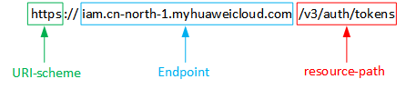

# 构造请求<a name="vod_04_0108"></a>

本节介绍REST API请求的组成，并以调用IAM服务的获取用户Token说明如何调用API，该API用于获取用户的Token，Token可以用于调用其他API时鉴权。具体如何调用本服务的API请参考[快速入门](示例1-媒资上传.md)。

## URI<a name="zh-cn_topic_0171784220_zh-cn_topic_0121682347_zh-cn_topic_0113746487_section697653216219"></a>

URI由如下部分组成：

**\{URI-scheme\}://\{Endpoint\}/\{resource-path\}?\{query-string\}**

尽管URI包含在请求消息头中，但大多数语言或框架都要求您从请求消息中单独传递它，所以在此单独强调。

**表 1**  URI中的参数说明

<a name="zh-cn_topic_0171784220_zh-cn_topic_0121682347_zh-cn_topic_0113746487_table4443194632512"></a>
<table><thead align="left"><tr id="zh-cn_topic_0171784220_zh-cn_topic_0121682347_zh-cn_topic_0113746487_row1944414616258"><th class="cellrowborder" valign="top" width="19.5%" id="mcps1.2.3.1.1"><p id="zh-cn_topic_0171784220_zh-cn_topic_0121682347_zh-cn_topic_0113746487_p1644484692510"><a name="zh-cn_topic_0171784220_zh-cn_topic_0121682347_zh-cn_topic_0113746487_p1644484692510"></a><a name="zh-cn_topic_0171784220_zh-cn_topic_0121682347_zh-cn_topic_0113746487_p1644484692510"></a><strong id="zh-cn_topic_0171784220_zh-cn_topic_0121682347_zh-cn_topic_0113746487_b2015193132620"><a name="zh-cn_topic_0171784220_zh-cn_topic_0121682347_zh-cn_topic_0113746487_b2015193132620"></a><a name="zh-cn_topic_0171784220_zh-cn_topic_0121682347_zh-cn_topic_0113746487_b2015193132620"></a>参数</strong></p>
</th>
<th class="cellrowborder" valign="top" width="80.5%" id="mcps1.2.3.1.2"><p id="zh-cn_topic_0171784220_zh-cn_topic_0121682347_zh-cn_topic_0113746487_p174441146142511"><a name="zh-cn_topic_0171784220_zh-cn_topic_0121682347_zh-cn_topic_0113746487_p174441146142511"></a><a name="zh-cn_topic_0171784220_zh-cn_topic_0121682347_zh-cn_topic_0113746487_p174441146142511"></a><strong id="zh-cn_topic_0171784220_zh-cn_topic_0121682347_zh-cn_topic_0113746487_b131565362615"><a name="zh-cn_topic_0171784220_zh-cn_topic_0121682347_zh-cn_topic_0113746487_b131565362615"></a><a name="zh-cn_topic_0171784220_zh-cn_topic_0121682347_zh-cn_topic_0113746487_b131565362615"></a>描述</strong></p>
</th>
</tr>
</thead>
<tbody><tr id="zh-cn_topic_0171784220_zh-cn_topic_0121682347_zh-cn_topic_0113746487_row10444144620259"><td class="cellrowborder" valign="top" width="19.5%" headers="mcps1.2.3.1.1 "><p id="zh-cn_topic_0171784220_zh-cn_topic_0121682347_zh-cn_topic_0113746487_p154446465251"><a name="zh-cn_topic_0171784220_zh-cn_topic_0121682347_zh-cn_topic_0113746487_p154446465251"></a><a name="zh-cn_topic_0171784220_zh-cn_topic_0121682347_zh-cn_topic_0113746487_p154446465251"></a>URI-scheme</p>
</td>
<td class="cellrowborder" valign="top" width="80.5%" headers="mcps1.2.3.1.2 "><p id="zh-cn_topic_0171784220_zh-cn_topic_0121682347_zh-cn_topic_0113746487_p8444144692517"><a name="zh-cn_topic_0171784220_zh-cn_topic_0121682347_zh-cn_topic_0113746487_p8444144692517"></a><a name="zh-cn_topic_0171784220_zh-cn_topic_0121682347_zh-cn_topic_0113746487_p8444144692517"></a>表示用于传输请求的协议，当前所有API均采用<strong id="zh-cn_topic_0171784220_zh-cn_topic_0121682347_b100829303"><a name="zh-cn_topic_0171784220_zh-cn_topic_0121682347_b100829303"></a><a name="zh-cn_topic_0171784220_zh-cn_topic_0121682347_b100829303"></a>HTTPS</strong>协议。</p>
</td>
</tr>
<tr id="zh-cn_topic_0171784220_zh-cn_topic_0121682347_zh-cn_topic_0113746487_row444414692513"><td class="cellrowborder" valign="top" width="19.5%" headers="mcps1.2.3.1.1 "><p id="zh-cn_topic_0171784220_zh-cn_topic_0121682347_zh-cn_topic_0113746487_p7444194610257"><a name="zh-cn_topic_0171784220_zh-cn_topic_0121682347_zh-cn_topic_0113746487_p7444194610257"></a><a name="zh-cn_topic_0171784220_zh-cn_topic_0121682347_zh-cn_topic_0113746487_p7444194610257"></a>Endpoint</p>
</td>
<td class="cellrowborder" valign="top" width="80.5%" headers="mcps1.2.3.1.2 "><p id="zh-cn_topic_0171784220_zh-cn_topic_0121682347_zh-cn_topic_0113746487_p244474613259"><a name="zh-cn_topic_0171784220_zh-cn_topic_0121682347_zh-cn_topic_0113746487_p244474613259"></a><a name="zh-cn_topic_0171784220_zh-cn_topic_0121682347_zh-cn_topic_0113746487_p244474613259"></a>指定承载REST服务端点的服务器域名或IP，不同服务不同区域的Endpoint不同，您可以在<a href="https://developer.huaweicloud.com/endpoint?IAM" target="_blank" rel="noopener noreferrer">地区和终端节点</a>获取。</p>
<p id="zh-cn_topic_0171784220_zh-cn_topic_0121682347_p885485594717"><a name="zh-cn_topic_0171784220_zh-cn_topic_0121682347_p885485594717"></a><a name="zh-cn_topic_0171784220_zh-cn_topic_0121682347_p885485594717"></a>例如IAM服务在“<strong id="zh-cn_topic_0171784220_b178991114185915"><a name="zh-cn_topic_0171784220_b178991114185915"></a><a name="zh-cn_topic_0171784220_b178991114185915"></a>华北-北京四</strong>”区域的Endpoint为“<strong id="zh-cn_topic_0171784220_b581251045910"><a name="zh-cn_topic_0171784220_b581251045910"></a><a name="zh-cn_topic_0171784220_b581251045910"></a>iam.cn-north-4.myhuaweicloud.com</strong>”。</p>
</td>
</tr>
<tr id="zh-cn_topic_0171784220_zh-cn_topic_0121682347_zh-cn_topic_0113746487_row1744454612520"><td class="cellrowborder" valign="top" width="19.5%" headers="mcps1.2.3.1.1 "><p id="zh-cn_topic_0171784220_zh-cn_topic_0121682347_zh-cn_topic_0113746487_p14442468257"><a name="zh-cn_topic_0171784220_zh-cn_topic_0121682347_zh-cn_topic_0113746487_p14442468257"></a><a name="zh-cn_topic_0171784220_zh-cn_topic_0121682347_zh-cn_topic_0113746487_p14442468257"></a>resource-path</p>
</td>
<td class="cellrowborder" valign="top" width="80.5%" headers="mcps1.2.3.1.2 "><p id="zh-cn_topic_0171784220_zh-cn_topic_0121682347_zh-cn_topic_0113746487_p1844412467258"><a name="zh-cn_topic_0171784220_zh-cn_topic_0121682347_zh-cn_topic_0113746487_p1844412467258"></a><a name="zh-cn_topic_0171784220_zh-cn_topic_0121682347_zh-cn_topic_0113746487_p1844412467258"></a>资源路径，也即API访问路径。从具体API的URI模块获取，例如<span class="parmname" id="zh-cn_topic_0171784220_zh-cn_topic_0121682347_parmname10948814168"><a name="zh-cn_topic_0171784220_zh-cn_topic_0121682347_parmname10948814168"></a><a name="zh-cn_topic_0171784220_zh-cn_topic_0121682347_parmname10948814168"></a>“获取用户Token”</span>API的resource-path为<span class="parmvalue" id="zh-cn_topic_0171784220_zh-cn_topic_0121682347_parmvalue10149384167"><a name="zh-cn_topic_0171784220_zh-cn_topic_0121682347_parmvalue10149384167"></a><a name="zh-cn_topic_0171784220_zh-cn_topic_0121682347_parmvalue10149384167"></a>“/v3/auth/tokens”</span>。</p>
</td>
</tr>
<tr id="zh-cn_topic_0171784220_zh-cn_topic_0121682347_zh-cn_topic_0113746487_row184441346152515"><td class="cellrowborder" valign="top" width="19.5%" headers="mcps1.2.3.1.1 "><p id="zh-cn_topic_0171784220_zh-cn_topic_0121682347_zh-cn_topic_0113746487_p4444154692516"><a name="zh-cn_topic_0171784220_zh-cn_topic_0121682347_zh-cn_topic_0113746487_p4444154692516"></a><a name="zh-cn_topic_0171784220_zh-cn_topic_0121682347_zh-cn_topic_0113746487_p4444154692516"></a>query-string</p>
</td>
<td class="cellrowborder" valign="top" width="80.5%" headers="mcps1.2.3.1.2 "><p id="zh-cn_topic_0171784220_zh-cn_topic_0121682347_zh-cn_topic_0113746487_p1444414622514"><a name="zh-cn_topic_0171784220_zh-cn_topic_0121682347_zh-cn_topic_0113746487_p1444414622514"></a><a name="zh-cn_topic_0171784220_zh-cn_topic_0121682347_zh-cn_topic_0113746487_p1444414622514"></a>查询参数，是可选部分，并不是每个API都有查询参数。查询参数前面需要带一个<span class="parmname" id="zh-cn_topic_0171784220_zh-cn_topic_0121682347_parmname1580211351239"><a name="zh-cn_topic_0171784220_zh-cn_topic_0121682347_parmname1580211351239"></a><a name="zh-cn_topic_0171784220_zh-cn_topic_0121682347_parmname1580211351239"></a>“？”</span>，形式为<span class="parmname" id="zh-cn_topic_0171784220_zh-cn_topic_0121682347_parmname15353163216276"><a name="zh-cn_topic_0171784220_zh-cn_topic_0121682347_parmname15353163216276"></a><a name="zh-cn_topic_0171784220_zh-cn_topic_0121682347_parmname15353163216276"></a>“名称=参数取值”</span>，例如<span class="parmname" id="zh-cn_topic_0171784220_zh-cn_topic_0121682347_parmname250193215285"><a name="zh-cn_topic_0171784220_zh-cn_topic_0121682347_parmname250193215285"></a><a name="zh-cn_topic_0171784220_zh-cn_topic_0121682347_parmname250193215285"></a>“limit=10”</span>，表示查询不超过10条数据。</p>
</td>
</tr>
</tbody>
</table>

例如您需要获取IAM在“华北-北京四“区域的Token，则需使用“华北-北京四“区域的Endpoint（**iam.cn-north-4.myhuaweicloud.com**），并在[获取用户Token](https://support.huaweicloud.com/api-iam/iam_30_0001.html)的URI部分找到resource-path（/v3/auth/tokens），拼接起来如下所示。

```
https://iam.cn-north-4.myhuaweicloud.com/v3/auth/tokens
```

**图 1**  URI示意图<a name="zh-cn_topic_0171784220_zh-cn_topic_0121682347_fig949762553218"></a>  


> **说明：** 
>为查看方便，在每个具体API的URI部分，只给出resource-path部分，并将请求方法写在一起。这是因为URI-scheme都是HTTPS，而Endpoint在同一个区域也相同，所以简洁起见将这两部分省略。

## 请求方法<a name="zh-cn_topic_0171784220_zh-cn_topic_0121682347_zh-cn_topic_0113746487_section5296154118345"></a>

HTTP请求方法（也称为操作或动词），它告诉服务您正在请求什么类型的操作。

**表 2**  HTTP方法

<a name="zh-cn_topic_0171784220_zh-cn_topic_0121682347_zh-cn_topic_0113746487_table1961229113819"></a>
<table><thead align="left"><tr id="zh-cn_topic_0171784220_zh-cn_topic_0121682347_zh-cn_topic_0113746487_row86141913816"><th class="cellrowborder" valign="top" width="30%" id="mcps1.2.3.1.1"><p id="zh-cn_topic_0171784220_zh-cn_topic_0121682347_zh-cn_topic_0113746487_p186147910387"><a name="zh-cn_topic_0171784220_zh-cn_topic_0121682347_zh-cn_topic_0113746487_p186147910387"></a><a name="zh-cn_topic_0171784220_zh-cn_topic_0121682347_zh-cn_topic_0113746487_p186147910387"></a><strong id="zh-cn_topic_0171784220_zh-cn_topic_0121682347_zh-cn_topic_0113746487_b1093312238395"><a name="zh-cn_topic_0171784220_zh-cn_topic_0121682347_zh-cn_topic_0113746487_b1093312238395"></a><a name="zh-cn_topic_0171784220_zh-cn_topic_0121682347_zh-cn_topic_0113746487_b1093312238395"></a>方法</strong></p>
</th>
<th class="cellrowborder" valign="top" width="70%" id="mcps1.2.3.1.2"><p id="zh-cn_topic_0171784220_zh-cn_topic_0121682347_zh-cn_topic_0113746487_p166141293387"><a name="zh-cn_topic_0171784220_zh-cn_topic_0121682347_zh-cn_topic_0113746487_p166141293387"></a><a name="zh-cn_topic_0171784220_zh-cn_topic_0121682347_zh-cn_topic_0113746487_p166141293387"></a><strong id="zh-cn_topic_0171784220_zh-cn_topic_0121682347_zh-cn_topic_0113746487_b169341023133919"><a name="zh-cn_topic_0171784220_zh-cn_topic_0121682347_zh-cn_topic_0113746487_b169341023133919"></a><a name="zh-cn_topic_0171784220_zh-cn_topic_0121682347_zh-cn_topic_0113746487_b169341023133919"></a>说明</strong></p>
</th>
</tr>
</thead>
<tbody><tr id="zh-cn_topic_0171784220_zh-cn_topic_0121682347_zh-cn_topic_0113746487_row146141194381"><td class="cellrowborder" valign="top" width="30%" headers="mcps1.2.3.1.1 "><p id="zh-cn_topic_0171784220_zh-cn_topic_0121682347_zh-cn_topic_0113746487_p12831539123914"><a name="zh-cn_topic_0171784220_zh-cn_topic_0121682347_zh-cn_topic_0113746487_p12831539123914"></a><a name="zh-cn_topic_0171784220_zh-cn_topic_0121682347_zh-cn_topic_0113746487_p12831539123914"></a>GET</p>
</td>
<td class="cellrowborder" valign="top" width="70%" headers="mcps1.2.3.1.2 "><p id="zh-cn_topic_0171784220_zh-cn_topic_0121682347_zh-cn_topic_0113746487_p2831123916397"><a name="zh-cn_topic_0171784220_zh-cn_topic_0121682347_zh-cn_topic_0113746487_p2831123916397"></a><a name="zh-cn_topic_0171784220_zh-cn_topic_0121682347_zh-cn_topic_0113746487_p2831123916397"></a>请求服务器返回指定资源。</p>
</td>
</tr>
<tr id="zh-cn_topic_0171784220_zh-cn_topic_0121682347_zh-cn_topic_0113746487_row161429103817"><td class="cellrowborder" valign="top" width="30%" headers="mcps1.2.3.1.1 "><p id="zh-cn_topic_0171784220_zh-cn_topic_0121682347_zh-cn_topic_0113746487_p3831239183912"><a name="zh-cn_topic_0171784220_zh-cn_topic_0121682347_zh-cn_topic_0113746487_p3831239183912"></a><a name="zh-cn_topic_0171784220_zh-cn_topic_0121682347_zh-cn_topic_0113746487_p3831239183912"></a>PUT</p>
</td>
<td class="cellrowborder" valign="top" width="70%" headers="mcps1.2.3.1.2 "><p id="zh-cn_topic_0171784220_zh-cn_topic_0121682347_zh-cn_topic_0113746487_p178311939193911"><a name="zh-cn_topic_0171784220_zh-cn_topic_0121682347_zh-cn_topic_0113746487_p178311939193911"></a><a name="zh-cn_topic_0171784220_zh-cn_topic_0121682347_zh-cn_topic_0113746487_p178311939193911"></a>请求服务器更新指定资源。</p>
</td>
</tr>
<tr id="zh-cn_topic_0171784220_zh-cn_topic_0121682347_zh-cn_topic_0113746487_row56141190384"><td class="cellrowborder" valign="top" width="30%" headers="mcps1.2.3.1.1 "><p id="zh-cn_topic_0171784220_zh-cn_topic_0121682347_zh-cn_topic_0113746487_p68311239113912"><a name="zh-cn_topic_0171784220_zh-cn_topic_0121682347_zh-cn_topic_0113746487_p68311239113912"></a><a name="zh-cn_topic_0171784220_zh-cn_topic_0121682347_zh-cn_topic_0113746487_p68311239113912"></a>POST</p>
</td>
<td class="cellrowborder" valign="top" width="70%" headers="mcps1.2.3.1.2 "><p id="zh-cn_topic_0171784220_zh-cn_topic_0121682347_zh-cn_topic_0113746487_p1583133918391"><a name="zh-cn_topic_0171784220_zh-cn_topic_0121682347_zh-cn_topic_0113746487_p1583133918391"></a><a name="zh-cn_topic_0171784220_zh-cn_topic_0121682347_zh-cn_topic_0113746487_p1583133918391"></a>请求服务器新增资源或执行特殊操作。</p>
</td>
</tr>
<tr id="zh-cn_topic_0171784220_zh-cn_topic_0121682347_zh-cn_topic_0113746487_row861411903812"><td class="cellrowborder" valign="top" width="30%" headers="mcps1.2.3.1.1 "><p id="zh-cn_topic_0171784220_zh-cn_topic_0121682347_zh-cn_topic_0113746487_p1183153943916"><a name="zh-cn_topic_0171784220_zh-cn_topic_0121682347_zh-cn_topic_0113746487_p1183153943916"></a><a name="zh-cn_topic_0171784220_zh-cn_topic_0121682347_zh-cn_topic_0113746487_p1183153943916"></a>DELETE</p>
</td>
<td class="cellrowborder" valign="top" width="70%" headers="mcps1.2.3.1.2 "><p id="zh-cn_topic_0171784220_zh-cn_topic_0121682347_zh-cn_topic_0113746487_p6831163914392"><a name="zh-cn_topic_0171784220_zh-cn_topic_0121682347_zh-cn_topic_0113746487_p6831163914392"></a><a name="zh-cn_topic_0171784220_zh-cn_topic_0121682347_zh-cn_topic_0113746487_p6831163914392"></a>请求服务器删除指定资源，如删除对象等。</p>
</td>
</tr>
<tr id="zh-cn_topic_0171784220_zh-cn_topic_0121682347_zh-cn_topic_0113746487_row5614119183810"><td class="cellrowborder" valign="top" width="30%" headers="mcps1.2.3.1.1 "><p id="zh-cn_topic_0171784220_zh-cn_topic_0121682347_zh-cn_topic_0113746487_p78314395393"><a name="zh-cn_topic_0171784220_zh-cn_topic_0121682347_zh-cn_topic_0113746487_p78314395393"></a><a name="zh-cn_topic_0171784220_zh-cn_topic_0121682347_zh-cn_topic_0113746487_p78314395393"></a>HEAD</p>
</td>
<td class="cellrowborder" valign="top" width="70%" headers="mcps1.2.3.1.2 "><p id="zh-cn_topic_0171784220_zh-cn_topic_0121682347_zh-cn_topic_0113746487_p38311239153920"><a name="zh-cn_topic_0171784220_zh-cn_topic_0121682347_zh-cn_topic_0113746487_p38311239153920"></a><a name="zh-cn_topic_0171784220_zh-cn_topic_0121682347_zh-cn_topic_0113746487_p38311239153920"></a>请求服务器资源头部。</p>
</td>
</tr>
<tr id="zh-cn_topic_0171784220_zh-cn_topic_0121682347_zh-cn_topic_0113746487_row2614199163812"><td class="cellrowborder" valign="top" width="30%" headers="mcps1.2.3.1.1 "><p id="zh-cn_topic_0171784220_zh-cn_topic_0121682347_zh-cn_topic_0113746487_p1483143915390"><a name="zh-cn_topic_0171784220_zh-cn_topic_0121682347_zh-cn_topic_0113746487_p1483143915390"></a><a name="zh-cn_topic_0171784220_zh-cn_topic_0121682347_zh-cn_topic_0113746487_p1483143915390"></a>PATCH</p>
</td>
<td class="cellrowborder" valign="top" width="70%" headers="mcps1.2.3.1.2 "><p id="zh-cn_topic_0171784220_zh-cn_topic_0121682347_zh-cn_topic_0113746487_p17831173918394"><a name="zh-cn_topic_0171784220_zh-cn_topic_0121682347_zh-cn_topic_0113746487_p17831173918394"></a><a name="zh-cn_topic_0171784220_zh-cn_topic_0121682347_zh-cn_topic_0113746487_p17831173918394"></a>请求服务器更新资源的部分内容。</p>
<p id="zh-cn_topic_0171784220_zh-cn_topic_0121682347_zh-cn_topic_0113746487_p9831123911390"><a name="zh-cn_topic_0171784220_zh-cn_topic_0121682347_zh-cn_topic_0113746487_p9831123911390"></a><a name="zh-cn_topic_0171784220_zh-cn_topic_0121682347_zh-cn_topic_0113746487_p9831123911390"></a>当资源不存在的时候，PATCH可能会去创建一个新的资源。</p>
</td>
</tr>
</tbody>
</table>

在[获取用户Token](https://support.huaweicloud.com/api-iam/iam_30_0001.html)的URI部分，您可以看到其请求方法为“POST“，则其请求为：

```
POST https://iam.cn-north-4.myhuaweicloud.com/v3/auth/tokens
```

## 请求消息头<a name="zh-cn_topic_0171784220_zh-cn_topic_0121682347_section479119143310"></a>

附加请求头字段，如指定的URI和HTTP方法所要求的字段。例如定义消息体类型的请求头“Content-Type“，请求鉴权信息等。

详细的公共请求消息头字段请参见[表3](#zh-cn_topic_0171784220_zh-cn_topic_0121682347_table1986821153312)。

**表 3**  公共请求消息头

<a name="zh-cn_topic_0171784220_zh-cn_topic_0121682347_table1986821153312"></a>
<table><thead align="left"><tr id="zh-cn_topic_0171784220_zh-cn_topic_0121682347_row1286841153311"><th class="cellrowborder" valign="top" width="20%" id="mcps1.2.5.1.1"><p id="zh-cn_topic_0171784220_zh-cn_topic_0121682347_p178680183310"><a name="zh-cn_topic_0171784220_zh-cn_topic_0121682347_p178680183310"></a><a name="zh-cn_topic_0171784220_zh-cn_topic_0121682347_p178680183310"></a><strong id="zh-cn_topic_0171784220_zh-cn_topic_0121682347_b68682163320"><a name="zh-cn_topic_0171784220_zh-cn_topic_0121682347_b68682163320"></a><a name="zh-cn_topic_0171784220_zh-cn_topic_0121682347_b68682163320"></a>名称</strong></p>
</th>
<th class="cellrowborder" valign="top" width="30%" id="mcps1.2.5.1.2"><p id="zh-cn_topic_0171784220_zh-cn_topic_0121682347_p78688118335"><a name="zh-cn_topic_0171784220_zh-cn_topic_0121682347_p78688118335"></a><a name="zh-cn_topic_0171784220_zh-cn_topic_0121682347_p78688118335"></a><strong id="zh-cn_topic_0171784220_zh-cn_topic_0121682347_b148681111333"><a name="zh-cn_topic_0171784220_zh-cn_topic_0121682347_b148681111333"></a><a name="zh-cn_topic_0171784220_zh-cn_topic_0121682347_b148681111333"></a>描述</strong></p>
</th>
<th class="cellrowborder" valign="top" width="30%" id="mcps1.2.5.1.3"><p id="zh-cn_topic_0171784220_zh-cn_topic_0121682347_p58686123316"><a name="zh-cn_topic_0171784220_zh-cn_topic_0121682347_p58686123316"></a><a name="zh-cn_topic_0171784220_zh-cn_topic_0121682347_p58686123316"></a><strong id="zh-cn_topic_0171784220_zh-cn_topic_0121682347_b98684111338"><a name="zh-cn_topic_0171784220_zh-cn_topic_0121682347_b98684111338"></a><a name="zh-cn_topic_0171784220_zh-cn_topic_0121682347_b98684111338"></a>是否必选</strong></p>
</th>
<th class="cellrowborder" valign="top" width="20%" id="mcps1.2.5.1.4"><p id="zh-cn_topic_0171784220_zh-cn_topic_0121682347_p48681314333"><a name="zh-cn_topic_0171784220_zh-cn_topic_0121682347_p48681314333"></a><a name="zh-cn_topic_0171784220_zh-cn_topic_0121682347_p48681314333"></a><strong id="zh-cn_topic_0171784220_zh-cn_topic_0121682347_b48688114333"><a name="zh-cn_topic_0171784220_zh-cn_topic_0121682347_b48688114333"></a><a name="zh-cn_topic_0171784220_zh-cn_topic_0121682347_b48688114333"></a>示例</strong></p>
</th>
</tr>
</thead>
<tbody><tr id="zh-cn_topic_0171784220_zh-cn_topic_0121682347_row1286861153311"><td class="cellrowborder" valign="top" width="20%" headers="mcps1.2.5.1.1 "><p id="zh-cn_topic_0171784220_zh-cn_topic_0121682347_p2086813163316"><a name="zh-cn_topic_0171784220_zh-cn_topic_0121682347_p2086813163316"></a><a name="zh-cn_topic_0171784220_zh-cn_topic_0121682347_p2086813163316"></a>Host</p>
</td>
<td class="cellrowborder" valign="top" width="30%" headers="mcps1.2.5.1.2 "><p id="zh-cn_topic_0171784220_zh-cn_topic_0140252986_p434914402568"><a name="zh-cn_topic_0171784220_zh-cn_topic_0140252986_p434914402568"></a><a name="zh-cn_topic_0171784220_zh-cn_topic_0140252986_p434914402568"></a>主机地址，填写为本服务的EndPoint。</p>
</td>
<td class="cellrowborder" valign="top" width="30%" headers="mcps1.2.5.1.3 "><p id="zh-cn_topic_0171784220_p10551815124317"><a name="zh-cn_topic_0171784220_p10551815124317"></a><a name="zh-cn_topic_0171784220_p10551815124317"></a>否</p>
<p id="zh-cn_topic_0171784220_p9419264437"><a name="zh-cn_topic_0171784220_p9419264437"></a><a name="zh-cn_topic_0171784220_p9419264437"></a>使用AK/SK认证时该字段为必选。</p>
</td>
<td class="cellrowborder" valign="top" width="20%" headers="mcps1.2.5.1.4 "><p id="zh-cn_topic_0171784220_p1761412515365"><a name="zh-cn_topic_0171784220_p1761412515365"></a><a name="zh-cn_topic_0171784220_p1761412515365"></a><em id="zh-cn_topic_0171784220_i264934010162"><a name="zh-cn_topic_0171784220_i264934010162"></a><a name="zh-cn_topic_0171784220_i264934010162"></a>region</em>.myhuaweicloud.com</p>
</td>
</tr>
<tr id="zh-cn_topic_0171784220_zh-cn_topic_0121682347_row386818143313"><td class="cellrowborder" valign="top" width="20%" headers="mcps1.2.5.1.1 "><p id="zh-cn_topic_0171784220_zh-cn_topic_0121682347_p118689123320"><a name="zh-cn_topic_0171784220_zh-cn_topic_0121682347_p118689123320"></a><a name="zh-cn_topic_0171784220_zh-cn_topic_0121682347_p118689123320"></a>Content-Type</p>
</td>
<td class="cellrowborder" valign="top" width="30%" headers="mcps1.2.5.1.2 "><p id="zh-cn_topic_0171784220_zh-cn_topic_0121682347_p1486815116337"><a name="zh-cn_topic_0171784220_zh-cn_topic_0121682347_p1486815116337"></a><a name="zh-cn_topic_0171784220_zh-cn_topic_0121682347_p1486815116337"></a>发送的实体的MIME类型。推荐用户默认使用application/json。</p>
</td>
<td class="cellrowborder" valign="top" width="30%" headers="mcps1.2.5.1.3 "><p id="zh-cn_topic_0171784220_zh-cn_topic_0121682347_p1086812114335"><a name="zh-cn_topic_0171784220_zh-cn_topic_0121682347_p1086812114335"></a><a name="zh-cn_topic_0171784220_zh-cn_topic_0121682347_p1086812114335"></a>是</p>
</td>
<td class="cellrowborder" valign="top" width="20%" headers="mcps1.2.5.1.4 "><p id="zh-cn_topic_0171784220_zh-cn_topic_0121682347_p1186841163310"><a name="zh-cn_topic_0171784220_zh-cn_topic_0121682347_p1186841163310"></a><a name="zh-cn_topic_0171784220_zh-cn_topic_0121682347_p1186841163310"></a>application/json</p>
</td>
</tr>
<tr id="zh-cn_topic_0171784220_zh-cn_topic_0121682347_row11868419337"><td class="cellrowborder" valign="top" width="20%" headers="mcps1.2.5.1.1 "><p id="zh-cn_topic_0171784220_zh-cn_topic_0121682347_p178687119330"><a name="zh-cn_topic_0171784220_zh-cn_topic_0121682347_p178687119330"></a><a name="zh-cn_topic_0171784220_zh-cn_topic_0121682347_p178687119330"></a>Content-Length</p>
</td>
<td class="cellrowborder" valign="top" width="30%" headers="mcps1.2.5.1.2 "><p id="zh-cn_topic_0171784220_zh-cn_topic_0121682347_p178681813332"><a name="zh-cn_topic_0171784220_zh-cn_topic_0121682347_p178681813332"></a><a name="zh-cn_topic_0171784220_zh-cn_topic_0121682347_p178681813332"></a>请求body长度，单位为Byte。</p>
</td>
<td class="cellrowborder" valign="top" width="30%" headers="mcps1.2.5.1.3 "><p id="zh-cn_topic_0171784220_zh-cn_topic_0121682347_p18687183316"><a name="zh-cn_topic_0171784220_zh-cn_topic_0121682347_p18687183316"></a><a name="zh-cn_topic_0171784220_zh-cn_topic_0121682347_p18687183316"></a>否</p>
</td>
<td class="cellrowborder" valign="top" width="20%" headers="mcps1.2.5.1.4 "><p id="zh-cn_topic_0171784220_zh-cn_topic_0121682347_p148689110334"><a name="zh-cn_topic_0171784220_zh-cn_topic_0121682347_p148689110334"></a><a name="zh-cn_topic_0171784220_zh-cn_topic_0121682347_p148689110334"></a>3495</p>
</td>
</tr>
<tr id="zh-cn_topic_0171784220_row1896312238101"><td class="cellrowborder" valign="top" width="20%" headers="mcps1.2.5.1.1 "><p id="zh-cn_topic_0171784220_zh-cn_topic_0140252986_p16349204012564"><a name="zh-cn_topic_0171784220_zh-cn_topic_0140252986_p16349204012564"></a><a name="zh-cn_topic_0171784220_zh-cn_topic_0140252986_p16349204012564"></a>X-sdk-date</p>
</td>
<td class="cellrowborder" valign="top" width="30%" headers="mcps1.2.5.1.2 "><p id="zh-cn_topic_0171784220_zh-cn_topic_0140252986_p1534912406569"><a name="zh-cn_topic_0171784220_zh-cn_topic_0140252986_p1534912406569"></a><a name="zh-cn_topic_0171784220_zh-cn_topic_0140252986_p1534912406569"></a>请求的发生时间，格式为(YYYYMMDD'T'HHMMSS'Z')。取值为当前系统的GMT时间。</p>
</td>
<td class="cellrowborder" valign="top" width="30%" headers="mcps1.2.5.1.3 "><p id="zh-cn_topic_0171784220_p16964152314107"><a name="zh-cn_topic_0171784220_p16964152314107"></a><a name="zh-cn_topic_0171784220_p16964152314107"></a>否</p>
<p id="zh-cn_topic_0171784220_p925411464412"><a name="zh-cn_topic_0171784220_p925411464412"></a><a name="zh-cn_topic_0171784220_p925411464412"></a>使用AK/SK认证时该字段为必选。</p>
</td>
<td class="cellrowborder" valign="top" width="20%" headers="mcps1.2.5.1.4 "><p id="zh-cn_topic_0171784220_p16964122341012"><a name="zh-cn_topic_0171784220_p16964122341012"></a><a name="zh-cn_topic_0171784220_p16964122341012"></a>无</p>
</td>
</tr>
<tr id="zh-cn_topic_0171784220_row348802712106"><td class="cellrowborder" valign="top" width="20%" headers="mcps1.2.5.1.1 "><p id="zh-cn_topic_0171784220_zh-cn_topic_0140252986_p034913404569"><a name="zh-cn_topic_0171784220_zh-cn_topic_0140252986_p034913404569"></a><a name="zh-cn_topic_0171784220_zh-cn_topic_0140252986_p034913404569"></a>Authorization</p>
</td>
<td class="cellrowborder" valign="top" width="30%" headers="mcps1.2.5.1.2 "><p id="zh-cn_topic_0171784220_zh-cn_topic_0140252986_p634974015619"><a name="zh-cn_topic_0171784220_zh-cn_topic_0140252986_p634974015619"></a><a name="zh-cn_topic_0171784220_zh-cn_topic_0140252986_p634974015619"></a>请求消息中携带的鉴权信息。</p>
</td>
<td class="cellrowborder" valign="top" width="30%" headers="mcps1.2.5.1.3 "><p id="zh-cn_topic_0171784220_p148811272108"><a name="zh-cn_topic_0171784220_p148811272108"></a><a name="zh-cn_topic_0171784220_p148811272108"></a>否</p>
<p id="zh-cn_topic_0171784220_p334161734414"><a name="zh-cn_topic_0171784220_p334161734414"></a><a name="zh-cn_topic_0171784220_p334161734414"></a>使用AK/SK认证时该字段为必选。</p>
</td>
<td class="cellrowborder" valign="top" width="20%" headers="mcps1.2.5.1.4 "><p id="zh-cn_topic_0171784220_p19488172781020"><a name="zh-cn_topic_0171784220_p19488172781020"></a><a name="zh-cn_topic_0171784220_p19488172781020"></a>无</p>
</td>
</tr>
<tr id="zh-cn_topic_0171784220_zh-cn_topic_0121682347_row2868171143313"><td class="cellrowborder" valign="top" width="20%" headers="mcps1.2.5.1.1 "><p id="zh-cn_topic_0171784220_zh-cn_topic_0121682347_p586815118338"><a name="zh-cn_topic_0171784220_zh-cn_topic_0121682347_p586815118338"></a><a name="zh-cn_topic_0171784220_zh-cn_topic_0121682347_p586815118338"></a>X-Project-Id</p>
</td>
<td class="cellrowborder" valign="top" width="30%" headers="mcps1.2.5.1.2 "><p id="zh-cn_topic_0171784220_zh-cn_topic_0121682347_p1586811163312"><a name="zh-cn_topic_0171784220_zh-cn_topic_0121682347_p1586811163312"></a><a name="zh-cn_topic_0171784220_zh-cn_topic_0121682347_p1586811163312"></a>project id，项目编号。请参考<a href="获取项目ID.md#vod_04_0211">获取项目ID</a>章节获取项目编号。</p>
</td>
<td class="cellrowborder" valign="top" width="30%" headers="mcps1.2.5.1.3 "><p id="zh-cn_topic_0171784220_zh-cn_topic_0121682347_p886812110335"><a name="zh-cn_topic_0171784220_zh-cn_topic_0121682347_p886812110335"></a><a name="zh-cn_topic_0171784220_zh-cn_topic_0121682347_p886812110335"></a>否</p>
</td>
<td class="cellrowborder" valign="top" width="20%" headers="mcps1.2.5.1.4 "><p id="zh-cn_topic_0171784220_zh-cn_topic_0121682347_p198684143315"><a name="zh-cn_topic_0171784220_zh-cn_topic_0121682347_p198684143315"></a><a name="zh-cn_topic_0171784220_zh-cn_topic_0121682347_p198684143315"></a>e9993fc787d94b6c886cbaa340f9c0f4</p>
</td>
</tr>
<tr id="zh-cn_topic_0171784220_zh-cn_topic_0121682347_row188688113337"><td class="cellrowborder" valign="top" width="20%" headers="mcps1.2.5.1.1 "><p id="zh-cn_topic_0171784220_zh-cn_topic_0121682347_p198684111335"><a name="zh-cn_topic_0171784220_zh-cn_topic_0121682347_p198684111335"></a><a name="zh-cn_topic_0171784220_zh-cn_topic_0121682347_p198684111335"></a>X-Auth-Token</p>
</td>
<td class="cellrowborder" valign="top" width="30%" headers="mcps1.2.5.1.2 "><p id="zh-cn_topic_0171784220_zh-cn_topic_0121682347_p1086851153317"><a name="zh-cn_topic_0171784220_zh-cn_topic_0121682347_p1086851153317"></a><a name="zh-cn_topic_0171784220_zh-cn_topic_0121682347_p1086851153317"></a>用户Token。</p>
<p id="zh-cn_topic_0171784220_zh-cn_topic_0121682347_p1057635831"><a name="zh-cn_topic_0171784220_zh-cn_topic_0121682347_p1057635831"></a><a name="zh-cn_topic_0171784220_zh-cn_topic_0121682347_p1057635831"></a>用户Token也就是调用<a href="https://support.huaweicloud.com/api-iam/iam_30_0001.html" target="_blank" rel="noopener noreferrer">获取用户Token</a>接口的响应值，该接口是唯一不需要认证的接口。</p>
<p id="zh-cn_topic_0171784220_zh-cn_topic_0121682347_p15868417337"><a name="zh-cn_topic_0171784220_zh-cn_topic_0121682347_p15868417337"></a><a name="zh-cn_topic_0171784220_zh-cn_topic_0121682347_p15868417337"></a>请求响应成功后在响应消息头中包含的“X-Subject-Token”的值即为Token值。</p>
</td>
<td class="cellrowborder" valign="top" width="30%" headers="mcps1.2.5.1.3 "><p id="zh-cn_topic_0171784220_zh-cn_topic_0121682347_p4868514338"><a name="zh-cn_topic_0171784220_zh-cn_topic_0121682347_p4868514338"></a><a name="zh-cn_topic_0171784220_zh-cn_topic_0121682347_p4868514338"></a>否</p>
<p id="zh-cn_topic_0171784220_zh-cn_topic_0121682347_p986818114339"><a name="zh-cn_topic_0171784220_zh-cn_topic_0121682347_p986818114339"></a><a name="zh-cn_topic_0171784220_zh-cn_topic_0121682347_p986818114339"></a>使用Token认证时该字段必选。</p>
</td>
<td class="cellrowborder" valign="top" width="20%" headers="mcps1.2.5.1.4 "><p id="zh-cn_topic_0171784220_zh-cn_topic_0121682347_p27152505302"><a name="zh-cn_topic_0171784220_zh-cn_topic_0121682347_p27152505302"></a><a name="zh-cn_topic_0171784220_zh-cn_topic_0121682347_p27152505302"></a>注：以下仅为Token示例片段</p>
<p id="zh-cn_topic_0171784220_zh-cn_topic_0121682347_p168689113318"><a name="zh-cn_topic_0171784220_zh-cn_topic_0121682347_p168689113318"></a><a name="zh-cn_topic_0171784220_zh-cn_topic_0121682347_p168689113318"></a>MIIPAgYJKoZIhvcNAQcCo...ggg1BBIINPXsidG9rZ</p>
</td>
</tr>
</tbody>
</table>

> **说明：** 
>API同时支持使用AK/SK认证，AK/SK认证是使用SDK对请求进行签名，签名过程会自动往请求中添加Authorization（签名认证信息）和X-Sdk-Date（请求发送的时间）请求头。
>AK/SK认证的详细说明请参见[AK/SK认证](认证鉴权.md#zh-cn_topic_0171784241_zh-cn_topic_0121671869_section5887143815518)。

对于[获取用户Token](https://support.huaweicloud.com/api-iam/iam_30_0001.html)接口，由于不需要认证，所以只添加“Content-Type“即可，添加消息头后的请求如下所示。

```
POST https://iam.cn-north-4.myhuaweicloud.com/v3/auth/tokens
Content-Type: application/json
```

## 请求消息体（可选）<a name="zh-cn_topic_0171784220_zh-cn_topic_0121682347_zh-cn_topic_0113746487_section1437471411"></a>

该部分可选。请求消息体通常以结构化格式（如JSON或XML）发出，与请求消息头中Content-Type对应，传递除请求消息头之外的内容。若请求消息体中的参数支持中文，则中文字符必须为UTF-8编码。

每个接口的请求消息体内容不同，也并不是每个接口都需要有请求消息体（或者说消息体为空），GET、DELETE操作类型的接口不需要消息体，消息体具体内容需要根据具体接口而定。

对于[获取用户Token](https://support.huaweicloud.com/api-iam/iam_30_0001.html)接口，您可以从接口的请求部分看到所需的请求参数及参数说明。将消息体加入后的请求如下所示，加粗的斜体字段需要根据实际值填写，其中_**username**_为用户名，_**domainname**_为用户所属的账号名，_**\*\*\*\*\*\*\*\***_为用户登录密码，_**username**_和_**domainname**_可以在“我的凭证“页面获取，_**projectname**_为项目名称，如cn-north-4，您可以从[地区和终端节点](https://developer.huaweicloud.com/endpoint?IAM)中获取。


```
POST https://iam.cn-north-4.myhuaweicloud.com/v3/auth/tokens
Content-Type: application/json

{
  "auth": {
    "identity": {
      "methods": [
        "password"
      ],
      "password": {
        "user": {
          "name": "username",   
          "password": "********", 
          "domain": {
            "name": "domainname"    
          }
        }
      }
    },
    "scope": {
      "project": {
         "name": "projectname"  
      }
    }
  }
}
```

到这里为止这个请求需要的内容就具备齐全了，您可以使用[curl](https://curl.haxx.se/)、[Postman](https://www.getpostman.com/)或直接编写代码等方式发送请求调用API。对于获取用户Token接口，返回的响应消息头中“x-subject-token”就是需要获取的用户Token。有了Token之后，您就可以使用Token认证调用其他API。

