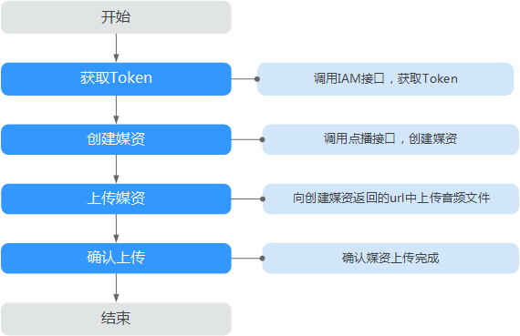
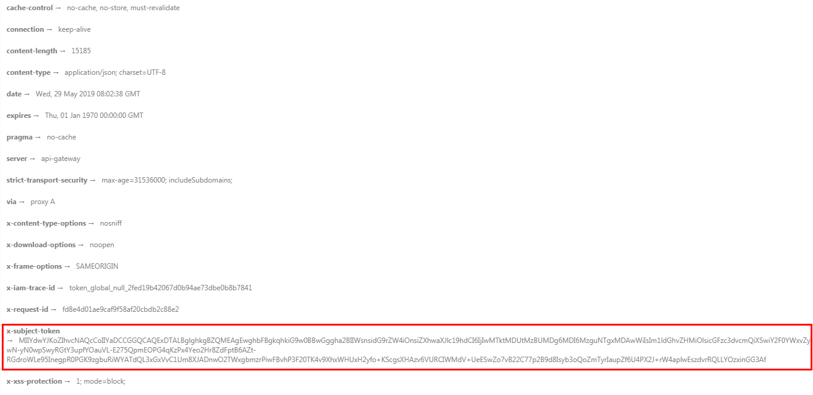

# 示例1：媒资上传（20M以下）<a name="vod_04_0195"></a>

## 场景描述<a name="section3467422104418"></a>

若您需要将存储在本地的音视频文件上传到点播服务，并在上传后，自动处理音视频，如发布、转码等，您可以调用VOD API进行媒资创建，并通过OBS API将音视频文件上传到VOD的存储桶中。

本章节指导用户如何使用API调用的方式上传一个大小20M以下的视频文件。

## 前提条件<a name="section1535328172818"></a>

-   已明确需要上传媒资的点播服务所在的区域信息，并获取该区域的Endpoint，您可以从[地区和终端节点](https://developer.huaweicloud.com/endpoint?VOD)获取。
-   已获取需要上传到对应点播服务所在区域的项目ID，具体获取方法请参见[获取项目ID](获取项目ID.md)。

## 总体流程<a name="section15675193905619"></a>

**图 1**  媒资上传流程<a name="fig1465716529471"></a>  


1.  调用[创建媒资：上传方式](创建媒资-上传方式.md)接口创建媒资。
2.  使用PUT方法将本地媒资文件上传。
3.  调用[确认媒资上传](确认媒资上传.md)接口完成媒资创建确认。

## 操作步骤<a name="section127693448583"></a>

1.  <a name="li134912423710"></a>[获取用户Token](https://support.huaweicloud.com/api-iam/iam_30_0001.html)，用于调用点播接口时进行认证鉴权。

    详细信息请参见[构造请求](构造请求.md)。以“华北-北京四”为示例，若您需要调用其它区域的点播接口，请替换成对应区域的[IAM终端节点](https://developer.huaweicloud.com/endpoint?IAM)。

    ```
    POST https://iam.cn-north-4.myhuaweicloud.com/v3/auth/tokens
    Content-Type: application/json
    
    {
      "auth": {
        "identity": {
          "methods": [
            "password"
          ],
          "password": {
            "user": {
              "name": "username", 
              "password": "password", 
              "domain": {
                "name": "domainname"   
              }
            }
          }
        },
        "scope": {
          "project": {
             "name": "projectname"
          }
        }
      }
    }
    ```

    如[图2](#fig955023251511)所示，红框中的信息为获取用户Token。

    **图 2**  获取用户Token<a name="fig955023251511"></a>  
    

2.  调用[创建媒资：上传方式](创建媒资-上传方式.md)接口，创建媒资，在请求头中增加“X-Auth-Token“字段，其中“Value“为[步骤1](#li134912423710)获取的。

    ```
    POST https://vod.cn-north-4.myhuaweicloud.com/v1.0/{project_id}/asset
    
    {
    	"title": "视频上传测试",
    	"description": "test",
    	"category_id": 87748,
    	"video_name": "test.mp4",
    	"video_type": "MP4",
    	"cover_type": "PNG",
    	"tags":"mytags,test",
    	"auto_publish": 0,    
    	"template_group_name":"test",
    	"subtitles":[      
    		{	
    			"id":1,
    			"language":"CN", 
    			"type": "SRT", 
    			"md5": "SqcyFjJZoDZaP8oKIY6rgQ==",    
    			"description":"AAAAA" ,
    			"name":"cc.srt"
    		}  
    	],
    	"thumbnail":{
    		"type":"time",
    		"cover_position":1
    	
    	},
    	"review":{
    		"interval":10,
    		"politics":-1,
    		"terrorism":-1,
    		"porn":-1
    	}	
    }
    ```

    “vod.cn-north-4.myhuaweicloud.com”为点播服务的终端节点，您可以在[VOD终端节点](使用前必读.md#section499212013211)中获取。

    > **说明：** 
    >调用IAM接口的区域需与调用点播接口的区域一致，如调用“cn-north-4”区域的IAM接口获取用户Token，则该Token仅能用于调用“cn-north-4”区域点播接口的鉴权。

3.  在返回参数中获取“video\_upload\_url“，“cover\_upload\_url“和“subtitle\_upload\_urls“。

    ```
    {
      "asset_id": "3f40a2c7c60454f5f84381e0313ca230",
      "video_upload_url": "https://vod-bucket-81.obs.myhwclouds.com:443/474bcff2992f4be5b883a2fb9cec7343/3f40a2c7c60454f5f84381e0313ca230/cdeda86cd1b7b3dd760a3ff28a5ee497.mp4?AWSAccessKeyId=BG923RWHL4HFXOGKCVAL&Expires=1560420274&Signature=9f%2BZcdD6SwjIU5ARHYiP6YY1Lyw%3D",
      "cover_upload_url": "https://vod-bucket-81.obs.myhwclouds.com:443/474bcff2992f4be5b883a2fb9cec7343/3f40a2c7c60454f5f84381e0313ca230/cover/Cover0.png?AWSAccessKeyId=BG923RWHL4HFXOGKCVAL&Expires=1560420274&Signature=4Aa88NK%2By%2By1Xo0RvLpOvuaFCoE%3D",
      "subtitle_upload_urls": [
        "https://vod-bucket-81.obs.myhwclouds.com:443/474bcff2992f4be5b883a2fb9cec7343/3f40a2c7c60454f5f84381e0313ca230/subtitle/1.srt?AWSAccessKeyId=BG923RWHL4HFXOGKCVAL&Expires=1560420274&Signature=l0UclE9yfaVrxkl0kaNnr%2BemG98%3D"
      ],
      "target": {
        "bucket": "vod-bucket-81",
        "location": "cn-north-4",
        "object": "474bcff2992f4be5b883a2fb9cec7343/3f40a2c7c60454f5f84381e0313ca230/cdeda86cd1b7b3dd760a3ff28a5ee497.mp4"
      }
    }
    ```

4.  使用PUT请求分别向“video\_upload\_url“，“cover\_upload\_url“和“subtitle\_upload\_urls“中上传视频文件、封面图片和字幕文件。

    其中，“Content-Type“需要根据上传的文件类型分别设置，如下所示：

    -   视频文件：video/_视频格式_，如：“video/mp4“。
    -   图片文件：image/_图片格式_，如：“image/png“。
    -   字幕文件：application/octet-stream。

5.  调用接口[确认媒资上传](确认媒资上传.md)接口，完成媒资上传。

    ```
    POST https://vod.cn-north-4.myhuaweicloud.com/v1.0/{project_id}/asset/status/uploaded
    
    {
    	 "asset_id": "0f4d3f1f32ec353d8866f2d84a036124",
    	 "status":"CREATED"
    }
    ```


媒资上传成功后，您可以在[视频点播控制台](https://console.huaweicloud.com/vod)查看媒资相关详细信息。

