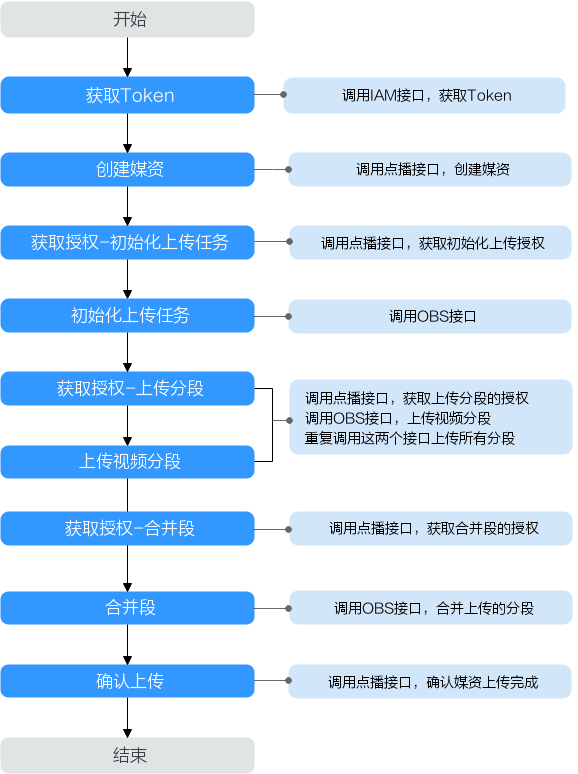
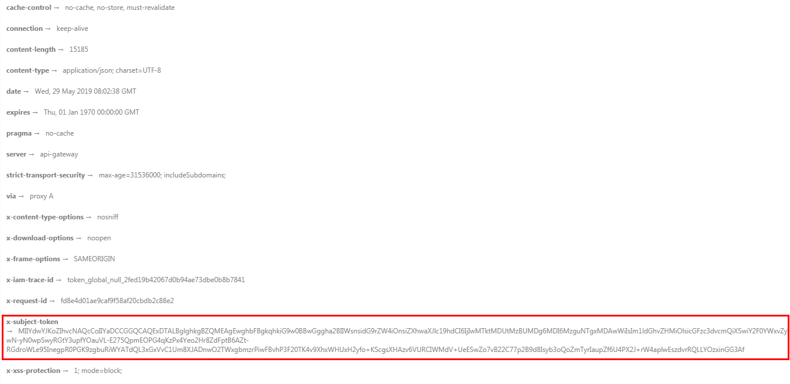

# 示例2：媒资分段上传（20M以上）<a name="vod_04_0216"></a>

## 场景描述<a name="section3467422104418"></a>

[示例1：媒资上传（20M以下）](示例1-媒资上传（20M以下）.md)已介绍了如何将小于20M大小的音视频文件上传到点播服务。若您需要上传的音视频文件的大小大于20M，您可以调用VOD API进行分段上传。

本章节指导用户如何使用API调用的方式上传一个文件大小大于20M的视频文件。

## 前提条件<a name="section1535328172818"></a>

-   已明确需要上传媒资的点播服务所在的区域信息，并获取该区域的Endpoint，您可以从[地区和终端节点](https://developer.huaweicloud.com/endpoint?VOD)获取。
-   已获取需要上传到对应点播服务所在区域的项目ID，具体获取方法请参见[获取项目ID](获取项目ID.md)。
-   待上传的视频文件已完成二进制流分割，每个分段的大小不能超过20M。

## 总体流程<a name="section15675193905619"></a>

**图 1**  媒资上传流程<a name="fig1465716529471"></a>  


1.  [获取用户Token](#li134912423710)
2.  [创建点播媒资](#li16635165815515)
3.  [获取初始化上传任务的授权](#li782121555817)
4.  [初始化上传任务](#li1797773483516)
5.  <a name="li272601318310"></a>[获取上传分段的授权](#li8913247134916)
6.  <a name="li144451892812"></a>[上传分段](#li1027416251210)
7.  参考[5](#li272601318310)-[6](#li144451892812)，将所有视频分段上传
8.  [获取列举已上传分段的授权](#li414915172295)
9.  [获取已上传的分段](#li267391015364)
10. [获取合并段的授权](#li34071429191710)
11. [合并上传的分段](#li26881244162214)
12. [确认媒资上传](#li1353022126)

## 操作步骤<a name="section3458122244512"></a>

1.  <a name="li134912423710"></a>[获取用户Token](https://support.huaweicloud.com/api-iam/iam_30_0001.html)，用于调用点播接口时进行认证鉴权。

    详细信息请参见[构造请求](构造请求.md)。以“华北-北京四”为示例，若您需要调用其它区域的点播接口，请替换成对应区域的[IAM终端节点](https://developer.huaweicloud.com/endpoint?IAM)。

    ```
    POST https://iam.cn-north-4.myhuaweicloud.com/v3/auth/tokens
    Content-Type: application/json
    
    {
      "auth": {
        "identity": {
          "methods": [
            "password"
          ],
          "password": {
            "user": {
              "name": "username", 
              "password": "password", 
              "domain": {
                "name": "domainname"   
              }
            }
          }
        },
        "scope": {
          "project": {
             "name": "projectname"
          }
        }
      }
    }
    ```

    如[图2](#fig955023251511)所示，红框中的信息为获取用户Token。

    **图 2**  获取用户Token<a name="fig955023251511"></a>  
    

2.  <a name="li16635165815515"></a>调用[创建媒资：上传方式](创建媒资-上传方式.md)接口，创建媒资。
    1.  选择**POST**请求方法并输入URI。

        ```
        https://vod.cn-north-4.myhuaweicloud.com/v1.0/{project_id}/asset
        ```

    2.  请求消息头中增加“X-Auth-Token“，值设置为[步骤1](#li134912423710)中获取的用户Token。
    3.  Request Body中传入参数如下：

        ```
        {
        	"title": "testVideo",
        	"description": "test",
        	"category_id": 87748,
        	"video_name": "test.mp4",
        	"video_type": "MP4",
        	"auto_publish": 0    
        }
        ```

        > **说明：** 
        >示例仅设置了部分媒资参数，您可以根据实际需求参考[创建媒资：上传方式](创建媒资-上传方式.md)接口的请求参数设置。

    4.  <a name="li198534575262"></a>请求响应成功后，返回处理媒资ID、视频上传地址及存储视频文件的OBS桶信息。

        ```
        {
            "asset_id": "fea62a2845e43c37b4cbfb017c0d0821",
            "video_upload_url": "https://vod-bucket-65-cn-north-4.obs.cn-north-4.myhuaweicloud.com:443/05041fffa4002****f6dc009cc6f8f33/fea62a2845e43c37b4cbfb017c0d0821/d1f221f09f6bffefb882c8f9e167483a.mp4?AWSAccessKeyId=MZH0LUL329N1SSXNB3S4&Expires=1596700132&Signature=GiHTcO2avO9B84sH8A5wL2GieCI%3D",
            "cover_upload_url": null,
            "subtitle_upload_urls": [],
            "target": {
                "bucket": "vod-bucket-65-cn-north-4",
                "location": "cn-north-4",
                "object": "05041fffa4002****f6dc009cc6f8f33/fea62a2845e43c37b4cbfb017c0d0821/d1f221f09f6bffefb882c8f9e167483a.mp4"
            }
        }
        ```


3.  <a name="li782121555817"></a>调用[获取分段上传授权](获取分段上传授权.md)接口，向OBS获取初始化上传任务的授权。
    1.  选择**GET**请求方法并输入URI。

        ```
        https://vod.cn-north-4.myhuaweicloud.com/v1.1/{project_id}/asset/authority?http_verb=POST&content_type=video/mp4&bucket=vod-bucket-65-cn-north-4&object_key=05041fffa4002****f6dc009cc6f8f33/fea62a2845e43c37b4cbfb017c0d0821/d1f221f09f6bffefb882c8f9e167483a.mp4
        ```

        -   http\_verb：分段上传时调用OBS接口的HTTP方法，具体操作需要的HTTP方法请参见[OBS API参考](https://support.huaweicloud.com/api-obs/obs_04_0098.html)。
        -   content\_type：文件类型对应的HTTP Content-type，您需要根据上传的视频格式进行设置，如MP4格式对应的是“video/mp4“。
        -   bucket：存储视频文件的OBS桶，[步骤2.d](#li198534575262)中返回的对应“bucket“字段。
        -   object\_key：OBS桶中的对象名，[步骤2.d](#li198534575262)中返回的对应“object“字段。

    2.  请求消息头中增加“X-Auth-Token”，值设置为[步骤1](#li134912423710)中获取的用户Token。
    3.  <a name="li1080710214598"></a>请求响应成功后，返回授权信息。

        ```
        {
            "sign_str": "https://vod-bucket-65-cn-north-4.obs.cn-north-4.myhuaweicloud.com:443/05041fffa4002****f6dc009cc6f8f33/fea62a2845e43c37b4cbfb017c0d0821/d1f221f09f6bffefb882c8f9e167483a.mp4?uploads&AWSAccessKeyId=MZH0LUL329N1SSXNB3S4&Expires=1596706429&Signature=5D15iJUcTkoWLpE2vn54FQZskXA%3D"
        }
        ```


4.  <a name="li1797773483516"></a>调用OBS的[初始化上传段任务](https://support.huaweicloud.com/api-obs/obs_04_0098.html)接口，初始化视频分段上传任务。
    1.  选择**POST**请求方法并输入[步骤3.c](#li1080710214598)返回的已授权URI。

        ```
        https://vod-bucket-65-cn-north-4.obs.cn-north-4.myhuaweicloud.com:443/05041fffa4002****f6dc009cc6f8f33/fea62a2845e43c37b4cbfb017c0d0821/d1f221f09f6bffefb882c8f9e167483a.mp4?uploads&AWSAccessKeyId=MZH0LUL329N1SSXNB3S4&Expires=1596706429&Signature=5D15iJUcTkoWLpE2vn54FQZskXA%3D
        ```

    2.  请求消息头中增加“Content-Type“，值设置为文件类型，请根据实际上传，如MP4格式设置为“video/mp4“。
    3.  <a name="li14759155494014"></a>请求成功，返回初始化信息。

        ```
        <?xml version="1.0" encoding="UTF-8" standalone="yes"?>
        <InitiateMultipartUploadResult xmlns="http://obs.cn-north-4.myhuaweicloud.com/doc/2015-06-30/">
            <Bucket>vod-bucket-65-cn-north-4</Bucket>
            <Key>05041fffa4002****f6dc009cc6f8f33/fea62a2845e43c37b4cbfb017c0d0821/d1f221f09f6bffefb882c8f9e167483a.mp4</Key>
            <UploadId>00000173C2ED862344C835374DFE33C8</UploadId>
        </InitiateMultipartUploadResult>
        ```


5.  <a name="li8913247134916"></a>调用[获取分段上传授权](获取分段上传授权.md)接口，获取分段上传的授权。
    1.  <a name="li146351927115017"></a>选择**GET**请求方法并输入URI。

        ```
        https://vod.cn-north-4.myhuaweicloud.com/v1.1/{project_id}/asset/authority?http_verb=PUT&content_type=video/mp4&bucket=vod-bucket-65-cn-north-4&object_key=05041fffa4002****f6dc009cc6f8f33/fea62a2845e43c37b4cbfb017c0d0821/d1f221f09f6bffefb882c8f9e167483a.mp4&content_md5=hHZXtgjYL2fmLpu%2byQ%2bXgg%3d%3d&upload_id=00000173C2ED862344C835374DFE33C8&part_number=1
        ```

        -   http\_verb：分段上传的HTTP方法为PUT。
        -   content\_type：文件类型对应的HTTP Content-type，您需要根据上传的视频格式进行设置，如MP4格式对应的是“video/mp4“。
        -   bucket：存储视频文件的OBS桶，[步骤2.d](#li198534575262)中返回的对应“bucket“字段。
        -   object\_key：OBS桶中的对象名，[步骤2.d](#li198534575262)中返回的对应“object“字段。
        -   content\_md5：每个视频分段的MD5值，该值为可选设置，具体生成方法可以参考[生成MD5值](生成MD5值.md)。
        -   upload\_id：上传任务的id，[步骤4.c](#li14759155494014)返回的“UploadId“字段。
        -   part\_number：每一个上传段的段号。

    2.  请求消息头中增加“X-Auth-Token”，值设置为[步骤1](#li134912423710)中获取的用户Token。
    3.  <a name="li13636122785015"></a>请求响应成功后，返回分段上传的授权信息。

        ```
        {
            "sign_str": "https://vod-bucket-65-cn-north-4.obs.cn-north-4.myhuaweicloud.com:443/05041fffa4002****f6dc009cc6f8f33/fea62a2845e43c37b4cbfb017c0d0821/d1f221f09f6bffefb882c8f9e167483a.mp4?AWSAccessKeyId=MZH0LUL329N1SSXNB3S4&Expires=1596708691&partNumber=1&uploadId=00000173C2ED862344C835374DFE33C8&Signature=cjw3CmUFeNBFAuLWBTsPRp9NfsQ%3D"
        }
        ```


6.  <a name="li1027416251210"></a>调用OBS的[上传段](https://support.huaweicloud.com/api-obs/obs_04_0099.html)接口，上传视频文件的第一个分段。
    1.  选择**PUT**请求方法并输入[步骤5.c](#li13636122785015)返回的已授权URI。

        ```
        https://vod-bucket-65-cn-north-4.obs.cn-north-4.myhuaweicloud.com:443/05041fffa4002****f6dc009cc6f8f33/fea62a2845e43c37b4cbfb017c0d0821/d1f221f09f6bffefb882c8f9e167483a.mp4?AWSAccessKeyId=MZH0LUL329N1SSXNB3S4&Expires=1596708691&partNumber=1&uploadId=00000173C2ED862344C835374DFE33C8&Signature=cjw3CmUFeNBFAuLWBTsPRp9NfsQ%3D
        ```

    2.  请求消息头中增加“Content-Type“，值设置为“application/octet-stream“。若[步骤5.a](#li146351927115017)设置了“content\_md5“参数，则请求消息头中必须增加“Content-MD5“，值设置为对应分段的MD5值，否则将会导致上传失败。
    3.  请求Body中使用二进制方式上传视频文件的第一个分段。
    4.  请求成功，返回状态码“200 OK“。

7.  参考操作[步骤5](#li8913247134916)-[步骤6](#li1027416251210)，上传视频文件的所有分段。
8.  <a name="li414915172295"></a>调用[获取分段上传授权](获取分段上传授权.md)接口，获取列举已上传段的授权。
    1.  选择**GET**请求方法并输入URI。

        ```
        https://vod.cn-north-4.myhuaweicloud.com/v1.1/{project_id}/asset/authority?http_verb=GET&bucket=vod-bucket-65-cn-north-4&object_key=05041fffa4002****f6dc009cc6f8f33/fea62a2845e43c37b4cbfb017c0d0821/d1f221f09f6bffefb882c8f9e167483a.mp4&upload_id=000001717E28524B44CEFF2C2CE1B06A
        ```

        -   http\_verb：合并段的HTTP方法为GET。
        -   bucket：存储视频文件的OBS桶，[步骤2.d](#li198534575262)中返回的对应“bucket“字段。
        -   object\_key：OBS桶中的对象名，[步骤2.d](#li198534575262)中返回的对应“object“字段。
        -   upload\_id：上传任务的id，[步骤4.c](#li14759155494014)返回的“UploadId“字段。

    2.  请求消息头中增加“X-Auth-Token”，值设置为[步骤1](#li134912423710)中获取的用户Token。
    3.  <a name="li17149171762916"></a>请求响应成功后，返回列举已上传段的授权信息。

        ```
        {
            "sign_str": "https://vod-bucket-65-cn-north-4.obs.cn-north-4.myhuaweicloud.com:443/05041fffa4002****f6dc009cc6f8f33/fea62a2845e43c37b4cbfb017c0d0821/d1f221f09f6bffefb882c8f9e167483a.mp4?AWSAccessKeyId=MZH0LUL329N1SSXNB3S4&Expires=1596710054&uploadId=000001717E28524B44CEFF2C2CE1B06A&Signature=G5EOUr488cyPIretp8lgQZmpPw0%3D"
        }
        ```


9.  <a name="li267391015364"></a>调用OBS的[列举已上传的段](https://support.huaweicloud.com/api-obs/obs_04_0101.html)接口，获取视频文件所有上传段的相关信息。
    1.  择**GET**请求方法并输入[步骤8.c](#li17149171762916)返回的已授权URI。

        ```
        https://vod-bucket-65-cn-north-4.obs.cn-north-4.myhuaweicloud.com:443/05041fffa4002****f6dc009cc6f8f33/fea62a2845e43c37b4cbfb017c0d0821/d1f221f09f6bffefb882c8f9e167483a.mp4?AWSAccessKeyId=MZH0LUL329N1SSXNB3S4&Expires=1596710054&uploadId=000001717E28524B44CEFF2C2CE1B06A&Signature=G5EOUr488cyPIretp8lgQZmpPw0%3D
        ```

    2.  <a name="li542164313390"></a>请求成功，返回已上传段的相关信息。

        ```
        <?xml version="1.0" encoding="UTF-8" standalone="yes"?>
        <ListPartsResult xmlns="http://obs.cn-north-4.myhuaweicloud.com/doc/2015-06-30/">
            <Bucket>vod-bucket-65-cn-north-4</Bucket>
            <Key>05041fffa4002****f6dc009cc6f8f33/fea62a2845e43c37b4cbfb017c0d0821/d1f221f09f6bffefb882c8f9e167483a.mp4</Key>
            <UploadId>00000173C2ED862344C835374DFE33C8</UploadId>
            <Initiator>
                <ID>d9235b9f3cf549499924f6de095241af:a96ecebcb3994e34b074e48f3dfc8237</ID>
                <DisplayName>xxx</DisplayName>
            </Initiator>
            <Owner>
                <ID>d9235b9f3cf549499924f6de095241af</ID>
                <DisplayName>xxx</DisplayName>
            </Owner>
            <StorageClass>STANDARD</StorageClass>
            <PartNumberMarker>0</PartNumberMarker>
            <NextPartNumberMarker>4</NextPartNumberMarker>
            <MaxParts>1000</MaxParts>
            <IsTruncated>false</IsTruncated>
            <Part>
                <PartNumber>1</PartNumber>
                <LastModified>2020-08-06T09:05:10.192Z</LastModified>
                <ETag>"847657b608d82f67e62e9bbec90f9782"</ETag>
                <Size>10000000</Size>
            </Part>
            <Part>
                <PartNumber>2</PartNumber>
                <LastModified>2020-08-06T08:02:02.821Z</LastModified>
                <ETag>"9a6a36ed9086a3a2fea130220e1e809c"</ETag>
                <Size>10000000</Size>
            </Part>
            <Part>
                <PartNumber>3</PartNumber>
                <LastModified>2020-08-06T08:04:19.711Z</LastModified>
                <ETag>"3a3afe552832bee0faf081c1e720067e"</ETag>
                <Size>10000000</Size>
            </Part>
            <Part>
                <PartNumber>4</PartNumber>
                <LastModified>2020-08-06T07:23:17.160Z</LastModified>
                <ETag>"6335af859c20ccef26b27ea691e7ecf7"</ETag>
                <Size>7472445</Size>
            </Part>
        </ListPartsResult>
        ```


10. <a name="li34071429191710"></a>调用[获取分段上传授权](获取分段上传授权.md)接口，获取合并段授权。
    1.  选择**GET**请求方法并输入URI。

        ```
        https://vod.cn-north-4.myhuaweicloud.com/v1.1/{project_id}/asset/authority?http_verb=POST&bucket=vod-bucket-65-cn-north-4&object_key=05041fffa4002****f6dc009cc6f8f33/fea62a2845e43c37b4cbfb017c0d0821/d1f221f09f6bffefb882c8f9e167483a.mp4&upload_id=00000173C2ED862344C835374DFE33C8
        ```

        -   http\_verb：合并段的HTTP方法为POST。
        -   bucket：存储视频文件的OBS桶，[步骤2.d](#li198534575262)中返回的对应“bucket“字段。
        -   object\_key：OBS桶中的对象名，[步骤2.d](#li198534575262)中返回的对应“object“字段。
        -   upload\_id：上传任务的id，[步骤4.c](#li14759155494014)返回的“UploadId“字段。

    2.  请求消息头中增加“X-Auth-Token”，值设置为[步骤1](#li134912423710)中获取的用户Token。
    3.  <a name="li189221657141716"></a>请求响应成功后，返回合上传段的授权信息。

        ```
        {
            "sign_str": "https://vod-bucket-65-cn-north-4.obs.cn-north-4.myhuaweicloud.com:443/05041fffa4002****f6dc009cc6f8f33/fea62a2845e43c37b4cbfb017c0d0821/d1f221f09f6bffefb882c8f9e167483a.mp4?AWSAccessKeyId=MZH0LUL329N1SSXNB3S4&Expires=1596709340&uploadId=000001717E28524B44CEFF2C2CE1B06A&Signature=Pa6IaMbH1Ofa0Vi%2BCbkdgmWzm70%3D"
        }
        ```


11. <a name="li26881244162214"></a>调用OBS的[合并段](https://support.huaweicloud.com/api-obs/obs_04_0102.html)接口，将上传的分段合并成一个视频文件。
    1.  选择**POST**请求方法并输入[步骤10.c](#li189221657141716)返回的已授权URI。

        ```
        https://vod-bucket-65-cn-north-4.obs.cn-north-4.myhuaweicloud.com:443/05041fffa4002****f6dc009cc6f8f33/fea62a2845e43c37b4cbfb017c0d0821/d1f221f09f6bffefb882c8f9e167483a.mp4?AWSAccessKeyId=MZH0LUL329N1SSXNB3S4&Expires=1596708691&partNumber=1&uploadId=00000173C2ED862344C835374DFE33C8&Signature=cjw3CmUFeNBFAuLWBTsPRp9NfsQ%3D
        ```

    2.  请求消息头中增加“Content-Type“，值设置为“application/xml“。
    3.  Request Body中传入参数如下：

        ```
        <CompleteMultipartUpload> 
             <Part>
                <PartNumber>1</PartNumber>
                <ETag>"847657b608d82f67e62e9bbec90f9782"</ETag>
            </Part>
            <Part>
                <PartNumber>2</PartNumber>
                <ETag>"9a6a36ed9086a3a2fea130220e1e809c"</ETag>
            </Part>
            <Part>
                <PartNumber>3</PartNumber>
                <ETag>"3a3afe552832bee0faf081c1e720067e"</ETag>
            </Part>
            <Part>
                <PartNumber>4</PartNumber>
                <ETag>"6335af859c20ccef26b27ea691e7ecf7"</ETag>
            </Part>
        </CompleteMultipartUpload>
        ```

        -   PartNumber：上传的段号。
        -   ETag：上传段成功后返回的ETag值，[步骤9.b](#li542164313390)中的返回信息有每个段对应的ETag值。

    4.  请求成功，返回合并段的相关信息。

        ```
        <?xml version="1.0" encoding="UTF-8" standalone="yes"?>
        <CompleteMultipartUploadResult xmlns="http://obs.cn-north-4.myhuaweicloud.com/doc/2015-06-30/">
            <Location>05041fffa4002****f6dc009cc6f8f33/fea62a2845e43c37b4cbfb017c0d0821/d1f221f09f6bffefb882c8f9e167483a.mp4</Location>
            <Bucket>vod-bucket-65-cn-north-4</Bucket>
            <Key>05041fffa4002****f6dc009cc6f8f33/fea62a2845e43c37b4cbfb017c0d0821/d1f221f09f6bffefb882c8f9e167483a.mp4</Key>
            <ETag>"87f450dd18b666dfcdf902ac6b162b5a-4"</ETag>
        </CompleteMultipartUploadResult>
        ```


12. <a name="li1353022126"></a>调用[确认媒资上传](确认媒资上传.md)接口，完成媒资上传确认。
    1.  选择**POST**请求方法并输入URI。

        ```
        https://vod.cn-north-4.myhuaweicloud.com/v1.0/{project_id}/asset/status/uploaded
        ```

    2.  请求消息头中增加“X-Auth-Token”，值设置为[步骤1](#li134912423710)中获取的用户Token。
    3.  Request Body中传入参数如下：

        ```
        {
           "asset_id": "fea62a2845e43c37b4cbfb017c0d0821",
           "status":"CREATED" 
        }
        ```

    4.  请求响应成功后，返回媒资ID。

        ```
        {
           "asset_id": "fea62a2845e43c37b4cbfb017c0d0821" 
        }
        ```


