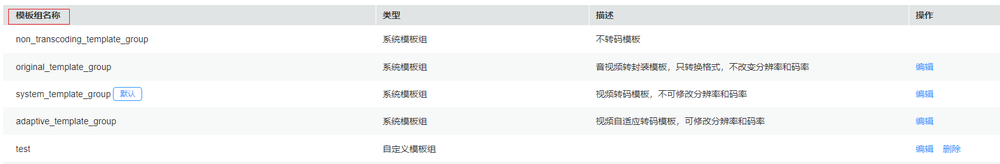
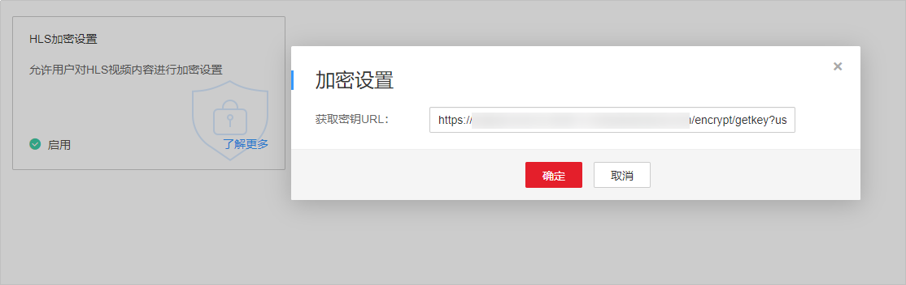

# 示例3：视频处理<a name="vod_04_0215"></a>

## 场景描述<a name="section5550124610275"></a>

音视频上传时，可以设置媒资处理参数，上传完成后，自动根据设置的参数进行音视频处理。若您需要对已上传的视频进行处理，您也可以调用VOD API实现。

本章节指导用户如何使用API调用的方式处理已上传的视频文件，包括视频转码、截图、加密等，支持同时启动多种处理操作，也可以只启动一种处理操作。

## 前提条件<a name="section1535328172818"></a>

-   已明确需要处理的视频文件所在区域信息，并获取该区域的Endpoint，您可以从[地区和终端节点](https://developer.huaweicloud.com/endpoint?MPC)获取。
-   已获取需要处理的视频文件所在区域的项目ID，具体获取方法请参见[获取项目ID](获取项目ID.md)。

## 总体流程<a name="section1753716933710"></a>

-   [获取用户Token](#li2334325914)
-   [（可选）创建转码模板](#li1405244112716)
-   [（可选）设置搭建的密钥管理服务的URL](#li5605136502)
-   [创建视频处理任务](#li1799120485439)
-   [查询视频处理执行情况](#li1475102024712)

## 操作步骤<a name="section6562835174311"></a>

1.  <a name="li2334325914"></a>[获取用户Token](https://support.huaweicloud.com/api-iam/iam_30_0001.html)，用于调用创建媒资上传接口时进行认证鉴权。

    详细信息请参见[构造请求](构造请求.md)。以“华北-北京四”为示例，若您需要调用其它区域的点播接口，请替换成对应区域的[IAM终端节点](https://developer.huaweicloud.com/endpoint?IAM)。

    ```
    POST https://iam.cn-north-4.myhuaweicloud.com/v3/auth/tokens
    Content-Type: application/json
    
    {
      "auth": {
        "identity": {
          "methods": [
            "password"
          ],
          "password": {
            "user": {
              "name": "username", 
              "password": "password", 
              "domain": {
                "name": "domainname"   
              }
            }
          }
        },
        "scope": {
          "project": {
             "name": "projectname"
          }
        }
      }
    }
    ```

    如[图1](#vod_04_0195_fig955023251511)所示，红框中的信息为获取用户Token。

    **图 1**  获取用户Token<a name="vod_04_0195_fig955023251511"></a>  
    

2.  <a name="li1405244112716"></a>在视频点播控制台创建自定义转码模板，具体操作请参见[转码设置](https://support.huaweicloud.com/usermanual-vod/vod_01_0072.html)。

    您也可以使用点播服务提供的系统转码模板。创建转码模板后，您可以在视频点播控制台获取需要使用的转码模板的模板名称。

    **图 2**  获取转码模板名称<a name="fig137441551143018"></a>  
    

3.  <a name="li5605136502"></a>在视频点播控制台配置搭建的密钥管理服务的URL，具体操作请参见[HLS加密设置](https://support.huaweicloud.com/usermanual-vod/vod_01_0073.html)。

    仅能对转码输出格式为HLS的视频进行加密。若不需要进行加密操作，可以跳过该步骤。

    **图 3**  加密设置<a name="fig8327639323"></a>  
    

4.  <a name="li1799120485439"></a>创建视频处理任务。
    1.  选择**POST**请求方法并输入URI。

        ```
        https://{endpoint}/v1.0/{project_id}/asset/process
        ```

    2.  请求消息头中增加“X-Auth-Token”，值设置为步骤[1](#li17445117513)中获取的用户Token。
    3.  Request Body中传入参数如下：

        ```
        {
        	"asset_id": "b4f39691d66cc0ef75d62ee567146e11",
        	"template_group_name": "test",
        	"auto_encrypt":0,
        	"thumbnail":{
        		"type":"time",
        		"time":12
        		
        	},
        	"subtitle_id":[1]
        }
        ```

        > **说明：** 
        >仅在[示例1：媒资上传](示例1-媒资上传.md)时，请求参数设置了“subtitles“时，才可以在视频处理时，更换字幕文件，设置的“subtitle\_id“才有效。

    4.  请求响应成功后，返回处理媒资ID。

        ```
        {
          "asset_id": "b4f39691d66cc0ef75d62ee567146e11"
        }
        ```

5.  <a name="li1475102024712"></a>调用查询详细信息接口查询视频处理执行情况，具体调用方法请参见[示例2：获取媒资详情](示例2-获取媒资详情.md)。

    视频处理任务执行的时间与视频文件的大小、设置的处理操作个数等有关，建议视频任务提交5-10分钟后再查询执行情况。


