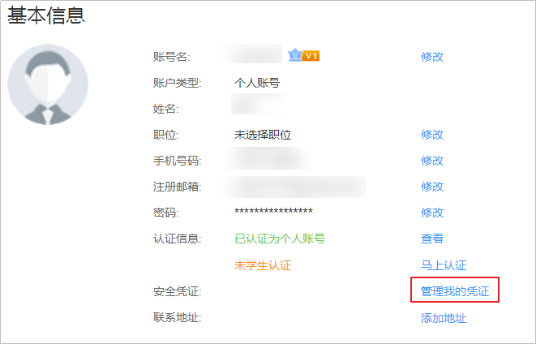
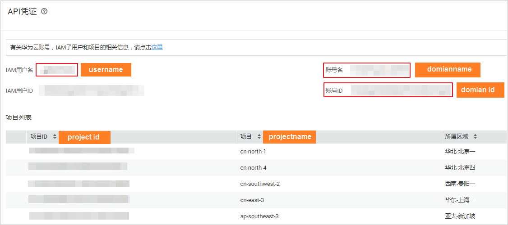

# 获取项目ID<a name="zh-cn_topic_0171449878"></a>

在调用接口的时候，部分URL中需要填入项目ID，所以需要获取到项目ID。您可以通过以下两种方式获取项目ID。

## 从控制台获取项目ID<a name="section16150143114253"></a>

1.  登录[华为云](https://auth.huaweicloud.com/authui/login.action?service=https://account.huaweicloud.com/usercenter/#/login)官网，在右上角单击账号名，选择“账号中心”。
2.  在基本信息页面单击“管理我的凭证“，进入“我的凭证”页面。

    **图 1**  基本信息<a name="zh-cn_topic_0161541108_fig651815401114"></a>  
    

3.  在左侧导航栏中选择“API凭证“，即可获取对应的项目ID信息。

    **图 2**  获取项目ID<a name="zh-cn_topic_0161541108_fig177761853216"></a>  
    


## 调用API获取项目ID<a name="section5912143972911"></a>

您还能通过调用[查询指定条件下的项目信息](https://support.huaweicloud.com/api-iam/zh-cn_topic_0057845625.html)API获取项目ID。

获取项目ID的接口为“GET https://\{Endpoint\}/v3/projects/”，其中\{Endpoint\}为IAM的终端节点，可以从[地区和终端节点](https://developer.huaweicloud.com/endpoint?IAM)获取。接口的认证鉴权请参见[认证鉴权](https://support.huaweicloud.com/api-vod/zh-cn_topic_0171436914.html)。

响应示例如下，其中projects下的“id”即为项目ID。

```
{ 
    "projects": [ 
        { 
            "domain_id": "65382450e8f64ac0870cd180d14e684b", 
            "is_domain": false, 
            "parent_id": "65382450e8f64ac0870cd180d14e684b", 
            "name": "cn-north-4", 
            "description": "", 
            "links": { 
                "next": null, 
                "previous": null, 
                "self": "https://www.example.com/v3/projects/a4a5d4098fb4474fa22cd05f897d6b99" 
            }, 
            "id": "a4a5d4098fb4474fa22cd05f897d6b99", 
            "enabled": true 
        } 
    ], 
    "links": { 
        "next": null, 
        "previous": null, 
        "self": "https://www.example.com/v3/projects" 
    } 
}
```

