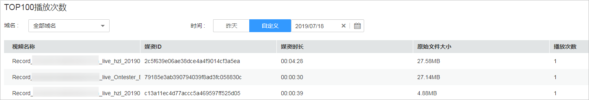

# CDN热点统计

点播服务提供了CDN热点统计功能，您可以根据域名查看音视频文件播放量的TOP排名。

## 注意事项

由于CDN热点统计是根据CDN的内容请求次数来统计媒资播放次数的，由于存在请求数大于播放次数的可能，所以CDN热点统计可能与SDK热点统计的数据存在差异。

## 查询说明

-   查询时间必须为昨天或之前的日期，支持查询最近1个月内的历史数据。
-   支持查看全部域名或单域名下的TOP100播放次数。

## 查询步骤

1.  登录[视频点播控制台](视频点播控制台https://console.huaweicloud.com/vod)。
2.  在左侧导航栏选择“统计分析 \> CDN热点统计”，进入CDN热点统计页面。
3.  选择需要查询的域名及时间段（昨天或自定义），查看单音视频播放次数TOP100的数据。

    **图 1**  TOP100播放次数  
    

