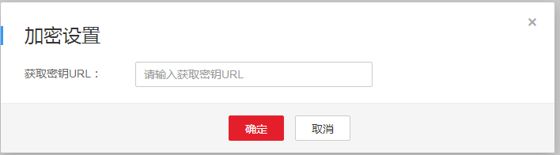

# HLS加密设置

防盗链机制只能避免非授权用户拿到URL后去下载、播放视频，但无法阻止恶意的付费用户将视频下载到本地后进行二次分发。因此，为有效防止视频泄露和盗链问题，华为云提供对HLS视频进行内容加密的能力，加密后的视频，即使恶意用户下载也很难分发给其他人观看。

> **说明：**   
>HLS加密的具体实现原理及流程请参见[通过HLS加密防止视频泄露](https://support.huaweicloud.com/bestpractice-vod/zh-cn_topic_0173947041.html)。  

## 注意事项

-   加密任务必须和转码任务合在一起进行。因此，HLS加密将会产生视频转码费用，具体请参考[价格说明](https://support.huaweicloud.com/price-vod/vod070001.html)。
-   加密不会对原始上传的视频进行，只针对转码输出的HLS流加密，若转码的输出为MP4、DASH等其他类型，则不支持加密。
-   加密、解密均依照HLS规范进行，只有支持播放HLS流的播放器才能播放。
-   修改了获取密钥URL，需要对已加密的视频进行重新转码加密，否则新的加密密钥无法应用到视频中。

## 前提条件

已搭建密钥管理服务和Token生成服务，具体搭建方法请参见[通过HLS加密防止视频泄露](https://support.huaweicloud.com/bestpractice-vod/zh-cn_topic_0173947041.html)。

## 操作步骤

1.  登录[视频点播控制台](视频点播控制台https://console.huaweicloud.com/vod)。
2.  在左侧导航栏选择“全局设置  \>  安全设置“，进入安全设置页面
3.  单击“HLS加密设置”，弹出“加密设置”界面，输入“获取密钥URL“，如[图1](#fig53996414018)所示。

    **图 1**  加密设置页面  
    

    **获取密钥URL：**如前提条件中搭建的密钥管理服务的地址。

    **示例**：https://domain-sample/get-key

4.  单击“确认”，完成配置。
5.  配置完成后，您需要使用转码功能对视频文件进行加密。
    1.  在左侧导航树中选择“音视频管理”，进入音视频管理页面。
    2.  勾选需要HLS加密的视频，单击“转码”，选择创建的转码模板。

        当“转码状态”为“转码成功”时，表示HLS加密完成。

