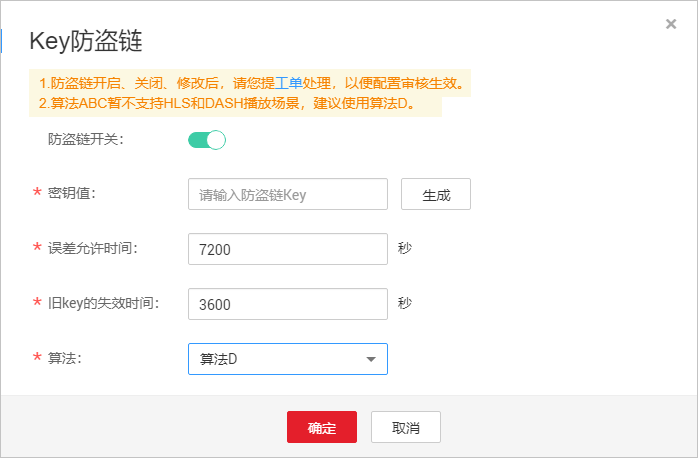
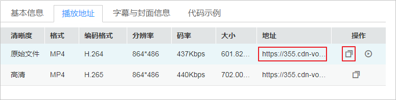

# Key防盗链<a name="vod010014"></a>

使用Referer防盗链可以对访问者的身份进行过滤，但Referer内容是可伪造的，无法彻底保障点播资源的安全。所以视频点播还提供了Key防盗链功能，用户可以自行配置Key值，并生成对应的播放URL，且该链接有一定的时效性，从而有效地保障了用户上传到点播服务上的资源不被非法盗用。您可以参考如下步骤完成Key防盗链的配置，也可以通过[视频指导](https://bbs.huaweicloud.com/videos/a8464ac1a5e4474980f7b86559540994)来操作。

## 实现原理<a name="section81121143172618"></a>

在控制配置Key防盗链功能后，点播服务会将配置的密钥值等信息同步到CDN节点中。用户请求点播资源的流程如下所示：

1.  观众通过提供的鉴权播放URL向CDN请求视频播放。
2.  CDN根据播放URL中携带的鉴权信息校验请求的合法性，仅校验通过的请求会被允许。

## 注意事项<a name="section257818139314"></a>

-   该功能为可选项，默认不启用。
-   启用该功能后，原始视频加速URL将无法播放，需要按规则生成合法的防盗链URL。
-   若防盗链URL过期，或者签名不能通过，将无法播放视频，并返回“403 Forbidden”信息。
-   加密算法ABC暂不支持HLS和DASH播放场景。
-   若需要关闭Key防盗链，请[提交工单](https://console.huaweicloud.com/ticket/?#/ticketindex/business?productTypeId=462902cc39a04ab3a429df872021f970)申请。

## 配置步骤<a name="section8975140513"></a>

1.  登录[视频点播控制台](视频点播控制台https://console.huaweicloud.com/vod)。
2.  在左侧导航栏选择“域名管理”，进入域名管理界面。
3.  单击域名右侧“配置 ”，选择“防盗链”页签。
4.  单击“Key防盗链”板块，打开“防盗链开关”。
5.  配置Key防盗链参数，具体如[表1](#table9974649519)所示。

    **图 1**  配置Key防盗链<a name="fig45872508437"></a>  
    

    **表 1**  参数说明

    <a name="table9974649519"></a>
    <table><thead align="left"><tr id="row1497218417515"><th class="cellrowborder" valign="top" width="25.840000000000003%" id="mcps1.2.3.1.1"><p id="p2972154555"><a name="p2972154555"></a><a name="p2972154555"></a>参数</p>
    </th>
    <th class="cellrowborder" valign="top" width="74.16%" id="mcps1.2.3.1.2"><p id="p7972741858"><a name="p7972741858"></a><a name="p7972741858"></a>说明</p>
    </th>
    </tr>
    </thead>
    <tbody><tr id="row179736410511"><td class="cellrowborder" valign="top" width="25.840000000000003%" headers="mcps1.2.3.1.1 "><p id="p16972341857"><a name="p16972341857"></a><a name="p16972341857"></a>密钥值</p>
    </td>
    <td class="cellrowborder" valign="top" width="74.16%" headers="mcps1.2.3.1.2 "><p id="p997217410513"><a name="p997217410513"></a><a name="p997217410513"></a>即Key值，单击“生成”，可自动生成符合格式的密钥值。</p>
    </td>
    </tr>
    <tr id="row12973041050"><td class="cellrowborder" valign="top" width="25.840000000000003%" headers="mcps1.2.3.1.1 "><p id="p12973841758"><a name="p12973841758"></a><a name="p12973841758"></a>误差允许时间</p>
    </td>
    <td class="cellrowborder" valign="top" width="74.16%" headers="mcps1.2.3.1.2 "><p id="p1432280192815"><a name="p1432280192815"></a><a name="p1432280192815"></a>表示当前防盗链有效时间，默认为120分钟。</p>
    <p id="p22451257162013"><a name="p22451257162013"></a><a name="p22451257162013"></a>示例：若鉴权URL生成时间为1573806090（2019/11/15 16:21:30），配置的<span class="parmname" id="parmname031311501356"><a name="parmname031311501356"></a><a name="parmname031311501356"></a>“误差允许时间”</span>为120分钟，则鉴权URL的失效时间为2019/11/15 18:21:30。</p>
    </td>
    </tr>
    <tr id="row169731044515"><td class="cellrowborder" valign="top" width="25.840000000000003%" headers="mcps1.2.3.1.1 "><p id="p12973184055"><a name="p12973184055"></a><a name="p12973184055"></a>旧key的失效时间</p>
    </td>
    <td class="cellrowborder" valign="top" width="74.16%" headers="mcps1.2.3.1.2 "><p id="p139739416515"><a name="p139739416515"></a><a name="p139739416515"></a>采用新Key时，旧Key值的失效时间，从新Key生效时开始计算，默认60分钟后失效。</p>
    <p id="p79211317172512"><a name="p79211317172512"></a><a name="p79211317172512"></a>示例：若新Key生效时间为2019/11/15 16:21:30，配置的<span class="parmname" id="parmname132481455103510"><a name="parmname132481455103510"></a><a name="parmname132481455103510"></a>“旧Key的失效时间”</span>为60分钟，则旧鉴权URL的真正失效时间为2019/11/15 17:21:30。</p>
    </td>
    </tr>
    <tr id="row0974147514"><td class="cellrowborder" valign="top" width="25.840000000000003%" headers="mcps1.2.3.1.1 "><p id="p097410411520"><a name="p097410411520"></a><a name="p097410411520"></a>算法</p>
    </td>
    <td class="cellrowborder" valign="top" width="74.16%" headers="mcps1.2.3.1.2 "><p id="p5974641653"><a name="p5974641653"></a><a name="p5974641653"></a>Key值加密算法，有ABCD四种算法，默认为算法D（安全的对称加密算法）。</p>
    <div class="note" id="note840115352011"><a name="note840115352011"></a><a name="note840115352011"></a><span class="notetitle"> 说明： </span><div class="notebody"><p id="p164011235803"><a name="p164011235803"></a><a name="p164011235803"></a>算法ABC暂不支持HLS和DASH播放场景，建议使用算法D。</p>
    </div></div>
    </td>
    </tr>
    </tbody>
    </table>

6.  单击“确定”，完成参数配置。
7.  [提交工单](https://console.huaweicloud.com/ticket/?#/ticketindex/business?productTypeId=462902cc39a04ab3a429df872021f970)申请审核，提交的信息需要包含配置的域名，及[表1](#table9974649519)中的信息。

    审核通过后Key防盗链功能才会生效。若修改了Key防盗链配置，需要重新[提交工单](https://console.huaweicloud.com/ticket/?#/ticketindex/business?productTypeId=462902cc39a04ab3a429df872021f970)审核。

8.  验证Key防盗链生效是否生效。

    获取对应的鉴权播放地址，并使用该地址进行播放，若播放成功，则表示Key防盗链配置生效。


## 生成鉴权URL<a name="section442013352310"></a>

**控制台获取**

1.  登录[视频点播控制台](视频点播控制台https://console.huaweicloud.com/vod)。
2.  在左侧导航栏选择“音视频管理”，进入音视频管理界面。
3.  在对应的音视频行单击“管理“，选择播放地址，进入播放地址展示页面。

    其中“地址“列为音视频的原始地址，单击即可获取鉴权URL。

    **图 2**  获取鉴权URL<a name="fig17366229445"></a>  
    


**SDK生成鉴权URL**

您也只可以下载服务端SDK，通过SDK来生成媒资的鉴权URL，具体请参见[获取CDN加速域名Key防盗链URL](https://support.huaweicloud.com/ssdk-vod/vod_05_0050.html)。

## 加密算法A<a name="section152233717511"></a>

**鉴权URL格式**

```
原始URL?auth_key={timestamp}-{rand}-{uid}-{auth_key}
```

**auth\_key**的计算公式：

```
auth_key = MD5(/asset/{assetId}/{file_name}-{timestamp}-{rand}-{uid}-{private_key})
```

**表 2**  鉴权字段描述

<a name="table490961813212"></a>
<table><thead align="left"><tr id="row691061852112"><th class="cellrowborder" valign="top" width="21.55%" id="mcps1.2.3.1.1"><p id="p16583925162413"><a name="p16583925162413"></a><a name="p16583925162413"></a>字段</p>
</th>
<th class="cellrowborder" valign="top" width="78.45%" id="mcps1.2.3.1.2"><p id="p191001872110"><a name="p191001872110"></a><a name="p191001872110"></a>描述</p>
</th>
</tr>
</thead>
<tbody><tr id="row1720717196316"><td class="cellrowborder" valign="top" width="21.55%" headers="mcps1.2.3.1.1 "><p id="p13910518172117"><a name="p13910518172117"></a><a name="p13910518172117"></a>timestamp</p>
</td>
<td class="cellrowborder" valign="top" width="78.45%" headers="mcps1.2.3.1.2 "><p id="p11582720164616"><a name="p11582720164616"></a><a name="p11582720164616"></a>鉴权URL生成时间，为Unix时间戳，1970年1月1日以来的秒数。</p>
<p id="p9703119268"><a name="p9703119268"></a><a name="p9703119268"></a>示例：1564731935（即2019.08.02 15.45）</p>
</td>
</tr>
<tr id="row153813413319"><td class="cellrowborder" valign="top" width="21.55%" headers="mcps1.2.3.1.1 "><p id="p4910121815212"><a name="p4910121815212"></a><a name="p4910121815212"></a>rand</p>
</td>
<td class="cellrowborder" valign="top" width="78.45%" headers="mcps1.2.3.1.2 "><p id="p146406263810"><a name="p146406263810"></a><a name="p146406263810"></a>随机数，建议使用UUID ，不能包含中划线”-“。</p>
<p id="p159111218102113"><a name="p159111218102113"></a><a name="p159111218102113"></a>示例：f03cbe7c4a3849bc8d8769e3110e4533</p>
</td>
</tr>
<tr id="row13721482031"><td class="cellrowborder" valign="top" width="21.55%" headers="mcps1.2.3.1.1 "><p id="p17911518142110"><a name="p17911518142110"></a><a name="p17911518142110"></a>uid</p>
</td>
<td class="cellrowborder" valign="top" width="78.45%" headers="mcps1.2.3.1.2 "><p id="p1891191816212"><a name="p1891191816212"></a><a name="p1891191816212"></a>暂未使用，直接设置成0即可。</p>
</td>
</tr>
<tr id="row14304017153118"><td class="cellrowborder" valign="top" width="21.55%" headers="mcps1.2.3.1.1 "><p id="p203056178319"><a name="p203056178319"></a><a name="p203056178319"></a>private_key</p>
</td>
<td class="cellrowborder" valign="top" width="78.45%" headers="mcps1.2.3.1.2 "><p id="p7305517143115"><a name="p7305517143115"></a><a name="p7305517143115"></a>在控制台设置的防盗链Key值，具体请参见<a href="#section8975140513">配置步骤</a>。</p>
</td>
</tr>
</tbody>
</table>

**鉴权URL示例**

```
原始URL：http://1.cdn.myhuaweicloud.com/asset/6b2d740f10b8697d8ea6672868ecdb6f/test.mp4
private_key：myPrivateKey
timestamp：1547123166
rand：477b3bbc253f467b8def6711128c7bec
uid：0
```

则根据计算公式，得到**auth\_key**

```
auth_key = md5(/asset/6b2d740f10b8697d8ea6672868ecdb6f/test.mp4-1547123166-477b3bbc253f467b8def6711128c7bec-0-myPrivateKey) = 584883719a3f722bf1a32a3b0a4d25dd
```

最终得到算法A的鉴权URL

```
http://1.cdn.myhuaweicloud.com/asset/6b2d740f10b8697d8ea6672868ecdb6f/test.mp4?auth_key=1547123166-477b3bbc253f467b8def6711128c7bec-0-584883719a3f722bf1a32a3b0a4d25dd
```

## 加密算法B<a name="section20253496273"></a>

**鉴权URL格式**

```
https://{cdn_domain}/{date_YYYYmmddHHMM}/{md5sum}/asset/{asset_id}/{file_name}
```

**md5sum**的计算公式：

```
md5sum = md5({private_key}{date_yyyyMMddHHmm}/asset/{asset_id}/{file_name})
```

**表 3**  鉴权字段描述

<a name="table2271383454"></a>
<table><thead align="left"><tr id="row82711586455"><th class="cellrowborder" valign="top" width="24.84%" id="mcps1.2.3.1.1"><p id="p92714812454"><a name="p92714812454"></a><a name="p92714812454"></a>字段</p>
</th>
<th class="cellrowborder" valign="top" width="75.16000000000001%" id="mcps1.2.3.1.2"><p id="p1127112815455"><a name="p1127112815455"></a><a name="p1127112815455"></a>描述</p>
</th>
</tr>
</thead>
<tbody><tr id="row281552316452"><td class="cellrowborder" valign="top" width="24.84%" headers="mcps1.2.3.1.1 "><p id="p13428182984518"><a name="p13428182984518"></a><a name="p13428182984518"></a>date_yyyyMMddHHmm</p>
</td>
<td class="cellrowborder" valign="top" width="75.16000000000001%" headers="mcps1.2.3.1.2 "><p id="p842852974519"><a name="p842852974519"></a><a name="p842852974519"></a>鉴权URL生成时间，格式为：yyyyMMddHHmm。</p>
<p id="p19542164116458"><a name="p19542164116458"></a><a name="p19542164116458"></a>示例：201908051445</p>
</td>
</tr>
<tr id="row192721383457"><td class="cellrowborder" valign="top" width="24.84%" headers="mcps1.2.3.1.1 "><p id="p1727218184515"><a name="p1727218184515"></a><a name="p1727218184515"></a>file_name</p>
</td>
<td class="cellrowborder" valign="top" width="75.16000000000001%" headers="mcps1.2.3.1.2 "><p id="p5821115615464"><a name="p5821115615464"></a><a name="p5821115615464"></a>指原始播放URL中从媒资ID后开始到最后的路径。</p>
<p id="p2027214820459"><a name="p2027214820459"></a><a name="p2027214820459"></a>示例：play_video/test.mp4</p>
</td>
</tr>
<tr id="row52729811454"><td class="cellrowborder" valign="top" width="24.84%" headers="mcps1.2.3.1.1 "><p id="p227278194512"><a name="p227278194512"></a><a name="p227278194512"></a>private_key</p>
</td>
<td class="cellrowborder" valign="top" width="75.16000000000001%" headers="mcps1.2.3.1.2 "><p id="p1727218814519"><a name="p1727218814519"></a><a name="p1727218814519"></a>在控制台设置的防盗链Key值，具体请参见<a href="#section8975140513">配置步骤</a>。</p>
</td>
</tr>
</tbody>
</table>

**鉴权URL示例**

```
原始URL：http://1.cdn.myhuaweicloud.com/asset/6b2d740f10b8697d8ea6672868ecdb6f/test.mp4
private_key：myPrivateKey
date_yyyyMMddHHmm：201901102026
file_name：test.mp4
```

则根据计算公式，得到**md5sum**

```
md5sum = md5(myPrivateKey201901102026/asset/6b2d740f10b8697d8ea6672868ecdb6f/test.mp4) = 713ef643de8df076da6ec3c0545968cb
```

最终得到算法B的鉴权URL

```
http://1.cdn.myhuaweicloud.com/201901102026/713ef643de8df076da6ec3c0545968cb/asset/6b2d740f10b8697d8ea6672868ecdb6f/test.mp4
```

## 加密算法C<a name="section1121142971020"></a>

**鉴权URL格式**

```
https://{cdn_domain}/{md5hash}/{time_hex}/asset/{asset_id}/{file_name}
```

**md5hash**的计算公式**：**

```
md5hash = md5({private_key}/asset/{asset_id}/{file_name}{time_hex})
```

**表 4**  鉴权字段描述

<a name="table1618218281199"></a>
<table><thead align="left"><tr id="row218302818193"><th class="cellrowborder" valign="top" width="29.630000000000003%" id="mcps1.2.3.1.1"><p id="p6183162812191"><a name="p6183162812191"></a><a name="p6183162812191"></a>字段</p>
</th>
<th class="cellrowborder" valign="top" width="70.37%" id="mcps1.2.3.1.2"><p id="p1918302821919"><a name="p1918302821919"></a><a name="p1918302821919"></a>描述</p>
</th>
</tr>
</thead>
<tbody><tr id="row066562410563"><td class="cellrowborder" valign="top" width="29.630000000000003%" headers="mcps1.2.3.1.1 "><p id="p34871543125616"><a name="p34871543125616"></a><a name="p34871543125616"></a>file_name</p>
</td>
<td class="cellrowborder" valign="top" width="70.37%" headers="mcps1.2.3.1.2 "><p id="p597062320592"><a name="p597062320592"></a><a name="p597062320592"></a>指原始播放URL中从媒资ID后开始到最后的路径。</p>
<p id="p17970112319594"><a name="p17970112319594"></a><a name="p17970112319594"></a>示例：play_video/test.mp4</p>
</td>
</tr>
<tr id="row8183028191911"><td class="cellrowborder" valign="top" width="29.630000000000003%" headers="mcps1.2.3.1.1 "><p id="p52702036195910"><a name="p52702036195910"></a><a name="p52702036195910"></a>time_hex</p>
</td>
<td class="cellrowborder" valign="top" width="70.37%" headers="mcps1.2.3.1.2 "><p id="p1018342871917"><a name="p1018342871917"></a><a name="p1018342871917"></a>鉴权URL生成时间，为Unix时间戳的十六进制结果。</p>
<p id="p613919597310"><a name="p613919597310"></a><a name="p613919597310"></a>示例：hex(1564987530)=5D47D08A</p>
</td>
</tr>
<tr id="row718316287199"><td class="cellrowborder" valign="top" width="29.630000000000003%" headers="mcps1.2.3.1.1 "><p id="p9183828201917"><a name="p9183828201917"></a><a name="p9183828201917"></a>private_key</p>
</td>
<td class="cellrowborder" valign="top" width="70.37%" headers="mcps1.2.3.1.2 "><p id="p198611561303"><a name="p198611561303"></a><a name="p198611561303"></a>在控制台设置的防盗链Key值，具体请参见<a href="#section8975140513">配置步骤</a>。</p>
</td>
</tr>
</tbody>
</table>

**鉴权URL示例**

```
原始URL：http://1.cdn.myhuaweicloud.com/asset/6b2d740f10b8697d8ea6672868ecdb6f/test.mp4
private_key：myPrivateKey
time_hex：hex(timestamp) = hex(1547123166) = 5C3739DE
file_name：test.mp4
```

则根据计算公式，得到**md5sum**

```
md5hash=md5(myPrivateKey/asset/6b2d740f10b8697d8ea6672868ecdb6f/test.mp45C3739DE) = afa20c956043fe6d130b16f2704ac870
```

最终得到算法C的鉴权URL

```
http://1.cdn.myhuaweicloud.com/afa20c956043fe6d130b16f2704ac870/5C3739DE/asset/6b2d740f10b8697d8ea6672868ecdb6f/test.mp4 
```

## 加密算法D<a name="section9966544143317"></a>

**鉴权URL格式**

```
原始URL?auth_info={加密串}.{EncodedIV}
```

**加密串**和**EncodedIV**的计算公式：

-   加密原始串 = url\_encoding\(\{path\}+"$"+\{Timestamp\}\)
-   加密串 = aes\_cbc\_128\_pkcs5padding\(原始加密串,key,IV\)
-   EncodedIV = hex\(IV\)

**表 5**  鉴权字段描述

<a name="table770214491206"></a>
<table><thead align="left"><tr id="row1070394911016"><th class="cellrowborder" valign="top" width="30.48%" id="mcps1.2.3.1.1"><p id="p15703749708"><a name="p15703749708"></a><a name="p15703749708"></a>字段</p>
</th>
<th class="cellrowborder" valign="top" width="69.52000000000001%" id="mcps1.2.3.1.2"><p id="p1070314493020"><a name="p1070314493020"></a><a name="p1070314493020"></a>描述</p>
</th>
</tr>
</thead>
<tbody><tr id="row870315491903"><td class="cellrowborder" valign="top" width="30.48%" headers="mcps1.2.3.1.1 "><p id="p156117497713"><a name="p156117497713"></a><a name="p156117497713"></a>path</p>
</td>
<td class="cellrowborder" valign="top" width="69.52000000000001%" headers="mcps1.2.3.1.2 "><p id="p1670324919018"><a name="p1670324919018"></a><a name="p1670324919018"></a>指从域名开始，到最后一层目录，包括域名后的“/”，也包含最后一层目录后的“/”，不包括文件名。</p>
<p id="p104915268920"><a name="p104915268920"></a><a name="p104915268920"></a>示例：/asset/32237c8f68fcc6071a2d8e3421eee20d/play_video/</p>
</td>
</tr>
<tr id="row137031349806"><td class="cellrowborder" valign="top" width="30.48%" headers="mcps1.2.3.1.1 "><p id="p270324912013"><a name="p270324912013"></a><a name="p270324912013"></a>Timestamp</p>
</td>
<td class="cellrowborder" valign="top" width="69.52000000000001%" headers="mcps1.2.3.1.2 "><p id="p136317491193"><a name="p136317491193"></a><a name="p136317491193"></a>鉴权URL生成时间，UTC时间，格式为yyyyMMddHHmmss，用于检查鉴权参数是否过期。</p>
<p id="p1174019541896"><a name="p1174019541896"></a><a name="p1174019541896"></a>示例：20190805101025</p>
</td>
</tr>
<tr id="row3480617885"><td class="cellrowborder" valign="top" width="30.48%" headers="mcps1.2.3.1.1 "><p id="p830210216818"><a name="p830210216818"></a><a name="p830210216818"></a>key</p>
</td>
<td class="cellrowborder" valign="top" width="69.52000000000001%" headers="mcps1.2.3.1.2 "><p id="p169161033113"><a name="p169161033113"></a><a name="p169161033113"></a>在控制台设置的防盗链Key值，具体请参见<a href="#section8975140513">配置步骤</a>。</p>
</td>
</tr>
<tr id="row4489151480"><td class="cellrowborder" valign="top" width="30.48%" headers="mcps1.2.3.1.1 "><p id="p1412292717199"><a name="p1412292717199"></a><a name="p1412292717199"></a>IV</p>
</td>
<td class="cellrowborder" valign="top" width="69.52000000000001%" headers="mcps1.2.3.1.2 "><p id="p1711711718114"><a name="p1711711718114"></a><a name="p1711711718114"></a>随机生成的bytes数组，长度为16。</p>
<p id="p782016418129"><a name="p782016418129"></a><a name="p782016418129"></a>hex()：将bytes数组转换成十六进制的字符串。</p>
<div class="p" id="p12251653174910"><a name="p12251653174910"></a><a name="p12251653174910"></a>生成IV生成示例代码如下所示：<pre class="screen" id="screen15276392346"><a name="screen15276392346"></a><a name="screen15276392346"></a>byte[] iv = new byte[16];
SecureRandom secureRand = new SecureRandom();
secureRand.nextBytes(iv);</pre>
</div>
</td>
</tr>
</tbody>
</table>

**鉴权URL示例**

```
原始URL：https://179.cdn-vod.huaweicloud.com/asset/32237c8f68fcc6071a2d8e3421eee20d/play_video/index.m3u8
path：/asset/e85182a8f0d1e1245fa674fc50900555/
key：8Ks1qn14XRO28qOa
Timestamp：20190805102430
```

则根据计算公式，得到**加密串**和**EncodedIV**

```
原始加密串 = url_encoding("/asset/32237c8f68fcc6071a2d8e3421eee20d/play_video/$20190805102430")= "%2fasset%2f32237c8f68fcc6071a2d8e3421eee20d%2fplay_video%2f%2420190805102430"
加密串 = aes_cbc_128_pkcs5padding(原始加密串,key,IV) = 34M%2F6KtYgxuAozdBLIVTe0dUVAZdvXsYQoYAnDmuhRHh1hshYg%2B2Tl0AmSwySDh%2BmkER44qYKpSP%2BgfsLM%2FIZe4F6K4n1Nx6ouGwyKfqdDA%3D
EncodedIV = hex(IV) = 79436d453636364e335941713330534e
```

最终得到算法D的鉴权URL

```
https://179.cdn-vod.huaweicloud.com/asset/32237c8f68fcc6071a2d8e3421eee20d/play_video/index.m3u8?auth_info=34M%2F6KtYgxuAozdBLIVTe0dUVAZdvXsYQoYAnDmuhRHh1hshYg%2B2Tl0AmSwySDh%2BmkER44qYKpSP%2BgfsLM%2FIZe4F6K4n1Nx6ouGwyKfqdDA%3D.79436d453636364e335941713330534e
```

