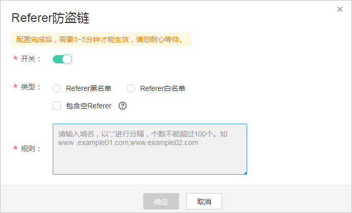

# Referer防盗链

Referer防盗链是基于HTTP协议支持的Referer机制实现的，通过播放请求中携带的Referer字段识别请求来源。配置黑名单或白名单，CDN将根据名单对请求来源进行过滤，从而达到访问控制的目的。您可以参考如下步骤配置Referer防盗链，也可以通过[视频指导](https://bbs.huaweicloud.com/videos/cf87fe1e4eb04c79a56fe71e374441ec)来操作。

## 注意事项

-   该功能为可选项，默认不启用。
-   Referer黑名单与Referer白名单互斥，不支持同时设置。
-   黑名单或白名单中的域名最多支持4级域名，且最多支持配置100条。
-   黑名单或白名单中配置的域名前不能带协议名，域名为前缀匹配。如填写“example.example01.com“，则“example.example01.com/123“和“example.example01.com.cn“也会匹配成功。

## 配置步骤

1.  登录[视频点播控制台](https://console.huaweicloud.com/vod)。
2.  在左侧导航栏选择“域名管理”，进入域名管理界面。
3.  单击域名右侧“配置 ”，选择“防盗链配置”页签。
4.  单击“Referer防盗链“。弹出“配置Referer防盗链“页面。
5.  单击“开关“。配置Referer防盗链参数，如[图1 Referer防盗链配置信息](#fig1470581991315)所示。

    **图 1**  Referer防盗链配置信息  
    

    防盗链配置及对应访问权限说明如[表1](#zh-cn_topic_0129356805_table837817528191)所示。

    **表 1**  参数说明

    
    <table><thead align="left"><tr id="zh-cn_topic_0129356805_zh-cn_topic_0111450891_row19890101885714"><th class="cellrowborder" valign="top" width="10.67%" id="mcps1.2.3.1.1">
参数

    </th>
    <th class="cellrowborder" valign="top" width="89.33%" id="mcps1.2.3.1.2">
说明

    </th>
    </tr>
    </thead>
    <tbody><tr id="zh-cn_topic_0129356805_zh-cn_topic_0111450891_row1089016185579"><td class="cellrowborder" valign="top" width="10.67%" headers="mcps1.2.3.1.1 ">
类型

    </td>
    <td class="cellrowborder" valign="top" width="89.33%" headers="mcps1.2.3.1.2 ">
支持黑名单和白名单模式。<ul id="ul1528259181510"><li>Referer黑名单：允许非名单内的域名请求访问媒资，拒绝名单中的域名请求访问。</li><li>Referer白名单：允许名单内的域名请求访问点播媒资，拒绝其它域名请求访问。</li></ul>
    

    
包含空Referer是指HTTP请求Header中的Referer内容为空，或者无Referer。根据选择的黑名单或白名单，勾选“包含空Referer”的效果是不同的。<ul id="ul413616772312"><li>黑名单模式：勾选“包含空Referer”表示若请求中的Referer为空，则拒绝该请求，否则允许。</li><li>白名单模式：勾选“包含空Referer”表示若请求中的Referer为空，则允许该请求，否则拒绝。</li></ul>
    

    </td>
    </tr>
    <tr id="zh-cn_topic_0129356805_zh-cn_topic_0111450891_row4725335657"><td class="cellrowborder" valign="top" width="10.67%" headers="mcps1.2.3.1.1 ">
规则

    </td>
    <td class="cellrowborder" valign="top" width="89.33%" headers="mcps1.2.3.1.2 ">
黑名单或白名单中的域名。

    <ul id="zh-cn_topic_0129356805_ul1316151174219"><li>最多支持4级域名。</li><li>规则最多支持100条（最少1条），每一行一条记录，或者以英文“;”分隔。</li><li>域名前不能带协议名（http://和https://）。</li><li>域名为前缀匹配，若填写“example.example01.com”，则“example.example01.com/123”和“example.example01.com.cn”也会匹配成功。</li></ul>
    
示例如下：

    <pre class="screen" id="zh-cn_topic_0129356805_zh-cn_topic_0111450891_screen186510416563">example.example01.com
    example.example02.com</pre>
    </td>
    </tr>
    </tbody>
    </table>

6.  配置完成后，单击“确定“。

    配置完成后，需要3\~5分钟才能生效。

