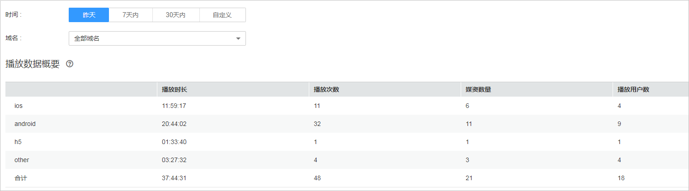
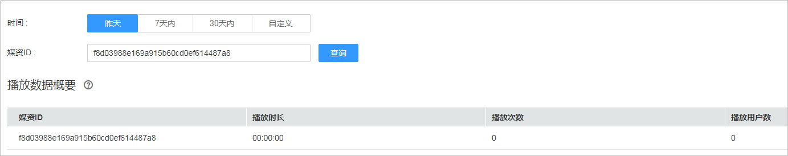

# SDK播放统计

点播服务提供了基于华为云视频点播播放器的数据采集能力，您可以根据域名或媒资查询播放器端的播放次数。

## 注意事项

仅使用华为云视频点播提供的播放器SDK时，才可查询该统计数据。

## 查询说明

-   查询时间必须为昨天或之前的日期，支持查询最近6个月内的历史数据。
-   支持查看全部或单个域名的SDK播放热点统计数据。
-   查询的时间跨度最长为31天。

## 查询步骤

1.  登录[视频点播控制台](https://console.huaweicloud.com/vod)。
2.  在左侧导航栏选择“统计分析 \> SDK播放统计”，进入SDK播放统计页面。
3.  选择“域名维度”或“媒资维度”查看对应的播放统计数据。

## 域名维度

您可以根据域名查询iOS端、Android端、H5等各播放器端的播放次数。

**图 1**  域名维度  

## 媒资维度

您可以根据媒资ID查询该媒资在SDK播放器上的播放次数。

**图 2**  媒资维度  

