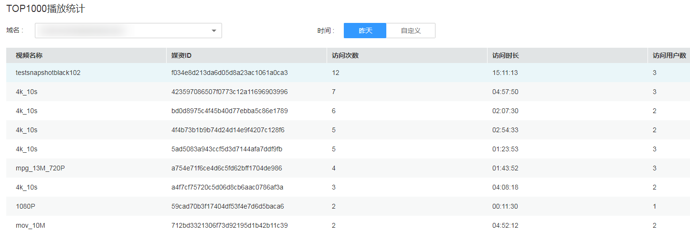

# SDK热点统计

点播服务提供了基于华为云视频点播播放器的数据采集能力，您可以根据域名查询播放器端的热点音视频。

## 注意事项

仅使用华为云视频点播提供的播放器SDK时，才可查询该统计数据。

## 查询说明

-   查询时间必须为昨天或之前的日期，支持查询最近6个月内的历史数据。
-   仅支持查看单个域名的SDK播放热点统计数据。

## 查询步骤

1.  登录[视频点播控制台](视频点播控制台https://console.huaweicloud.com/vod)。
2.  在左侧导航栏选择“统计分析 \> SDK热点统计”，进入SDK热点统计页面。
3.  选择需要查询的域名及时间段（昨天或自定义），查看音视频播放次数TOP1000的数据。

    **图 1**  TOP1000播放统计  
    

