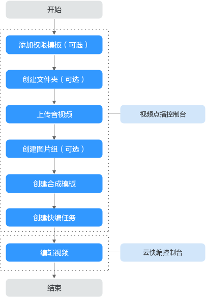
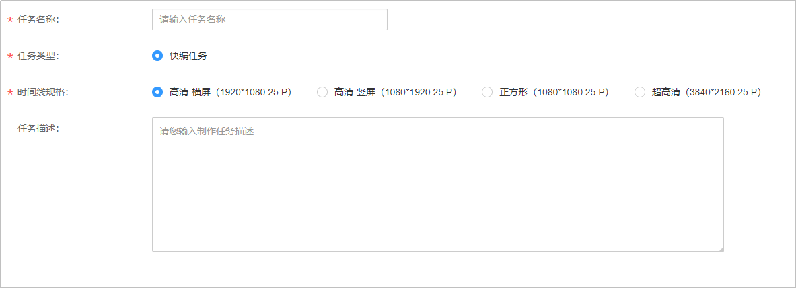

# 云快编

视频点播提供了云快编功能，它是一款基于互联网、云技术的面向新闻专题类节目制作的快速、高效的非线性编辑工具。云快编提供了拼接、剪切、合成、混音等功能。

## 注意事项

-   云快编功能暂只支持“华北-北京四”区域，请在控制台的左上角确认是否切换到该区域。
-   云快编暂只可处理通过控制台本地上传方式上传的音视频，OBS托管、URL拉取和直播录制等方式上传的音视频不能通过云快编处理。

## 使用流程

**图 1**  使用流程  

1.  （可选）[添加权限模板](权限模板.md#section17305922184214)：若您需要为上传的音视频配置操作权限，可以在上传前根据实际需求配置权限模板。
2.  （可选）[创建文件夹](媒资管理.md#section1575554019337)：若您需要将上传的音视频进行归类，可以在上传前创建文件夹。
3.  [上传音视频](媒资管理.md#section20499155015207)：将需要编辑的音视频上传到点播服务，上传时需要开启“支持编辑”开关，否则无法通过云快编功能处理上传的音视频。
4.  [创建图片组](媒资管理.md#section182434141202)：您可以将编辑视频过程中需要使用到的图片素材上传到图片组中。
5.  [创建合成模板](合成模板管理.md#section765974512718)：编辑后的元素需要按合成模板生成新的媒资。
6.  [创建快编任务](#section57241710421)：创建云快编任务，可以在将任务中进行视频编辑等。
7.  [编辑视频](#section1598981112520)：在云快编任务中根据实际需求完成视频编辑，并按照创建的合成模板生成新的媒资。

## 创建快编任务

1.  登录[视频点播控制台](https://console.huaweicloud.com/vod)。
2.  在控制台左上角切换区域到“华北-北京四”。

    **图 2**  切换区域  
    

3.  在左侧导航栏选择“云编辑 \> 云快编”，进入云快编页面。
4.  单击“创建任务”，配置快编任务参数。

    **图 3**  创建云快编任务  
    

    -   **任务名称**：长度不能超过128个字符。
    -   **时间线规格**：视频线视频的格式，默认为“高清 横屏 （1920\*1080 25P）”。
    -   **任务描述**：可以对该任务的具体操作或作用进行描述，方便后续查找。

5.  单击“确定”，完成创建。

    云快编任务创建后，您可以直接在云快编平台对上传的音视频进行编辑。

## 编辑视频

云快编任务创建后，在任务列表中对应的任务行单击“编辑”，进入Web快编页面，您就可以使用云快编提供的丰富的视频编辑功能了。编辑完成后，可以使用创建的[合成模板](合成模板管理.md)生成编辑后的视频文件。

> **说明：** 
>您可以在Web快编页面的正上方单击，获取Web快编的具体操作指导。

## 管理快编任务

快编任务创建后，您可以对相关任务进行管理操作。

-   **编辑**：您可以在对应的任务行单击“更多 \> 更新”，进入编辑页面修改快编任务的名称和描述。。
-   **重做**：您可以在对应的任务行单击“更多 \> 重做”，将已制作任务进行重置，任务中的编辑操作将会被清空。
-   **复制**：您可以在对应的任务行单击“更多 \> 复制”，复制一个相同的快编任务。
-   **删除**：您可以在对应的任务行单击“更多 \> 删除”，删除无用的云快编任务。

