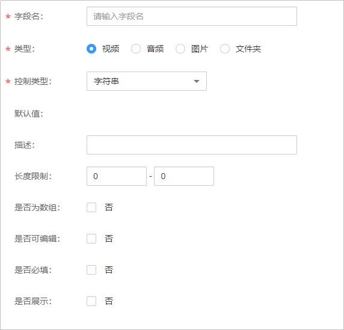

# 元数据

您可以创建元数据类型，在查询媒资时可以指定对应元数据顺序返回。

## 注意事项

元数据功能暂只支持“华北-北京四”区域，请在控制台的左上角确认是否切换到该区域。

## 添加元数据

1.  登录[视频点播控制台](视频点播控制台https://console.huaweicloud.com/vod)。
2.  在控制台左上角切换区域到“华北-北京四”。

    **图 1**  切换区域  
    

3.  在左侧导航栏选择“云快编 \> 元数据”，进入元数据管理页面。

    系统默认预置了大量的视频、音频、图片和文件夹的元数据。

4.  单击“添加元数据”，配置元数据参数。

    **图 2**  添加元数据  
    

    元数据参数说明如[表1](#table49505287400)所示。

    **表 1**  元数据参数说明

    
    <table><thead align="left"><tr id="row99501028134016"><th class="cellrowborder" valign="top" width="39.96%" id="mcps1.2.3.1.1">
参数

    </th>
    <th class="cellrowborder" valign="top" width="60.040000000000006%" id="mcps1.2.3.1.2">
说明

    </th>
    </tr>
    </thead>
    <tbody><tr id="row19515285404"><td class="cellrowborder" valign="top" width="39.96%" headers="mcps1.2.3.1.1 ">
字段名

    </td>
    <td class="cellrowborder" valign="top" width="60.040000000000006%" headers="mcps1.2.3.1.2 ">
图片组名称，由英文、下划线和数字组成，长度不能超过128个字符。

    </td>
    </tr>
    <tr id="row20951102814018"><td class="cellrowborder" valign="top" width="39.96%" headers="mcps1.2.3.1.1 ">
类型

    </td>
    <td class="cellrowborder" valign="top" width="60.040000000000006%" headers="mcps1.2.3.1.2 ">
元数据所属类型，支持视频、音频、图片和文件夹。

    </td>
    </tr>
    <tr id="row99512028174016"><td class="cellrowborder" valign="top" width="39.96%" headers="mcps1.2.3.1.1 ">
控制类型

    </td>
    <td class="cellrowborder" valign="top" width="60.040000000000006%" headers="mcps1.2.3.1.2 ">
元数据的类型。

    </td>
    </tr>
    <tr id="row6951152812407"><td class="cellrowborder" valign="top" width="39.96%" headers="mcps1.2.3.1.1 ">
默认值

    </td>
    <td class="cellrowborder" valign="top" width="60.040000000000006%" headers="mcps1.2.3.1.2 ">
元数据的默认值，暂不支持配置。

    </td>
    </tr>
    <tr id="row109511328194018"><td class="cellrowborder" valign="top" width="39.96%" headers="mcps1.2.3.1.1 ">
描述

    </td>
    <td class="cellrowborder" valign="top" width="60.040000000000006%" headers="mcps1.2.3.1.2 ">
元数据描述长度不超过1024字节。。

    </td>
    </tr>
    <tr id="row19516282402"><td class="cellrowborder" valign="top" width="39.96%" headers="mcps1.2.3.1.1 ">
长度

    </td>
    <td class="cellrowborder" valign="top" width="60.040000000000006%" headers="mcps1.2.3.1.2 ">
元数据可设置的长度。

    </td>
    </tr>
    <tr id="row965113481787"><td class="cellrowborder" valign="top" width="39.96%" headers="mcps1.2.3.1.1 ">
是否为数组

    </td>
    <td class="cellrowborder" valign="top" width="60.040000000000006%" headers="mcps1.2.3.1.2 ">
元数据是否支持配置多个。

    </td>
    </tr>
    <tr id="row2609750789"><td class="cellrowborder" valign="top" width="39.96%" headers="mcps1.2.3.1.1 ">
是否可编辑

    </td>
    <td class="cellrowborder" valign="top" width="60.040000000000006%" headers="mcps1.2.3.1.2 ">
元数据是否支持编辑。

    </td>
    </tr>
    <tr id="row18421955086"><td class="cellrowborder" valign="top" width="39.96%" headers="mcps1.2.3.1.1 ">
是否必填

    </td>
    <td class="cellrowborder" valign="top" width="60.040000000000006%" headers="mcps1.2.3.1.2 ">
元数据是否设置为必填。

    </td>
    </tr>
    <tr id="row360935716816"><td class="cellrowborder" valign="top" width="39.96%" headers="mcps1.2.3.1.1 ">
是否展示

    </td>
    <td class="cellrowborder" valign="top" width="60.040000000000006%" headers="mcps1.2.3.1.2 ">
设置的元数据是否显示。

    </td>
    </tr>
    </tbody>
    </table>

5.  单击“确定”，完成配置。

    元数据创建后，可以在媒资管理页面[自定义元数据](媒资管理.md#section0784122313131)。

