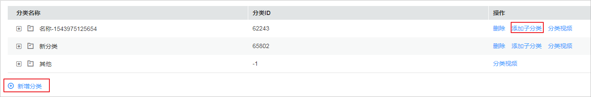
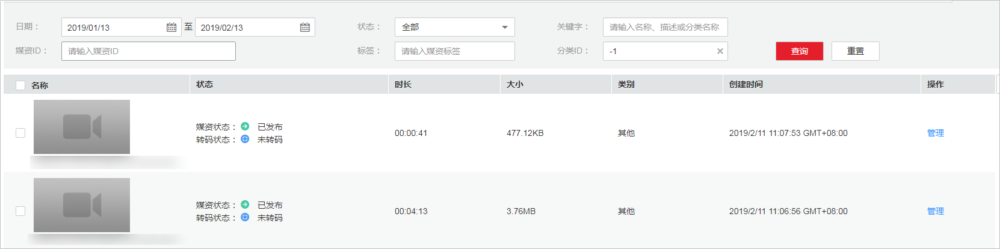

# 分类设置

视频点播支持对上传的音视频文件进行分类，方便快速按分类进行音视频搜索。除了在控制台进行分类管理，您还可以通过API实现分类信息管理，具体请参见[媒资分类接口](https://support.huaweicloud.com/api-vod/vod_04_0028.html)。

## 使用限制

最多支持添加128个分类；最多支持创建3级子类。

## 新增分类

1.  登录[视频点播控制台](https://console.huaweicloud.com/vod)。
2.  在左侧导航栏选择“全局设置  \>  分类设置“  ，进入分类管理页面。
3.  单击“新增分类“，添加父类。

    **图 1**  新增分类  
    

4.  在已创建的分类行单击“添加子类”，即可为该类创建子类。
5.  分类创建后，您可以在[音视频管理](音视频管理.md)或[上传音视频](控制台上传.md)中对音视频文件进行分类。

    音视频文件归类后，您也可以在分类设置页面，单击对应分类行的“分类视频”，即可检索到该类别下所有的文件。

    **图 2**  分类视频  
    

6.  若可以单击分类行的“删除”，删除不需要的类别。

    对于父类和子类的删除，该分类下的音视频文件的处理方式是不同的，如下所示：

    -   若删除的类别有父类，则原来属于该分类下的音视频文件将自动划分到父类中。
    -   若删除的类别无父类，即一级分类，则原来属于该分类下的音视频文件将自动划分到“其他”分类中。

