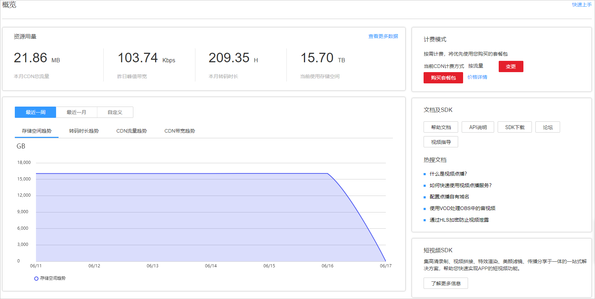

# 功能介绍

视频点播控制台提供了音视频上传和管理、视频处理、音视频审核、音视频托管等功能。此外，您还可以通过控制台查看点播资源的使用情况、TOP媒资等实时监控信息。

## 概览

登录[视频点播控制台](https://console.huaweicloud.com/vod)，默认进入“概览”页，可查看当前视频点播服务的相关使用情况。您也可以单击右上角的“快速上手”，获取视频点播入手指南。

**图 1**  概览  

-   资源用量：主要呈现本月视频点播的资源用量信息。

    **表 1**  资源用量说明

    
    <table><thead align="left"><tr id="row28819454466"><th class="cellrowborder" valign="top" width="26.41%" id="mcps1.2.3.1.1">
统计项

    </th>
    <th class="cellrowborder" valign="top" width="73.59%" id="mcps1.2.3.1.2">
说明

    </th>
    </tr>
    </thead>
    <tbody><tr id="row288124518462"><td class="cellrowborder" valign="top" width="26.41%" headers="mcps1.2.3.1.1 ">
本月CDN总流量

    </td>
    <td class="cellrowborder" valign="top" width="73.59%" headers="mcps1.2.3.1.2 ">
本月点播加速的产生的总流量。

    </td>
    </tr>
    <tr id="row988154584619"><td class="cellrowborder" valign="top" width="26.41%" headers="mcps1.2.3.1.1 ">
昨日峰值带宽

    </td>
    <td class="cellrowborder" valign="top" width="73.59%" headers="mcps1.2.3.1.2 ">
昨天使用点播服务进行分发加速产生的峰值带宽。

    </td>
    </tr>
    <tr id="row2881154554618"><td class="cellrowborder" valign="top" width="26.41%" headers="mcps1.2.3.1.1 ">
本月转码时长

    </td>
    <td class="cellrowborder" valign="top" width="73.59%" headers="mcps1.2.3.1.2 ">
本月累积视频转码时长，呈现的为输出LD规格的转码时长，输出规格为4K/2K/HD/SD的转码时长将按12 : 6 : 3 : 1.5 : 1（4K : 2K : HD : SD : LD）折算成LD时长统计。

    </td>
    </tr>
    <tr id="row6881145124610"><td class="cellrowborder" valign="top" width="26.41%" headers="mcps1.2.3.1.1 ">
总存储空间

    </td>
    <td class="cellrowborder" valign="top" width="73.59%" headers="mcps1.2.3.1.2 ">
当前所有媒资文件占用的存储空间，包括上传的音视频、图片、字幕以及音视频处理产生的媒资文件等。

    </td>
    </tr>
    </tbody>
    </table>

-   使用趋势：呈现最近一周或一个月的资源用量趋势，包括存储空间趋势、转码时长趋势、CDN流量趋势图和CDN带宽趋势图。
-   计费模式：呈现当前视频点播的CDN计费方式。您可以单击“变更”，变更CDN计费方式；单击“购买套餐包”，进入视频点播套餐包购买页面，购买相关套餐包。

## 功能列表

您可以在[视频点播控制台](https://console.huaweicloud.com/vod)的左侧导航栏选择相关功能，进行参数配置或功能使用。

**表 2**  控制台功能列表

<table><thead align="left"><tr id="row102051744416"><th class="cellrowborder" valign="top" width="22.93%" id="mcps1.2.3.1.1">
功能

</th>
<th class="cellrowborder" valign="top" width="77.07000000000001%" id="mcps1.2.3.1.2">
描述

</th>
</tr>
</thead>
<tbody><tr id="row82052441711"><td class="cellrowborder" valign="top" width="22.93%" headers="mcps1.2.3.1.1 ">
<a href="音视频管理.md">音视频管理</a>

</td>
<td class="cellrowborder" valign="top" width="77.07000000000001%" headers="mcps1.2.3.1.2 ">
对上传的音视频文件进行管理，包括转码、预热、设置分类、提取音频、导出媒资信息、删除媒资、查看媒资基本信息、获取媒资播放地址等。<ul id="ul209071615524"><li>转码支持输入的视频格式有MP4、TS、MOV、MXF、MPG、FLV、WMV、AVI、M4V、F4V、MPEG、3GP、ASF、MKV。</li><li>转码支持输入的音频格式有HLS、MP4、DASH、MP3、ADTS。</li></ul>

</td>
</tr>
<tr id="row622755175418"><td class="cellrowborder" valign="top" width="22.93%" headers="mcps1.2.3.1.1 ">
<a href="云快编.md">云编辑</a>

</td>
<td class="cellrowborder" valign="top" width="77.07000000000001%" headers="mcps1.2.3.1.2 ">
它是一款基于互联网、云技术的面向新闻专题类节目制作的快速、高效的非线性编辑工具。云快编提供了拼接、剪切、合成、混音等功能。

 说明： 

暂只有“华北-北京四”区域的点播服务支持该功能。

</td>
</tr>
<tr id="row1020510446112"><td class="cellrowborder" valign="top" width="22.93%" headers="mcps1.2.3.1.1 ">
<a href="音视频审核.md">音视频审核</a>

</td>
<td class="cellrowborder" valign="top" width="77.07000000000001%" headers="mcps1.2.3.1.2 ">
支持对音视频文件进行音频、画面、文件等进行自动审核或人工审核，将不合规的音视频进行屏蔽。

 说明： 

目前“华东-上海二”区域的点播服务暂不支持此功能。

</td>
</tr>
<tr id="row1820514415117"><td class="cellrowborder" valign="top" width="22.93%" headers="mcps1.2.3.1.1 ">
<a href="控制台上传.md">音视频上传</a>

</td>
<td class="cellrowborder" valign="top" width="77.07000000000001%" headers="mcps1.2.3.1.2 ">
支持本地上传音视频文件，或者通过音视频文件URL离线拉取上传。

</td>
</tr>
<tr id="row92053441115"><td class="cellrowborder" valign="top" width="22.93%" headers="mcps1.2.3.1.1 ">
<a href="资源用量.md">统计分析</a>

</td>
<td class="cellrowborder" valign="top" width="77.07000000000001%" headers="mcps1.2.3.1.2 ">
支持查看资源使用量和CDN热点统计。

</td>
</tr>
<tr id="row89538366562"><td class="cellrowborder" valign="top" width="22.93%" headers="mcps1.2.3.1.1 ">
<a href="用户管理.md">资源权限管理</a>

</td>
<td class="cellrowborder" valign="top" width="77.07000000000001%" headers="mcps1.2.3.1.2 ">
支持通过权限模板，对视频、音频、图片和文件夹进行权限控制。

 说明： 

暂只有“华北-北京四”区域的点播服务支持该功能。

</td>
</tr>
<tr id="row2205134417119"><td class="cellrowborder" valign="top" width="22.93%" headers="mcps1.2.3.1.1 ">
<a href="转码设置.md">全局设置</a>

</td>
<td class="cellrowborder" valign="top" width="77.07000000000001%" headers="mcps1.2.3.1.2 ">
支持根据实际需求配置转码模板、水印模板、配置HLS加密、设置分类、配置消息通知、设置工作流等。

</td>
</tr>
<tr id="row17205104413113"><td class="cellrowborder" valign="top" width="22.93%" headers="mcps1.2.3.1.1 ">
<a href="配置域名.md">域名管理</a>

</td>
<td class="cellrowborder" valign="top" width="77.07000000000001%" headers="mcps1.2.3.1.2 ">
支持添加管理自有的加速域名，也可对域名进行HTTPS和防盗链配置。

</td>
</tr>
<tr id="row159404714"><td class="cellrowborder" valign="top" width="22.93%" headers="mcps1.2.3.1.1 ">
<a href="概述.md">音视频托管</a>

</td>
<td class="cellrowborder" valign="top" width="77.07000000000001%" headers="mcps1.2.3.1.2 ">
支持将存储在OBS桶中的音视频文件托管给视频点播，从而使用视频点播服务的相关功能。

</td>
</tr>
<tr id="row1663980670"><td class="cellrowborder" valign="top" width="22.93%" headers="mcps1.2.3.1.1 ">
<a href="https://support.huaweicloud.com/svideo/vod_11_0001.html" target="_blank" rel="noopener noreferrer">短视频</a>

</td>
<td class="cellrowborder" valign="top" width="77.07000000000001%" headers="mcps1.2.3.1.2 ">
短视频解决方案集成了高清录制、视频拼接、特效渲染、美颜滤镜、传播分享等完整的短视频能力，为用户提供最具竞争力的端到端一站式短视频服务能力。

</td>
</tr>
</tbody>
</table>

