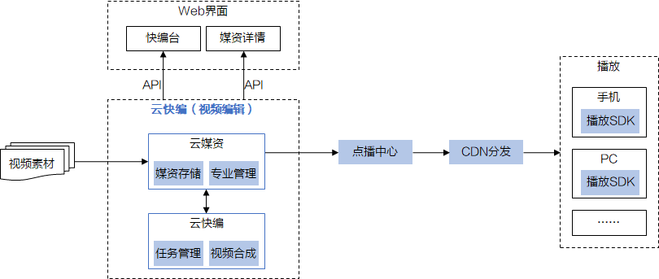

# 功能简介

云快编主要提供视频合成服务，将视频编辑过程中的一步一步操作（如视频切割、拼接、片段之间增加转场特效、增加字幕，等），逐个依次应用到编辑所涉及的一个或多个视频素材文件上，最终输出合成视频（即编辑界面上看到的编辑结果视频）。视频素材取自云媒资，合成视频也存回云媒资。

> **说明：** 
>云编辑功能需要通过[提交工单](https://console.huaweicloud.com/ticket/?#/ticketindex/business?productTypeId=ffb4ebf5fb094bc6aef0129c276ce42e)申请开通，该功能为计费项功能，具体价格请参见[产品价格详情](https://www.huaweicloud.com/pricing.html?tab=detail#/vod)。

## 功能特性

云编辑以B/S方式提供视频编辑云服务，主要提供工程管理、素材管理、视频编辑等能力。某ISV的参考功能如[表1](#table225617476119)所示，具体详情介绍您也可以参考[云快编](https://marketplace.huaweicloud.com/product/00301-498142-0--0)。

**表 1**  功能列表

<table><thead align="left"><tr id="row225612479113"><th class="cellrowborder" valign="top" width="22.06%" id="mcps1.2.3.1.1">
功能项

</th>
<th class="cellrowborder" valign="top" width="77.94%" id="mcps1.2.3.1.2">
功能说明

</th>
</tr>
</thead>
<tbody><tr id="row152569471014"><td class="cellrowborder" valign="top" width="22.06%" headers="mcps1.2.3.1.1 ">
工程管理

</td>
<td class="cellrowborder" valign="top" width="77.94%" headers="mcps1.2.3.1.2 ">
支持在页面上进行工程文件的创建、复制、删除和保存，可通过统一工程文件管理视图，实现不同用户之间时间线级的编辑成果共享。

</td>
</tr>
<tr id="row20256134716116"><td class="cellrowborder" valign="top" width="22.06%" headers="mcps1.2.3.1.1 ">
素材管理

</td>
<td class="cellrowborder" valign="top" width="77.94%" headers="mcps1.2.3.1.2 "><ul id="ul9352165784515"><li>支持平台权限下所有资源的统一检索查询；</li><li>支持以目录树方式或者统一视图进行资源呈现；</li><li>支持用户、用户组方式对媒体资源的共享；</li><li>支持预置媒体字幕以及图文特效模板的关联存储和管理。</li></ul>
</td>
</tr>
<tr id="row125714471110"><td class="cellrowborder" valign="top" width="22.06%" headers="mcps1.2.3.1.1 ">
视频编辑

</td>
<td class="cellrowborder" valign="top" width="77.94%" headers="mcps1.2.3.1.2 "><ul id="ul925711471311"><li>支持4K、HD、SD不同幅面比的视频编辑；</li><li>支持多轨道时间线编辑，视频轨不低于2轨，音频轨不低于2轨，字幕轨不低于6轨。</li><li>在编辑页面可预览素材，支持通过视频关键帧来实现视频与视频直接的线性/跃变过渡。</li></ul>
</td>
</tr>
<tr id="row82571647016"><td class="cellrowborder" valign="top" width="22.06%" headers="mcps1.2.3.1.1 ">
字幕

</td>
<td class="cellrowborder" valign="top" width="77.94%" headers="mcps1.2.3.1.2 ">
用户可在该页面进行字幕的添加和编辑，支持标题字、唱词添加，以及有间隔/无间隔2种唱词拍录模式、支持AE模板编辑。

</td>
</tr>
<tr id="row15374121284718"><td class="cellrowborder" valign="top" width="22.06%" headers="mcps1.2.3.1.1 ">
特技

</td>
<td class="cellrowborder" valign="top" width="77.94%" headers="mcps1.2.3.1.2 ">
用户可在该页面进行特技的添加和编辑，特技包括内部特技和过渡特技，内部特技包括2D、颜色调整和多种滤镜。

</td>
</tr>
</tbody>
</table>

## 使用限制

-   云编辑暂只可处理通过控制台本地上传方式上传的音视频，OBS托管、URL拉取和直播录制等方式上传的音视频不能通过云编辑处理。
-   云编辑功能暂只支持“华北-北京四”区域。

