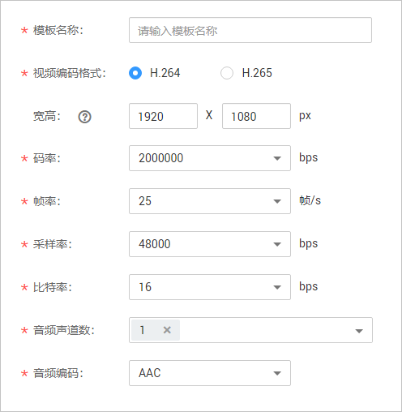

# 合成模板管理

使用云快编完成视频编辑后，您可以使用合成模板将编辑的视频合成一个新视频，并可以在视频管理中进行预览播放。

## 注意事项

合成模板管理暂只支持“华北-北京四”区域。

## 创建合成模板

1.  登录[视频点播控制台](https://console.huaweicloud.com/vod)。
2.  在控制台左上角切换区域到“华北-北京四”。

    **图 1**  切换区域  
    

3.  在左侧导航栏选择“云编辑 \> 合成模板管理”，进入合成模板管理页面。
4.  单击“新建模板”，配置合成模板参数。

    **图 2**  配置合成模板参数  
    

    **表 1**  合成模板参数说明

    
    <table><thead align="left"><tr id="row1989111719259"><th class="cellrowborder" valign="top" width="39.96%" id="mcps1.2.3.1.1">
参数

    </th>
    <th class="cellrowborder" valign="top" width="60.040000000000006%" id="mcps1.2.3.1.2">
说明

    </th>
    </tr>
    </thead>
    <tbody><tr id="row889116722510"><td class="cellrowborder" valign="top" width="39.96%" headers="mcps1.2.3.1.1 ">
模板名称

    </td>
    <td class="cellrowborder" valign="top" width="60.040000000000006%" headers="mcps1.2.3.1.2 ">
模板名称，由英文、数字和下划线组成。

    </td>
    </tr>
    <tr id="row148917772519"><td class="cellrowborder" valign="top" width="39.96%" headers="mcps1.2.3.1.1 ">
视频编码格式

    </td>
    <td class="cellrowborder" valign="top" width="60.040000000000006%" headers="mcps1.2.3.1.2 ">
合成输出视频的编码格式，支持H.264和H.265。

    </td>
    </tr>
    <tr id="row12891147132517"><td class="cellrowborder" valign="top" width="39.96%" headers="mcps1.2.3.1.1 ">
宽高

    </td>
    <td class="cellrowborder" valign="top" width="60.040000000000006%" headers="mcps1.2.3.1.2 ">
合成输出视频的分辨率。

    <ul id="ul129391342142916"><li>宽度取值范围： [640,3840]。</li><li>高度取值范围：[360,2160]。</li></ul>
    
 说明： 

若不设置宽高值，或设置为0*0，则按所有源素材中档位最高的分辨率输出合成视频。

    

    </td>
    </tr>
    <tr id="row148913742514"><td class="cellrowborder" valign="top" width="39.96%" headers="mcps1.2.3.1.1 ">
码率

    </td>
    <td class="cellrowborder" valign="top" width="60.040000000000006%" headers="mcps1.2.3.1.2 ">
合成输出视频的码率。

    
支持选择码率有：2000000、4000000、8000000和20000000。

    
单位：bps。

    </td>
    </tr>
    <tr id="row2057263016261"><td class="cellrowborder" valign="top" width="39.96%" headers="mcps1.2.3.1.1 ">
帧率

    </td>
    <td class="cellrowborder" valign="top" width="60.040000000000006%" headers="mcps1.2.3.1.2 ">
合成输出视频的帧率。

    
支持选择的帧率有：25、30。

    
单位：帧/s。

    </td>
    </tr>
    <tr id="row8217173342613"><td class="cellrowborder" valign="top" width="39.96%" headers="mcps1.2.3.1.1 ">
采样率

    </td>
    <td class="cellrowborder" valign="top" width="60.040000000000006%" headers="mcps1.2.3.1.2 ">
合成输出视频的音频采样率。

    
支持选择的码率有：48000、48800。

    
单位：bps。

    </td>
    </tr>
    <tr id="row4802153513269"><td class="cellrowborder" valign="top" width="39.96%" headers="mcps1.2.3.1.1 ">
比特率

    </td>
    <td class="cellrowborder" valign="top" width="60.040000000000006%" headers="mcps1.2.3.1.2 ">
合成输出视频的音频码率。

    </td>
    </tr>
    <tr id="row18111165582617"><td class="cellrowborder" valign="top" width="39.96%" headers="mcps1.2.3.1.1 ">
音频声道数

    </td>
    <td class="cellrowborder" valign="top" width="60.040000000000006%" headers="mcps1.2.3.1.2 ">
合成输出视频的音频声道数。

    
支持选择的声道数有：1、2、3、4。

    </td>
    </tr>
    <tr id="row1030399122718"><td class="cellrowborder" valign="top" width="39.96%" headers="mcps1.2.3.1.1 ">
音频编码

    </td>
    <td class="cellrowborder" valign="top" width="60.040000000000006%" headers="mcps1.2.3.1.2 ">
合成输出视频的音频编码，暂只支持AAC。

    </td>
    </tr>
    </tbody>
    </table>

5.  单击“确定”，完成合成模板创建。

    合成模板创建后，您就可以在[云快编](云快编.md)中使用该模板合成编辑后的视频。

## 管理合成模板

-   **修改**：您可以在对应的任务行单击“更多 \> 更新”，进入编辑页面修改合成模板。
-   **删除**：您可以在对应的任务行单击“更多 \> 删除”，删除无用的全成模板。

