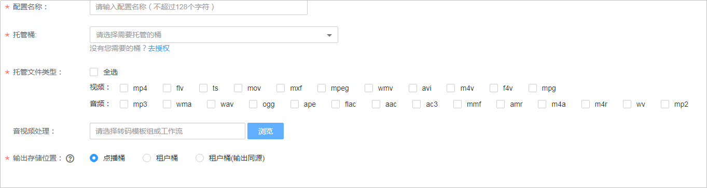
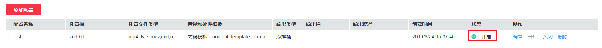

# 增量托管

配置增量音视频托管后，已授权的OBS桶中新增文件将被发布到点播系统，您可以对桶中的音视频文件进行相关管理操作。您可以对不同的OBS桶分别配置增量托管规则。

## 前提条件

-   待托管的OBS桶已完成授权，若未授权，请参考[桶授权](桶授权.md)处理。
-   若您需要对托管的OBS桶中的音视频进行转码或工作流处理，您可以先参考[转码设置](转码设置.md)自定义转码模板，或者参考[工作流设置](工作流设置.md)创建工作流。

## 注意事项

-   配置开启后只能托管已授权桶中新增的文件，已存在于OBS桶中的文件不能被托管。
-   当OBS已授权桶中有新增文件时，OBS需要使用SMN通知点播服务进行同步，因此，开启该功能后，将会产生消息通知费用，费用详情请参见[价格详情](https://www.huaweicloud.com/price_detail.html#/smn_detail)的HTTPS消息的收费标准。
-   若托管同时选择了对音视频进行处理，则会产生费用，请参考[计费说明](https://support.huaweicloud.com/price-vod/vod070001.html)。
-   已托管的音视频文件不会重复托管至点播服务。

## 添加托管配置

1.  登录[视频点播控制台](视频点播控制台https://console.huaweicloud.com/vod)。
2.  在左侧导航栏选择“音视频托管 \> 增量托管”。
3.  单击“添加配置”，进入创建托管配置页面。

    **图 1**  增量托管配置-  
    

4.  配置增量托管相关参数，具体如[表1](#table205301130152214)所示。

    **表 1**  增量托管参数说明

    
    <table><thead align="left"><tr id="row195305309225"><th class="cellrowborder" valign="top" width="33.18%" id="mcps1.2.3.1.1">
参数

    </th>
    <th class="cellrowborder" valign="top" width="66.82000000000001%" id="mcps1.2.3.1.2">
说明

    </th>
    </tr>
    </thead>
    <tbody><tr id="row3530830192215"><td class="cellrowborder" valign="top" width="33.18%" headers="mcps1.2.3.1.1 ">
配置名称

    </td>
    <td class="cellrowborder" valign="top" width="66.82000000000001%" headers="mcps1.2.3.1.2 ">
增量托管的配置名称，由英文、下划线或数据组成，长度不超过128个字符。

    </td>
    </tr>
    <tr id="row14530103052216"><td class="cellrowborder" valign="top" width="33.18%" headers="mcps1.2.3.1.1 ">
托管桶

    </td>
    <td class="cellrowborder" valign="top" width="66.82000000000001%" headers="mcps1.2.3.1.2 ">
需要被托管的桶，可选择一个或多个已经授权的OBS桶。

    </td>
    </tr>
    <tr id="row2530163012220"><td class="cellrowborder" valign="top" width="33.18%" headers="mcps1.2.3.1.1 ">
托管文件类型

    </td>
    <td class="cellrowborder" valign="top" width="66.82000000000001%" headers="mcps1.2.3.1.2 ">
OBS桶中需要托管的文件类型。

    </td>
    </tr>
    <tr id="row473465014263"><td class="cellrowborder" valign="top" width="33.18%" headers="mcps1.2.3.1.1 ">
音视频处理

    </td>
    <td class="cellrowborder" valign="top" width="66.82000000000001%" headers="mcps1.2.3.1.2 ">
若您需要对托管的音视频文件进行处理，可以在该配置项中选择转码模板或工作流。

    </td>
    </tr>
    <tr id="row587932916275"><td class="cellrowborder" valign="top" width="33.18%" headers="mcps1.2.3.1.1 ">
输出存储位置

    </td>
    <td class="cellrowborder" valign="top" width="66.82000000000001%" headers="mcps1.2.3.1.2 ">
支持如下三种存储位置：<ul id="ul1975815416352"><li>点播桶：音视频处理后的文件存储到点播服务中。</li><li>租户桶：音视频处理后的文件存储到租户OBS桶中。</li><li>租户桶（输出同源）：音视频处理后的文件存储到租户OBS桶中，且输出目录与源文件的存储目录相同。</li></ul>
    

    </td>
    </tr>
    </tbody>
    </table>

    若“输出存储位置“选择“租户桶（输出同源）“，则根据不同处理业务类型，生成文件的存储路径不同。

    例如，源文件存储路径为“vod1/input/video.mp4“，选择的输出桶为“vod2“，则音视频处理后的文件存储路径如[表2](#table34919212005)所示。

    **表 2**  存储路径说明

    
    <table><thead align="left"><tr id="row3491321305"><th class="cellrowborder" valign="top" width="35.03%" id="mcps1.2.3.1.1">
音视频处理

    </th>
    <th class="cellrowborder" valign="top" width="64.97%" id="mcps1.2.3.1.2">
输出文件存储路径

    </th>
    </tr>
    </thead>
    <tbody><tr id="row34915211903"><td class="cellrowborder" valign="top" width="35.03%" headers="mcps1.2.3.1.1 ">
转码

    </td>
    <td class="cellrowborder" valign="top" width="64.97%" headers="mcps1.2.3.1.2 "><ul id="ul1669637141411"><li>HLS格式<ul id="ul10345204116333"><li>一进一出模板：vod2/input/index.m3u8</li><li>一进多出模板：vod2/input/video_0.m3u8，vod2/input/video_1.m3u8，...</li></ul>
    </li><li>MP4格式<ul id="ul4993152193112"><li>一进一出模板：vod2/input/video.mp4</li><li>一进多出模板：vod2/input/video_0.mp4，vod2/input/video_1.mp4，...</li></ul>
    </li><li>DASH格式：vod2/input/video.mpd</li></ul>
    </td>
    </tr>
    <tr id="row1549115211902"><td class="cellrowborder" valign="top" width="35.03%" headers="mcps1.2.3.1.1 ">
截图

    </td>
    <td class="cellrowborder" valign="top" width="64.97%" headers="mcps1.2.3.1.2 ">
vod2/input/video{<em id="i274485315186">timestamp</em>}.pg

    
其中字段说明如下所示：<ul id="ul0439116102312"><li><em id="i1589754801812">timestamp</em>：截图时间戳。</li></ul>
    

    </td>
    </tr>
    <tr id="row149110216015"><td class="cellrowborder" valign="top" width="35.03%" headers="mcps1.2.3.1.1 ">
转封装

    </td>
    <td class="cellrowborder" valign="top" width="64.97%" headers="mcps1.2.3.1.2 "><ul id="ul1597655413118"><li>HLS格式：vod2/input/video.m3u8</li><li>MP4格式：vod2/input/video.mp4</li></ul>
    </td>
    </tr>
    <tr id="row665510181523"><td class="cellrowborder" valign="top" width="35.03%" headers="mcps1.2.3.1.1 ">
封面（上传封面+截图封面）

    </td>
    <td class="cellrowborder" valign="top" width="64.97%" headers="mcps1.2.3.1.2 ">
vod2/input/video_Cover0.jpg

    </td>
    </tr>
    <tr id="row519815111319"><td class="cellrowborder" valign="top" width="35.03%" headers="mcps1.2.3.1.1 ">
字幕

    </td>
    <td class="cellrowborder" valign="top" width="64.97%" headers="mcps1.2.3.1.2 ">
vod2/input/cc_1.srt

    </td>
    </tr>
    <tr id="row93212014532"><td class="cellrowborder" valign="top" width="35.03%" headers="mcps1.2.3.1.1 ">
音频提取

    </td>
    <td class="cellrowborder" valign="top" width="64.97%" headers="mcps1.2.3.1.2 ">
vod2/input/{<em id="i6107125916247">newasset_id</em>}/<em id="i1340132816269">audioName</em>.mp3

    
其中字段说明如下所示：<ul id="ul1776843715251"><li><em id="i177701332192514">newasset_id</em>：提取的音频文件的媒资ID。</li><li><em id="i1634519552619">audioName：</em>提取的音频文件的名称，随机生成。</li></ul>
    

    </td>
    </tr>
    <tr id="row1183030039"><td class="cellrowborder" valign="top" width="35.03%" headers="mcps1.2.3.1.1 ">
剪切

    </td>
    <td class="cellrowborder" valign="top" width="64.97%" headers="mcps1.2.3.1.2 ">
vod2/input/{<em id="i8202154617283">newasset_id</em>}/<em id="i1720284619282">videoName</em>.mp4

    
其中字段说明如下所示：<ul id="ul152021146142810"><li><em id="i202021046152818">newasset_id</em>：剪切的视频文件的媒资ID。</li><li><em id="i1510412405292">videoName：</em>剪切的视频文件的名称，随机生成。</li></ul>
    

    </td>
    </tr>
    <tr id="row629635418416"><td class="cellrowborder" valign="top" width="35.03%" headers="mcps1.2.3.1.1 ">
拼接

    </td>
    <td class="cellrowborder" valign="top" width="64.97%" headers="mcps1.2.3.1.2 ">
vod2/input/{<em id="i153230479287">newasset_id</em>}/<em id="i032334742819">audioName</em>.mp4

    
其中字段说明如下所示：<ul id="ul9323184772815"><li><em id="i15323174714286">newasset_id</em>：拼接的视频文件的媒资ID。</li><li><em id="i04551748142911">audioName：</em>拼接的视频文件的名称，随机生成。</li></ul>
    

    </td>
    </tr>
    </tbody>
    </table>

5.  单击“确认”，完成配置。
6.  当列表中的增量托管配置状态为“开启”时，表示配置生效。

    **图 2**  托管状态  
    

## 其它操作

增量托管配置添加后，您可以对在托管列表中对相关配置做如下操作：

-   编辑：修改已添加的增量托管配置。
-   开启：开启处于“关闭”状态中的增量托管配置。开启后，若托管配置中的OBS桶有新增音视频文件，则将会托管到点播服务，可在控制台的“音视频管理”页面查看到。
-   关闭：关闭处于“开启”状态的增量托管配置。关闭后，若托管配置中的OBS桶有新增音视频，则将不会托管到点播服务中。
-   删除：删除增量托管配置后，对应的OBS桶将与点播服务无托管关系。

