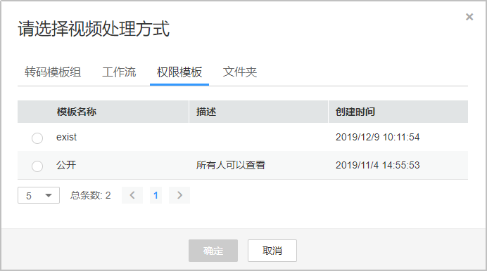
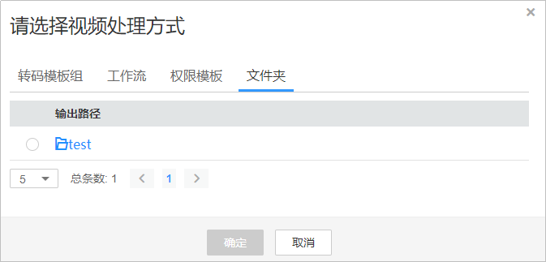
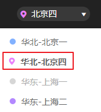
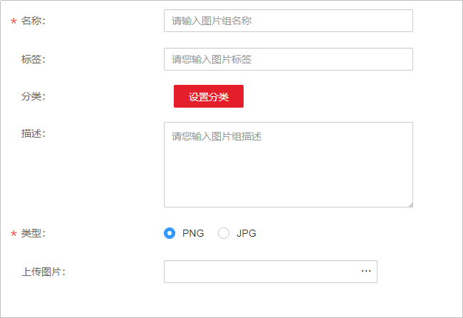
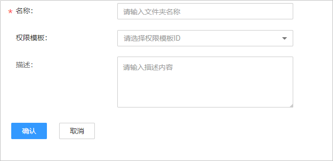
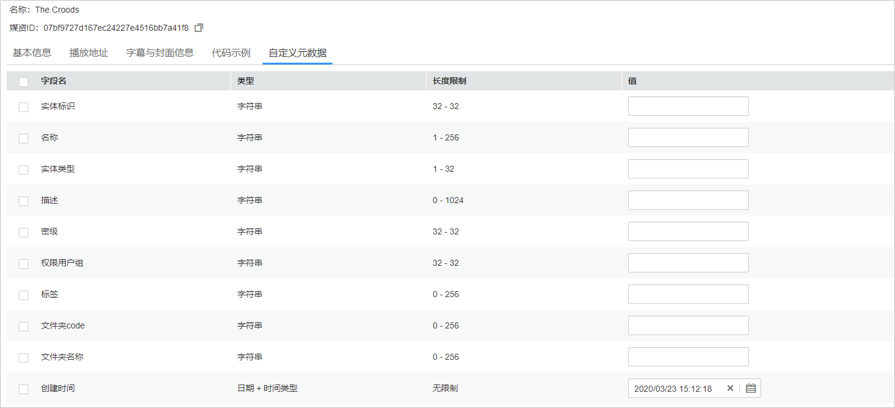

# 媒资管理

媒资管理中显示的音视频文件同[音视频管理](音视频管理.md)中是一致的，除了有音视频管理页面的相关功能，您还可以在媒资管理中上传音视频，创建图片组并上传图片，以及创建文件夹。

## 注意事项

媒资管理暂只支持“华北-北京四”区域，请在控制台的左上角确认是否切换到该区域。

## 前提条件

-   若您需要在为的音视频或创建的文件夹配置权限，请先在[权限管理](权限模板.md)中创建权限模板。
-   若需要对对音视频、图片或文件夹进行元数据配置，您可以在先创建[元数据](元数据.md)。

## 上传音视频

支持在上传音视频时设置权限模板和所属文件夹。

1.  登录[视频点播控制台](视频点播控制台https://console.huaweicloud.com/vod)。
2.  在控制台左上角切换区域到“华北-北京四”。

    **图 1**  切换区域  
    

3.  在左侧导航栏选择“云快编 \> 媒资管理”，进入媒资管理页面。
4.  单击“上传”，在本地上传页面单击“本地上传”。
5.  在弹出的页面单击“添加音视频”，选择需要上传的音视频文件。
6.  设置上传参数，除“权限模板”和“文件夹”参数外，其它参数设置与[本地上传](控制台上传.md#section17454109134614)相同。

    在需要设置的音视频行单击“音视频处理”，或勾选多个音视频单击音视频列表上方的“音视频处理”按钮。

    -   权限模板：支持为上传音视频设置权限，控制访问级别。您需要在先[创建权限模板](权限模板.md)。

        **图 2**  选择权限模板  
        

    -   文件夹：可以将上传的音视频归类在某个文件夹下，您需要先[创建文件夹](#section1575554019337)。

        **图 3**  选择文件夹  
        

## 创建图片组

您可以创建图片组，并上传图片，用于[云快编](云快编.md)中的音视频编辑中。

1.  登录[视频点播控制台](视频点播控制台https://console.huaweicloud.com/vod)。
2.  在控制台左上角切换区域到“华北-北京四”。

    **图 4**  切换区域  
    

3.  在左侧导航栏选择“云快编 \> 媒资管理”，进入媒资管理页面。
4.  单击“创建图片组”，进入图片组管理页面。
5.  单击“创建图片组”，配置图片组参数。

    

    参数说明如[表1](#table49505287400)所示。

    **表 1**  图片组参数说明

    
    <table><thead align="left"><tr id="row99501028134016"><th class="cellrowborder" valign="top" width="39.96%" id="mcps1.2.3.1.1">
参数

    </th>
    <th class="cellrowborder" valign="top" width="60.040000000000006%" id="mcps1.2.3.1.2">
说明

    </th>
    </tr>
    </thead>
    <tbody><tr id="row19515285404"><td class="cellrowborder" valign="top" width="39.96%" headers="mcps1.2.3.1.1 ">
名称

    </td>
    <td class="cellrowborder" valign="top" width="60.040000000000006%" headers="mcps1.2.3.1.2 ">
图片组名称，由英文、下划线和数字组成，长度不能超过128个字符。

    </td>
    </tr>
    <tr id="row20951102814018"><td class="cellrowborder" valign="top" width="39.96%" headers="mcps1.2.3.1.1 ">
标签

    </td>
    <td class="cellrowborder" valign="top" width="60.040000000000006%" headers="mcps1.2.3.1.2 ">
图片标签。

    </td>
    </tr>
    <tr id="row99512028174016"><td class="cellrowborder" valign="top" width="39.96%" headers="mcps1.2.3.1.1 ">
分类

    </td>
    <td class="cellrowborder" valign="top" width="60.040000000000006%" headers="mcps1.2.3.1.2 ">
图片分类，您可以在<a href="分类设置.md">分类设置</a>中创建相关分类。

    </td>
    </tr>
    <tr id="row6951152812407"><td class="cellrowborder" valign="top" width="39.96%" headers="mcps1.2.3.1.1 ">
描述

    </td>
    <td class="cellrowborder" valign="top" width="60.040000000000006%" headers="mcps1.2.3.1.2 ">
图片组描述。

    </td>
    </tr>
    <tr id="row109511328194018"><td class="cellrowborder" valign="top" width="39.96%" headers="mcps1.2.3.1.1 ">
类型

    </td>
    <td class="cellrowborder" valign="top" width="60.040000000000006%" headers="mcps1.2.3.1.2 ">
图片格式，暂只支持PNG和JPG格式。

    </td>
    </tr>
    <tr id="row19516282402"><td class="cellrowborder" valign="top" width="39.96%" headers="mcps1.2.3.1.1 ">
上传图片

    </td>
    <td class="cellrowborder" valign="top" width="60.040000000000006%" headers="mcps1.2.3.1.2 ">
选择图片上传。

    </td>
    </tr>
    </tbody>
    </table>

6.  单击“确定”，完成图片组创建。

## 创建文件夹

在上传音视频前，您可以创建文件夹，并配置相关权限模板，从而控制该文件夹下的音视频文件的访问权限。

1.  登录[视频点播控制台](视频点播控制台https://console.huaweicloud.com/vod)。
2.  在控制台左上角切换区域到“华北-北京四”。

    **图 5**  切换区域  
    

3.  在左侧导航栏选择“云快编 \> 媒资管理”，进入媒资管理页面。
4.  单击“创建文件夹”，配置文件夹参数。

    若您还未创建需要的权限模板，请参见[创建权限模板](权限模板.md)。

    

5.  单击“确定”，完成文件夹创建。

## 自定义元数据

您可以对已创建或上传的音视频、图片和文件夹进行元数据配置，以便在查询媒资时可以指定按某个元数据顺序进行返回。

1.  登录[视频点播控制台](视频点播控制台https://console.huaweicloud.com/vod)。
2.  在控制台左上角切换区域到“华北-北京四”。

    **图 6**  切换区域  
    

3.  在左侧导航栏选择“云快编 \> 媒资管理”，进入媒资管理页面。
4.  在对应的视频、音频、图片图或文件夹行单击“管理”，进行媒资详情页面。
5.  选择“自定义元数据”，在该页签配置对应元数据。

    **图 7**  自定义元数据  
    

6.  单击“保存”，完成配置。

