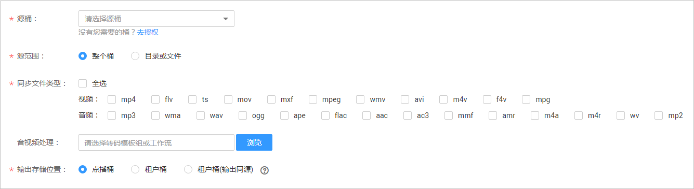
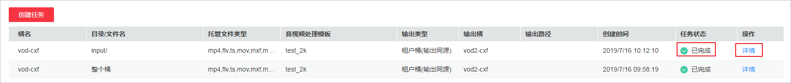
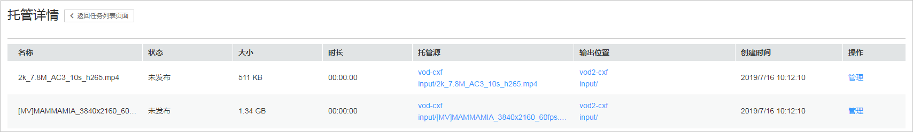

# 存量托管

创建存量音视频托管任务后，任务中选中的已授权的OBS桶中存量文件将被发布到点播系统，您可以对桶中的音视频文件进行相关管理操作。

## 前提条件

-   待托管的OBS桶已完成授权，若未授权，请参考[桶授权](桶授权.md)处理。
-   若您需要对托管的OBS桶中的音视频进行转码或工作流处理，您可以先参考[转码设置](转码设置.md)自定义转码模板，或者参考[工作流设置](工作流设置.md)创建工作流。

## 注意事项

-   单个任务只能托管已授权的某个桶中存量文件，托管多个桶中存量文件请创建多个任务。
-   若创建任务时选择了转码模板，则会产生转码费用，请参考[计费说明](https://support.huaweicloud.com/price-vod/vod070001.html)。
-   已托管的音视频文件不会重复托管至点播服务。

## 配置步骤

1.  在左侧导航栏选择“音视频托管 \> 存量托管”。
2.  单击“创建任务”，进入任务设置界面。

    **图 1**  存量托管配置  
    

3.  配置存量托管相关参数，如[表1](#table205301130152214)所示。

    **表 1**  存量托管参数说明

    
    <table><thead align="left"><tr id="row195305309225"><th class="cellrowborder" valign="top" width="33.18%" id="mcps1.2.3.1.1">
参数

    </th>
    <th class="cellrowborder" valign="top" width="66.82000000000001%" id="mcps1.2.3.1.2">
说明

    </th>
    </tr>
    </thead>
    <tbody><tr id="row3530830192215"><td class="cellrowborder" valign="top" width="33.18%" headers="mcps1.2.3.1.1 ">
源桶

    </td>
    <td class="cellrowborder" valign="top" width="66.82000000000001%" headers="mcps1.2.3.1.2 ">
需要被托管的桶，可选择一个或多个已经授权的OBS桶。

    </td>
    </tr>
    <tr id="row14530103052216"><td class="cellrowborder" valign="top" width="33.18%" headers="mcps1.2.3.1.1 ">
源范围

    </td>
    <td class="cellrowborder" valign="top" width="66.82000000000001%" headers="mcps1.2.3.1.2 ">
需要被托管的范围。

    <ul id="ul356662125510"><li>整个桶：表示某个桶中所有文件。可以选择需要托管的文件类型。</li><li>目录或文件：表示桶中的某个目录或者文件。若勾选目录，则此目录及子目录下的所有音视频文件都会被托管。</li></ul>
    </td>
    </tr>
    <tr id="row473465014263"><td class="cellrowborder" valign="top" width="33.18%" headers="mcps1.2.3.1.1 ">
音视频处理

    </td>
    <td class="cellrowborder" valign="top" width="66.82000000000001%" headers="mcps1.2.3.1.2 ">
若您需要对托管的音视频文件进行处理，可以在该配置项中选择转码模板或工作流。

    </td>
    </tr>
    <tr id="row587932916275"><td class="cellrowborder" valign="top" width="33.18%" headers="mcps1.2.3.1.1 ">
输出存储位置

    </td>
    <td class="cellrowborder" valign="top" width="66.82000000000001%" headers="mcps1.2.3.1.2 ">
支持如下三种存储位置：<ul id="ul1975815416352"><li>点播桶：音视频处理后的文件存储到点播服务中。</li><li>租户桶：音视频处理后的文件存储到租户OBS桶中。</li><li>租户桶（输出同源）：音视频处理后的文件存储到租户OBS桶中，且输出目录与源文件的存储目录相同。</li></ul>
    

    </td>
    </tr>
    </tbody>
    </table>

    若“输出存储位置“选择“租户桶（输出同源）“，则根据不同处理业务类型，生成文件的存储路径不同。

    例如，源文件存储路径为“vod1/input/video.mp4“，选择的输出桶为“vod2“，则音视频处理后的文件存储路径如[表2](#vod010032_table34919212005)所示。

    **表 2**  存储路径说明

    
    <table><thead align="left"><tr id="vod010032_row3491321305"><th class="cellrowborder" valign="top" width="35.03%" id="mcps1.2.3.1.1">
音视频处理

    </th>
    <th class="cellrowborder" valign="top" width="64.97%" id="mcps1.2.3.1.2">
输出文件存储路径

    </th>
    </tr>
    </thead>
    <tbody><tr id="vod010032_row34915211903"><td class="cellrowborder" valign="top" width="35.03%" headers="mcps1.2.3.1.1 ">
转码

    </td>
    <td class="cellrowborder" valign="top" width="64.97%" headers="mcps1.2.3.1.2 "><ul id="vod010032_ul1669637141411"><li>HLS格式<ul id="vod010032_ul10345204116333"><li>一进一出模板：vod2/input/index.m3u8</li><li>一进多出模板：vod2/input/video_0.m3u8，vod2/input/video_1.m3u8，...</li></ul>
    </li><li>MP4格式<ul id="vod010032_ul4993152193112"><li>一进一出模板：vod2/input/video.mp4</li><li>一进多出模板：vod2/input/video_0.mp4，vod2/input/video_1.mp4，...</li></ul>
    </li><li>DASH格式：vod2/input/video.mpd</li></ul>
    </td>
    </tr>
    <tr id="vod010032_row1549115211902"><td class="cellrowborder" valign="top" width="35.03%" headers="mcps1.2.3.1.1 ">
截图

    </td>
    <td class="cellrowborder" valign="top" width="64.97%" headers="mcps1.2.3.1.2 ">
vod2/input/video{<em id="vod010032_i274485315186">timestamp</em>}.pg

    
其中字段说明如下所示：<ul id="vod010032_ul0439116102312"><li><em id="vod010032_i1589754801812">timestamp</em>：截图时间戳。</li></ul>
    

    </td>
    </tr>
    <tr id="vod010032_row149110216015"><td class="cellrowborder" valign="top" width="35.03%" headers="mcps1.2.3.1.1 ">
转封装

    </td>
    <td class="cellrowborder" valign="top" width="64.97%" headers="mcps1.2.3.1.2 "><ul id="vod010032_ul1597655413118"><li>HLS格式：vod2/input/video.m3u8</li><li>MP4格式：vod2/input/video.mp4</li></ul>
    </td>
    </tr>
    <tr id="vod010032_row665510181523"><td class="cellrowborder" valign="top" width="35.03%" headers="mcps1.2.3.1.1 ">
封面（上传封面+截图封面）

    </td>
    <td class="cellrowborder" valign="top" width="64.97%" headers="mcps1.2.3.1.2 ">
vod2/input/video_Cover0.jpg

    </td>
    </tr>
    <tr id="vod010032_row519815111319"><td class="cellrowborder" valign="top" width="35.03%" headers="mcps1.2.3.1.1 ">
字幕

    </td>
    <td class="cellrowborder" valign="top" width="64.97%" headers="mcps1.2.3.1.2 ">
vod2/input/cc_1.srt

    </td>
    </tr>
    <tr id="vod010032_row93212014532"><td class="cellrowborder" valign="top" width="35.03%" headers="mcps1.2.3.1.1 ">
音频提取

    </td>
    <td class="cellrowborder" valign="top" width="64.97%" headers="mcps1.2.3.1.2 ">
vod2/input/{<em id="vod010032_i6107125916247">newasset_id</em>}/<em id="vod010032_i1340132816269">audioName</em>.mp3

    
其中字段说明如下所示：<ul id="vod010032_ul1776843715251"><li><em id="vod010032_i177701332192514">newasset_id</em>：提取的音频文件的媒资ID。</li><li><em id="vod010032_i1634519552619">audioName：</em>提取的音频文件的名称，随机生成。</li></ul>
    

    </td>
    </tr>
    <tr id="vod010032_row1183030039"><td class="cellrowborder" valign="top" width="35.03%" headers="mcps1.2.3.1.1 ">
剪切

    </td>
    <td class="cellrowborder" valign="top" width="64.97%" headers="mcps1.2.3.1.2 ">
vod2/input/{<em id="vod010032_i8202154617283">newasset_id</em>}/<em id="vod010032_i1720284619282">videoName</em>.mp4

    
其中字段说明如下所示：<ul id="vod010032_ul152021146142810"><li><em id="vod010032_i202021046152818">newasset_id</em>：剪切的视频文件的媒资ID。</li><li><em id="vod010032_i1510412405292">videoName：</em>剪切的视频文件的名称，随机生成。</li></ul>
    

    </td>
    </tr>
    <tr id="vod010032_row629635418416"><td class="cellrowborder" valign="top" width="35.03%" headers="mcps1.2.3.1.1 ">
拼接

    </td>
    <td class="cellrowborder" valign="top" width="64.97%" headers="mcps1.2.3.1.2 ">
vod2/input/{<em id="vod010032_i153230479287">newasset_id</em>}/<em id="vod010032_i032334742819">audioName</em>.mp4

    
其中字段说明如下所示：<ul id="vod010032_ul9323184772815"><li><em id="vod010032_i15323174714286">newasset_id</em>：拼接的视频文件的媒资ID。</li><li><em id="vod010032_i04551748142911">audioName：</em>拼接的视频文件的名称，随机生成。</li></ul>
    

    </td>
    </tr>
    </tbody>
    </table>

4.  单击“确认”，存量托管任务创建完成。
5.  可以在任务列表查看存量托管任务的执行状态，当“任务状态“为“已完成“时，表示存量托管完成，可以在“音视频管理“页面查看托管的媒资文件。

    **图 2**  存量托管状态  
    

6.  在对应任务列单击“详情”，可查看该托管任务的执行情况。

    **图 3**  存量托管详情  
    

