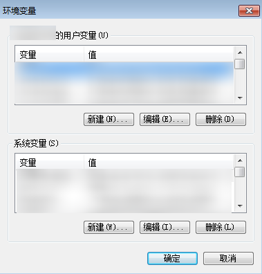

# 安装JDK<a name="ZH-CN_TOPIC_0141694140"></a>

本节主要介绍如何在Windows和Linux端安装JDK，并验证是否安装成功。

## Windows下安装JDK<a name="section888412451611"></a>

1.  根据系统情况[下载JDK安装包](https://www.oracle.com/technetwork/java/javase/downloads/jdk8-downloads-2133151.html)，建议下载JDK1.8。

    您需要根据自己的Windows系统版本下载对应的JDK1.8版本，下载前请先勾选“Accept License Agreement”。

    **图 1**  下载Windows版JDK<a name="fig16122181716354"></a>  
    

2.  双击安装包，根据安装向导完成JDK安装。
3.  Windows桌面右键单击“计算机”，选择“属性”。
4.  在左侧导航中选择“高级系统设置”，弹出“系统属性”窗口。
5.  单击“环境变量”，弹出“环境变量”窗口。
6.  配置环境变量。
    1.  在“用户变量”下单击“新建”，新建用户变量，变量名为“JAVA\_HOME”，变量值为JDK的安装路径，如“C:\\ProgramFiles\\Java\\jdk1.8.0\_45”。

        **图 2**  设置环境变量<a name="fig20487182312352"></a>  
        

    2.  在“系统变量”下选择“PATH”变量，单击“编辑”，将变量值末尾新增“;%JAVA\_HOME%\\bin;%JAVA\_HOME%\\jre\\bin”。
    3.  在“系统变量”下新建系统变量，变量名为“CLASSPATH”，变量值为“ .;%JAVA\_HOME%\\lib;%JAVA\_HOME%\\lib\\tools.jar”。
    4.  单击“确定”，完成环境变量的配置。

7.  选择“开始”-\>“运行”，输入“cmd”，执行命令：java -version。

    若命令执行成功，则说明环境变量配置成功。

    **图 3**  验证环境变量配置<a name="fig149816519360"></a>  
    


## Linux下安装JDK<a name="section10773186526"></a>

1.  根据系统情况[下载JDK安装包](https://www.oracle.com/technetwork/java/javase/downloads/jdk8-downloads-2133151.html)，建议下载JDK1.8。

    您需要根据自己的Linux系统版本下载对应的JDK1.8版本，下载前请先勾选“Accept License Agreement”。

    **图 4**  下载Linux版JDK<a name="fig18891041143519"></a>  
    

2.  解压安装包到JDK目录下。

    ```
    tar -xvf jdk-8u191-linux-x64.tar.gz -C /home/vod/jdk/
    ```

3.  配置环境变量。
    1.  执行**vi /etc/profile**命令进入profile文件。
    2.  在profile文件末尾加入如下内容。

        ```
        #set java environment
        export JAVA_HOME=/home/vod/jdk/jdk1.8.0_191
        export JRE_HOME=/home/vod/jdk/jdk1.8.0_191/jre
        export CLASSPATH=.:$JAVA_HOME/lib/dt.jar:$JRE_HOME/lib/tools.jar
        export PATH=$JAVA_HOME/bin:$PATH
        ```

    3.  执行**:wq**命令保存profile文件并退出。

4.  执行**java -version**验证JDK是否安装成功。

    回显以下JDK版本信息则表示安装成功。

    ```
    [root@ecs-c525-web ~]# java -version
    java version "1.8.0_191"
    Java(TM) SE Runtime Environment (build 1.8.0_191-b11)
    Java HotSpot(TM) 64-Bit Server VM (build 25.171-b11, mixed mode)
    ```


