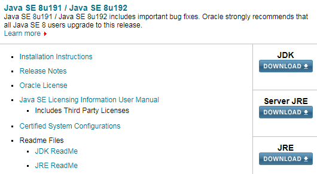
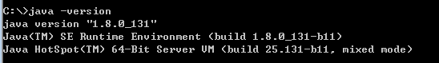

# 安装JDK<a name="vod_01_0055"></a>

本节主要介绍如何在Windows和Linux端安装JDK，并验证是否安装成功。

## Windows下安装JDK<a name="section888412451611"></a>

1.  [官网](http://www.oracle.com/technetwork/java/javase/downloads/index.html)下载JDK文件。以JDK8为例，单击JDK下的下载按钮进行下载。

    

2.  下载完成后按照提示安装，安装位置可自选，比如安装到本地“C:\\Program Files\\Java\\jdk1.8.0\_131”。
3.  安装完成后，配置Java环境变量。
    1.  右击"计算机"，单击"属性"，选择"高级系统设置"；
    2.  选择"高级"选项卡，单击"环境变量"；
    3.  在"系统变量"中设置3个变量：JAVA\_HOME,PATH,CLASSPATH（大小写均可），变量值如[表1](#zh-cn_topic_0161582720_table9897112283415)所示。

        若此三项属性已存在则单击"编辑"，不存在则单击"新建"。

        **表 1**  JAVA环境变量

        <a name="zh-cn_topic_0161582720_table9897112283415"></a>
        <table><thead align="left"><tr id="zh-cn_topic_0161582720_row148991122103413"><th class="cellrowborder" valign="top" width="15.02%" id="mcps1.2.4.1.1"><p id="zh-cn_topic_0161582720_p1189922293417"><a name="zh-cn_topic_0161582720_p1189922293417"></a><a name="zh-cn_topic_0161582720_p1189922293417"></a>变量名</p>
        </th>
        <th class="cellrowborder" valign="top" width="49.69%" id="mcps1.2.4.1.2"><p id="zh-cn_topic_0161582720_p289915222341"><a name="zh-cn_topic_0161582720_p289915222341"></a><a name="zh-cn_topic_0161582720_p289915222341"></a>变量值</p>
        </th>
        <th class="cellrowborder" valign="top" width="35.29%" id="mcps1.2.4.1.3"><p id="zh-cn_topic_0161582720_p19262133333813"><a name="zh-cn_topic_0161582720_p19262133333813"></a><a name="zh-cn_topic_0161582720_p19262133333813"></a>变量说明</p>
        </th>
        </tr>
        </thead>
        <tbody><tr id="zh-cn_topic_0161582720_row6899122213345"><td class="cellrowborder" valign="top" width="15.02%" headers="mcps1.2.4.1.1 "><p id="zh-cn_topic_0161582720_p9899142233412"><a name="zh-cn_topic_0161582720_p9899142233412"></a><a name="zh-cn_topic_0161582720_p9899142233412"></a>JAVA_HOME</p>
        </td>
        <td class="cellrowborder" valign="top" width="49.69%" headers="mcps1.2.4.1.2 "><p id="zh-cn_topic_0161582720_p15189164917363"><a name="zh-cn_topic_0161582720_p15189164917363"></a><a name="zh-cn_topic_0161582720_p15189164917363"></a>JDK安装的实际路径</p>
        </td>
        <td class="cellrowborder" valign="top" width="35.29%" headers="mcps1.2.4.1.3 "><p id="zh-cn_topic_0161582720_p67170504385"><a name="zh-cn_topic_0161582720_p67170504385"></a><a name="zh-cn_topic_0161582720_p67170504385"></a>例如：“C:\Program Files (x86)\Java\jdk1.8.0_1311”</p>
        </td>
        </tr>
        <tr id="zh-cn_topic_0161582720_row18899122123418"><td class="cellrowborder" valign="top" width="15.02%" headers="mcps1.2.4.1.1 "><p id="zh-cn_topic_0161582720_p589932283413"><a name="zh-cn_topic_0161582720_p589932283413"></a><a name="zh-cn_topic_0161582720_p589932283413"></a>PATH</p>
        </td>
        <td class="cellrowborder" valign="top" width="49.69%" headers="mcps1.2.4.1.2 "><p id="zh-cn_topic_0161582720_p1589962215348"><a name="zh-cn_topic_0161582720_p1589962215348"></a><a name="zh-cn_topic_0161582720_p1589962215348"></a>%JAVA_HOME%\bin;%JAVA_HOME%\jre\bin</p>
        </td>
        <td class="cellrowborder" valign="top" width="35.29%" headers="mcps1.2.4.1.3 "><p id="zh-cn_topic_0161582720_p126283320388"><a name="zh-cn_topic_0161582720_p126283320388"></a><a name="zh-cn_topic_0161582720_p126283320388"></a>在原PATH值后添加</p>
        </td>
        </tr>
        <tr id="zh-cn_topic_0161582720_row1590012215342"><td class="cellrowborder" valign="top" width="15.02%" headers="mcps1.2.4.1.1 "><p id="zh-cn_topic_0161582720_p10900222143418"><a name="zh-cn_topic_0161582720_p10900222143418"></a><a name="zh-cn_topic_0161582720_p10900222143418"></a>CLASSPATH</p>
        </td>
        <td class="cellrowborder" valign="top" width="49.69%" headers="mcps1.2.4.1.2 "><p id="zh-cn_topic_0161582720_p9900202218343"><a name="zh-cn_topic_0161582720_p9900202218343"></a><a name="zh-cn_topic_0161582720_p9900202218343"></a>.;%JAVA_HOME%\lib\dt.jar;%JAVA_HOME%\lib\tools.jar;</p>
        </td>
        <td class="cellrowborder" valign="top" width="35.29%" headers="mcps1.2.4.1.3 "><p id="zh-cn_topic_0161582720_p1526293393812"><a name="zh-cn_topic_0161582720_p1526293393812"></a><a name="zh-cn_topic_0161582720_p1526293393812"></a>注意前面有个"."</p>
        </td>
        </tr>
        </tbody>
        </table>

4.  打开命令行窗口，输入“java -version”。显示Java版本信息即表示配置成功。

    以JDK 8为例，成功示例图如下：

    


## Linux下安装JDK<a name="section10773186526"></a>

1.  根据系统情况[下载JDK安装包](https://www.oracle.com/technetwork/java/javase/downloads/jdk8-downloads-2133151.html)，建议下载JDK1.8。

    您需要根据自己的Linux系统版本下载对应的JDK1.8版本，下载前请先勾选“Accept License Agreement”。

    **图 1**  下载Linux版JDK<a name="fig18891041143519"></a>  
    

2.  解压安装包到JDK目录下。

    ```
    tar -xvf jdk-8u191-linux-x64.tar.gz -C /home/vod/jdk/
    ```

3.  配置环境变量。
    1.  执行**vi /etc/profile**命令进入profile文件。
    2.  在profile文件末尾加入如下内容。

        ```
        #set java environment
        export JAVA_HOME=/home/vod/jdk/jdk1.8.0_191
        export JRE_HOME=/home/vod/jdk/jdk1.8.0_191/jre
        export CLASSPATH=.:$JAVA_HOME/lib/dt.jar:$JRE_HOME/lib/tools.jar
        export PATH=$JAVA_HOME/bin:$PATH
        ```

    3.  执行**:wq**命令保存profile文件并退出。

4.  执行**java -version**验证JDK是否安装成功。

    回显以下JDK版本信息则表示安装成功。

    ```
    [root@ecs-c525-web ~]# java -version
    java version "1.8.0_191"
    Java(TM) SE Runtime Environment (build 1.8.0_191-b11)
    Java HotSpot(TM) 64-Bit Server VM (build 25.171-b11, mixed mode)
    ```


