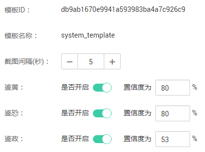
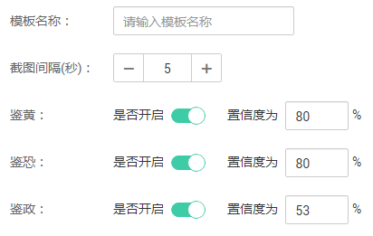
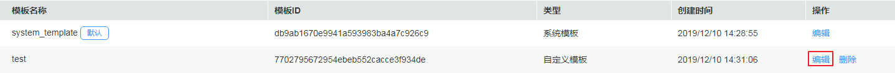
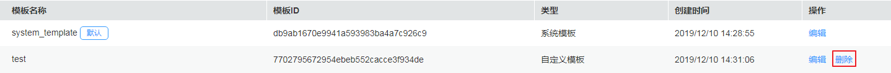

# 审核设置

视频点播服务支持在上传音视频文件后，对音视频文件是否涉黄、涉恐、涉政进行审查，提供了预置的系统审查模板，同时也支持用户根据实际需求自定义审查模板。

## 编辑系统模板

系统模板已设置了通用的音视频审核参数，建议您在使用系统模板时，先确认系统模板的设置是否满足需求，若不满足，您可以根据实际需求对系统模板进行编辑。

1.  登录[视频点播控制台](视频点播控制台https://console.huaweicloud.com/vod)。
2.  在左侧导航栏选择“审核管理 \> 审核设置”，进入音视频审核模板设置界面。
3.  在系统模板行单击“编辑”，在编辑页面修改系统模板的参数，如[图1](#fig124991281575)所示。

    **图 1**  编辑系统模板  
    

4.  编辑完成后，单击“确定”。

## 添加自定义模板

若系统预置模板无法满足您的业务需求，您也可以根据实际需求自定义审核模板。

1.  登录[视频点播控制台](视频点播控制台https://console.huaweicloud.com/vod)。
2.  在左侧导航栏选择“审核管理 \> 审核设置”，进入音视频审核模板设置页面。
3.  单击“自定义模板”，如[图2](#fig105661124174414)所示，在“新建审核模板”页面配置相关参数，参数说明如[表1](#table18452955164118)所示。

    **图 2**  新建审核模板  
    

    **表 1**  审核参数

    
    <table><thead align="left"><tr id="row104521855104115"><th class="cellrowborder" valign="top" width="22.45%" id="mcps1.2.3.1.1">
参数名称

    </th>
    <th class="cellrowborder" valign="top" width="77.55%" id="mcps1.2.3.1.2">
参数说明

    </th>
    </tr>
    </thead>
    <tbody><tr id="row37001686487"><td class="cellrowborder" valign="top" width="22.45%" headers="mcps1.2.3.1.1 ">
模板名称

    </td>
    <td class="cellrowborder" valign="top" width="77.55%" headers="mcps1.2.3.1.2 ">
自定义模板的名称。

    
模板名只能以字母或下划线或数字组成，不含特殊字符，长度不能超过128个字符。

    
示例：MP4_H264

    </td>
    </tr>
    <tr id="row24521455174116"><td class="cellrowborder" valign="top" width="22.45%" headers="mcps1.2.3.1.1 ">
截图间隔

    </td>
    <td class="cellrowborder" valign="top" width="77.55%" headers="mcps1.2.3.1.2 ">
根据间隔时间后台自动截图保存视频图片。

    
取值范围：[1,100]之间的整数。

    </td>
    </tr>
    <tr id="row1445245524112"><td class="cellrowborder" valign="top" width="22.45%" headers="mcps1.2.3.1.1 ">
鉴黄

    </td>
    <td class="cellrowborder" rowspan="3" valign="top" width="77.55%" headers="mcps1.2.3.1.2 ">
支持开启一个或多个，开启后需要设置“置信度”，取值范围为[0,100]。置信度越高，说明审核结果越可信。

    </td>
    </tr>
    <tr id="row1452145513417"><td class="cellrowborder" valign="top" headers="mcps1.2.3.1.1 ">
鉴恐

    </td>
    </tr>
    <tr id="row1145215514116"><td class="cellrowborder" valign="top" headers="mcps1.2.3.1.1 ">
鉴政

    </td>
    </tr>
    </tbody>
    </table>

4.  参数配置完成后，单击“确定“。

    “审核设置”页面的模板列表将生成新创建的模板。

5.  您可以在模板名称列选中目标模板，单击“设为默认”，将创建的模板设置为默认模板。

    若设置为默认模板，则进行音视频智能审核时，系统会根据设置的默认模板参数进行音视频审核。

## 编辑/删除自定义模板

-   自定义模板创建后，您可以在模板列表中单击“编辑”，修改对应的自定义模板。

    **图 3**  编辑自定义审核模板  
    

-   自定义模板创建后，您可以在模板列表中单击“删除”，删除已不需要的模板。删除模板后，使用该模板审核的音视频不受影响。

    **图 4**  删除自定义审核模板  
    

