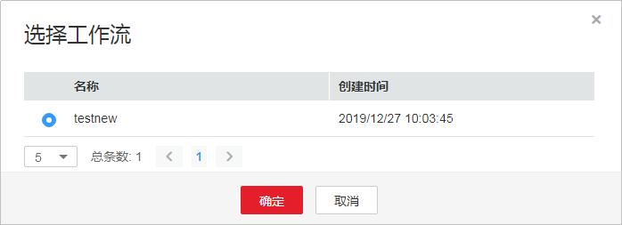
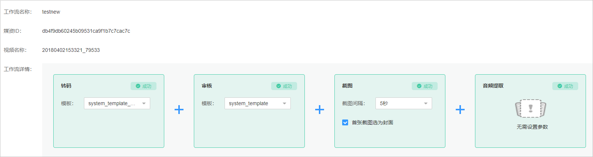

# 工作流管理

视频点播提供了转码、审核等多种媒资处理功能，工作流是指将这些功能流程化，对音视频文件同时进行转码、审核、截图、音频提取等操作，节省媒资处理时间。

> **说明：**   
>视频指导请参见[工作流管理](https://bbs.huaweicloud.com/videos/101101)。  

## 前提条件

已完成工作流程创建及参数配置，具体请参见[工作流设置](工作流设置.md)。

## 操作步骤

1.  登录[视频点播控制台](视频点播控制台https://console.huaweicloud.com/vod)。
2.  在左侧导航栏选择“视频处理 \> 工作流管理”，进入工作流处理界面。
3.  在音视频文件右侧单击“执行”，或者勾选多个视频，单击“执行工作流”，弹出工作流选择框。
4.  选择已配置的工作流，单击“确定”，开始执行工作流。

    **图 1**  选择工作流  
    

5.  工作流处理完成后，可在音视频文件右侧单击“查看”，查看工作流执行详情。

    工作流执行失败时可查看到具体某个任务的执行情况以及错误信息，如[图2](#fig21751813139)所示。

    **图 2**  工作流执行详情  
    

