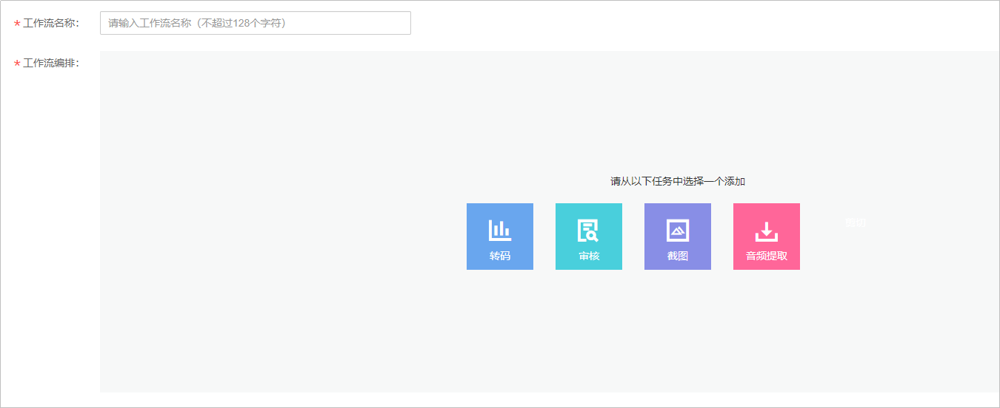
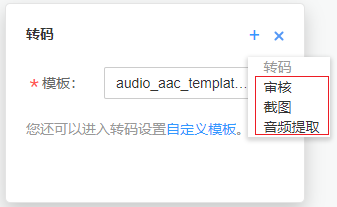

# 工作流设置

视频点播支持通过创建工作流模板，流程化地对音视频进行转码、转封装、审核、截图、音频提取等操作。工作流中所有任务并发执行，所以能在一定程度上提高音视频处理效率。

## 使用限制

一个工作流模板至少要编排一个任务，不支持任务重复编排。

## 创建工作流

1.  登录[视频点播控制台](https://console.huaweicloud.com/vod)。
2.  在左侧导航栏选择“全局设置 \> 工作流配置”，进入工作流配置界面。
3.  单击“创建工作流”，进入创建工作流页面。

    **图 1**  创建工作流  
    

4.  在“工作流名称”中设置工作流名称。

    工作流名称不能超过128个字符。

5.  在“工作流编排”区域创建工作流任务。
    1.  根据需要编排的工作流任务，先选择一个任务添加。
    2.  在选择的任务右上角单击选择其他的任务。您也可以单击删除某个任务，重新进行任务编排。

        **图 2**  编排任务  
        

    3.  为每个任务配置任务参数，具体请参考[表1 工作流任务配置](#table14471612181214)。

        **表 1**  工作流任务配置

        
        <table><thead align="left"><tr id="row1846811217126"><th class="cellrowborder" valign="top" width="11.110000000000001%" id="mcps1.2.4.1.1">
任务名称

        </th>
        <th class="cellrowborder" valign="top" width="36.93%" id="mcps1.2.4.1.2">
任务参数

        </th>
        <th class="cellrowborder" valign="top" width="51.959999999999994%" id="mcps1.2.4.1.3">
说明

        </th>
        </tr>
        </thead>
        <tbody><tr id="row046821291216"><td class="cellrowborder" valign="top" width="11.110000000000001%" headers="mcps1.2.4.1.1 ">
转码

        </td>
        <td class="cellrowborder" valign="top" width="36.93%" headers="mcps1.2.4.1.2 ">
模板：包含系统模板组以及自定义模板组。

        </td>
        <td class="cellrowborder" valign="top" width="51.959999999999994%" headers="mcps1.2.4.1.3 ">
若您需要使用自定义模板组，请先新建转码模板，具体各转码模板限制请参见<a href="转码设置.md">转码设置</a>。

        </td>
        </tr>
        <tr id="row84691812101218"><td class="cellrowborder" valign="top" width="11.110000000000001%" headers="mcps1.2.4.1.1 ">
审核

        </td>
        <td class="cellrowborder" valign="top" width="36.93%" headers="mcps1.2.4.1.2 ">
支持选择系统审核模板或自定义审核模板。

        </td>
        <td class="cellrowborder" valign="top" width="51.959999999999994%" headers="mcps1.2.4.1.3 ">
详细功能说明请参见<a href="音视频审核.md">音视频审核</a>。

        </td>
        </tr>
        <tr id="row104691112141217"><td class="cellrowborder" valign="top" width="11.110000000000001%" headers="mcps1.2.4.1.1 ">
截图

        </td>
        <td class="cellrowborder" valign="top" width="36.93%" headers="mcps1.2.4.1.2 "><ul id="ul446941218122"><li>按时间间隔：根据设置的时间间隔从视频首帧开始截图。</li><li>指定时间点：根据编辑的时间点从视频中截取图片。</li></ul>
        </td>
        <td class="cellrowborder" valign="top" width="51.959999999999994%" headers="mcps1.2.4.1.3 ">
详细功能说明请参见<a href="视频截图.md">视频截图</a>。

        </td>
        </tr>
        <tr id="row1247171271219"><td class="cellrowborder" valign="top" width="11.110000000000001%" headers="mcps1.2.4.1.1 ">
音频提取

        </td>
        <td class="cellrowborder" valign="top" width="36.93%" headers="mcps1.2.4.1.2 ">
无设置参数

        </td>
        <td class="cellrowborder" valign="top" width="51.959999999999994%" headers="mcps1.2.4.1.3 ">
详细功能说明请参见<a href="音视频管理.md#section9295184185414">音频提取</a>。

        </td>
        </tr>
        <tr id="row184711121121"><td class="cellrowborder" valign="top" width="11.110000000000001%" headers="mcps1.2.4.1.1 ">
剪切

        </td>
        <td class="cellrowborder" valign="top" width="36.93%" headers="mcps1.2.4.1.2 "><ul id="ul8471111220121"><li>首帧时间</li><li>尾帧时间</li></ul>
        </td>
        <td class="cellrowborder" valign="top" width="51.959999999999994%" headers="mcps1.2.4.1.3 ">
详细功能说明请参见<a href="视频剪辑.md#section5275183412526">视频剪切</a>。

        </td>
        </tr>
        </tbody>
        </table>

6.  配置完成后，单击“确认”。

    工作流列表中可以看到已创建的工作流。

7.  工作流创建后，您可以在[音视频管理](音视频管理.md)、[上传音视频](控制台上传.md)以及[音视频托管](概述.md)中使用创建的工作流进行音视频处理。

