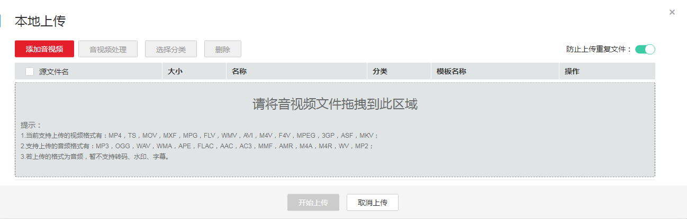
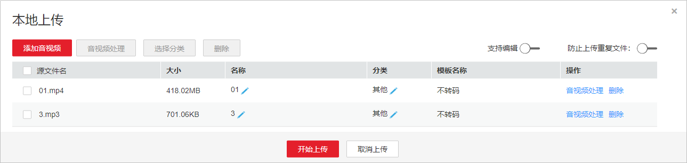
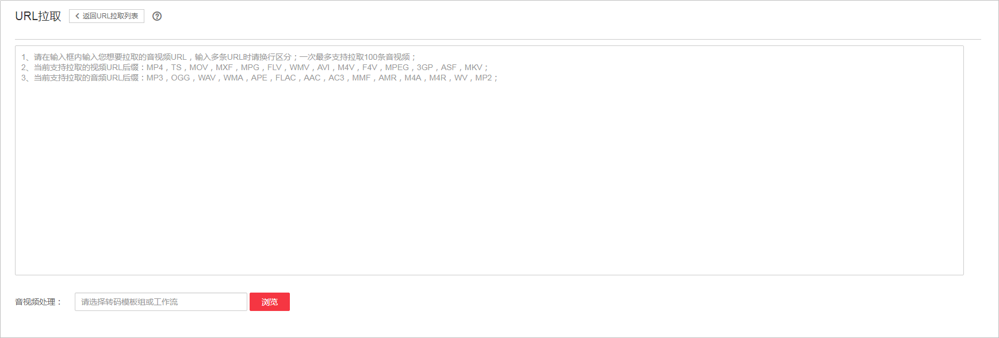
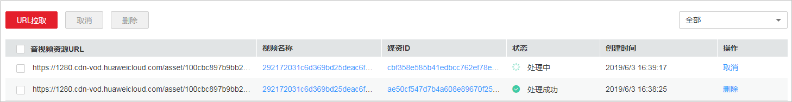

# 控制台上传

开通视频点播服务后，您可以将音视频上传至点播服务，从而进行相关管理操作。您可以参考如下步骤进行视频上传，也可以参考[视频指导](https://bbs.huaweicloud.com/videos/5dee9dd46e6645819b08cbdb7da338dc)来操作。

## 使用限制

支持上传的音视频文件格式如下所示：

-   视频文件格式：MP4，TS，MOV，MXF，MPG，FLV，WMV，AVI，M4V，F4V，MPEG，3GP，ASF，MKV、M3U8。
-   音频文件格式：MP3，OGG，WAV，WMA，APE，FLAC，AAC，AC3，MMF，AMR，M4A，M4R，WV，MP2。

## 前提条件

-   若您需要对上传的音视频进行分类，请先参考[分类设置](分类设置.md)创建分类。
-   若您需要实时了解音视频上传的进展，请先参考[消息订阅](消息订阅.md)配置消息通知。
-   若您需要对上传的音视频进行转码，请先参考[转码设置](转码设置.md)创建转码模板。
-   若您需要对使用工作流的方式对上传的音视频进行处理，请先参考[工作流设置](工作流设置.md)创建工作流。

## 本地上传

您可以将存储在本地磁盘的音视频文件上传到视频点播中。

> **须知：**   
>本地上传过程中请勿刷新页面、清理浏览器缓存或关闭浏览器。  

1.  登录[视频点播控制台](视频点播控制台https://console.huaweicloud.com/vod)。
2.  在左侧导航页选择“上传音视频 \> 本地上传”，进入本地上传页面。
3.  单击“本地上传”，弹出“本地上传”窗口。
4.  单击“添加音视频”添加本地媒资文件，或者直接将本地文件拖拽至界面区域。

    **图 1**  本地上传  
    

5.  在上传页面开启“防止上传重复文件”开关，可为防止重复上传音视频文件，避免时间及存储空间浪费。

    您可根据需要自行设置，开启后将默认一直开启。若添加本地文件时出现重复音视频，则右上角会显示错误提示。

6.  您可以选择是否对上传的音视频进行分类、名称修改、音视频处理等。

    **图 2**  设置音视频处理  
    

    -   不进行音视频处理：保持默认配置即可。
    -   进行音视频处理，则单击“音视频处理”，请根据下表配置视频处理参数。

        
        <table><thead align="left"><tr id="row1148512619521"><th class="cellrowborder" valign="top" width="50%" id="mcps1.1.3.1.1">
处理方式

        </th>
        <th class="cellrowborder" valign="top" width="50%" id="mcps1.1.3.1.2">
转码/工作流模板

        </th>
        </tr>
        </thead>
        <tbody><tr id="row5486102610520"><td class="cellrowborder" valign="top" width="50%" headers="mcps1.1.3.1.1 ">
转码模板组

        </td>
        <td class="cellrowborder" valign="top" width="50%" headers="mcps1.1.3.1.2 ">
当处理方式为选择“转码模板组”时，此参数为转码模板组，请选择系统预置模板组或者参考<a href="https://support.huaweicloud.com/usermanual-vod/zh-cn_topic_0128969719.html" target="_blank" rel="noopener noreferrer">转码设置</a>创建的自定义模板组。

        </td>
        </tr>
        <tr id="row134861126165211"><td class="cellrowborder" valign="top" width="50%" headers="mcps1.1.3.1.1 ">
工作流

        </td>
        <td class="cellrowborder" valign="top" width="50%" headers="mcps1.1.3.1.2 ">
当处理方式选择“工作流”时，此参数为工作流模板，请选择一个现有的任务流，或参考<a href="https://support.huaweicloud.com/usermanual-vod/vod010041.html" target="_blank" rel="noopener noreferrer">工作流设置</a>创建工作流模板。

        </td>
        </tr>
        </tbody>
        </table>

7.  设置完成后，单击“开始上传”，开始上传音视频文件。

    上传时间与文件大小和网络情况都有关。

8.  上传成功后，媒资文件默认发布，您可以在[音视频管理](https://support.huaweicloud.com/usermanual-vod/vod010010.html)页面查看音视频信息。

    视频文件上传后，点播系统将默认生成一张封面。

## URL拉取

URL拉取是指基于音视频源文件URL，离线拉取上传到点播系统。

1.  登录[视频点播控制台](视频点播控制台https://console.huaweicloud.com/vod)。
2.  在左侧导航栏选择“上传音视频 \> URL拉取”，进入URL拉取页面。
3.  单击“URL拉取”，输入符合要求的音视频URL。

    **图 3**  设置URL拉取参数  
    

    拉取的URL需要满足如下条件：

    -   URL中需要包括扩展名， 示例： “https://xxxx.mp4” 。
    -   拉取多个URL以换行区分，最多支持100个。
    -   暂只支持HTTP和HTTPS协议。

4.  您可以根据需要选择是否对拉取的音视频文件进行处理。
    -   不进行处理：保持默认配置即可。

    -   进行处理：则单击“音视频处理”右侧“浏览”，根据下表配置音视频处理参数。

        
        <table><thead align="left"><tr id="row981317441006"><th class="cellrowborder" valign="top" width="50%" id="mcps1.1.3.1.1">
处理方式

        </th>
        <th class="cellrowborder" valign="top" width="50%" id="mcps1.1.3.1.2">
转码/工作流模板

        </th>
        </tr>
        </thead>
        <tbody><tr id="row178133447019"><td class="cellrowborder" valign="top" width="50%" headers="mcps1.1.3.1.1 ">
转码模板组

        </td>
        <td class="cellrowborder" valign="top" width="50%" headers="mcps1.1.3.1.2 ">
当处理方式为选择“转码模板组”时，此参数为转码模板组，请选择系统预置模板组或者参考<a href="转码设置.md#section482219141611">自定义转码模板组</a>创建的自定义模板组。

        </td>
        </tr>
        <tr id="row168137441706"><td class="cellrowborder" valign="top" width="50%" headers="mcps1.1.3.1.1 ">
工作流

        </td>
        <td class="cellrowborder" valign="top" width="50%" headers="mcps1.1.3.1.2 ">
当处理方式选择“工作流”时，此参数为工作流模板，请选择一个现有的任务流，或参考<a href="工作流设置.md">工作流设置</a>创建工作流模板。

        </td>
        </tr>
        </tbody>
        </table>

5.  单击“确认”，可在URL拉取列表中查看到任务执行情况。

    **图 4**  URL拉取执行情况  
    

    当状态为“处理成功”时，表示拉取成功，您可以在[音视频管理](音视频管理.md)页面查看音视频信息。

## 音视频托管

若您的音视频文件已存储在华为云OBS桶中，您只可以使用该方式，将OBS桶中的音视频文件托管给视频点播，通过视频点播处理后的媒资文件可以选择存储在点播服务或者OBS桶中，详情请参见[音视频托管](概述.md)。

