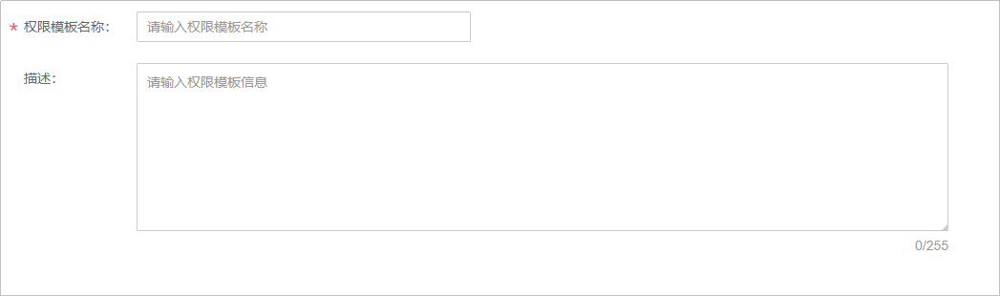

# 权限模板

## 注意事项

-   IAM子账号无法进行用户管理。
-   用户管理功能暂只支持“华北-北京四”区域，且暂处于公测阶段，若您有需要，请[提交工单](https://console.huaweicloud.com/ticket/?#/ticketindex/business?productTypeId=ffb4ebf5fb094bc6aef0129c276ce42e)申请开通。

## 创建模板

1.  登录[视频点播控制台](https://console.huaweicloud.com/vod)。
2.  在控制台左上角切换区域到“华北-北京四”。

    **图 1**  切换区域  
    

3.  在左侧导航树中选择“权限管理 \> 权限模板”，进入权限模板页面。
4.  单击“创建模板”，配置模板参数。

    **图 2**  创建权限模板  
    

5.  单击“确定”，完成权限模板创建。
    -   用户权限：权限模板创建后，您可以在角色管理中，为对应的角色[关联模板](角色管理.md#section10837142723219)，设置模板级别。
    -   媒资权限：权限模板创建后，您可以在媒资管理中[上传音视频](媒资管理.md#section20499155015207)、[创建图片组](媒资管理.md#section182434141202)或[创建文件夹](媒资管理.md#section1575554019337)时设置对应的权限模板。

## 管理模板

-   **编辑**：您可以在对应的任务行单击“编辑”，进入编辑页面修改权限模板的名称和描述。
-   **删除**：您可以在对应的任务行单击“删除”，删除无用的权限模板。

