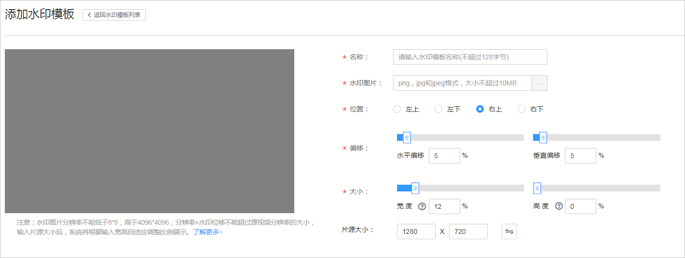

# 水印设置

视频点播支持水印设置，您可以根据需求上传图片作为水印模板。在视频转码时将水印压制到视频的指定位置。

## 注意事项

-   水印只能进行转码操作时压制到视频中，因此添加水印会产生转码费用，费用详情请参见[价格说明](https://support.huaweicloud.com/price-vod/vod070001.html)。
-   若您不需要添加水印，请在转码前把所有水印模板设为“非默认”状态，并且在转码模板中绑定“默认水印”。

## 使用限制

-   设置默认的水印模板数量不能超过2个，即最多只能对转码视频添加两个水印。
-   对水印图片要求如下：
    -   仅支持png、jpg和jpeg格式的图片作为水印模板。
    -   作为水印模板的图片分辨率不低于8\*8，不高于4096\*4096，图片大小不超过10MB。
    -   水印图片分辨率+水印位移不超过源视频分辨率大小。例如：输入源视频分辨率为1920\*1080，水印图片分辨率为1800\*1000，位移位置为（+200，+100），1800+200=2000\>1920，1000+100=1100\>1080，均会导致失败。

## 添加水印模板

1.  登录[视频点播控制台](视频点播控制台https://console.huaweicloud.com/vod)。
2.  在左侧导航栏选择“全局设置 \> 水印设置“  ，进入“水印设置“页面。
3.  单击“添加水印模板“，进入新建水印页面，配置水印参数。

    **图 1**  添加水印  
    

    水印参数说明如下所示：

    -   **名称**：不超过128个字节。
    -   **水印图片**：支持png、jpg、jpeg格式，大小不超过10M的图片，建议使用透明图片PNG格式。
    -   **位置**：水印的初始位置，默认为右上。
    -   **偏移**：根据设置的初始位置，设置对应比例进行水平或垂直偏移。
    -   **大小：**水印大小，按照设置的比例对上传图片进行缩放。
    -   **片源大小**：预览画面的大小，建议根据实际情况设置，以便展现水印的实际效果。

4.  水印参数设置后，可以在预览区域查看其水印效果。
5.  单击“确定”，水印模板列表新增一条记录。
6.  您可以在需要设置为默认水印模板的“操作“列单击“默认”。

    设置默认水印后，所有转码模板中的水印默认选择“默认水印”，转码时会将对应的默认水印压制到视频中，具体请参见[转码设置](转码设置.md)。

    > **须知：**   
    >若您只是需要对部分视频添加水印，建议不要设置默认水印，在需要添加水印的转码模板中选择对应的水印模板即可。  

