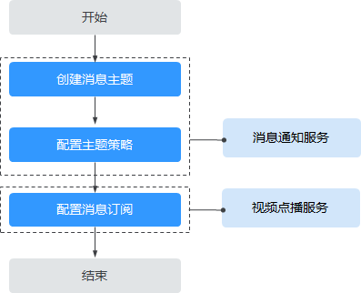
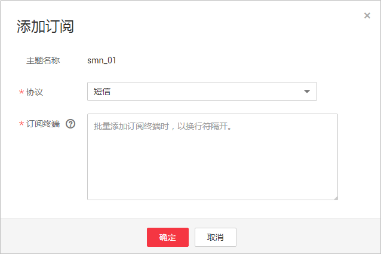
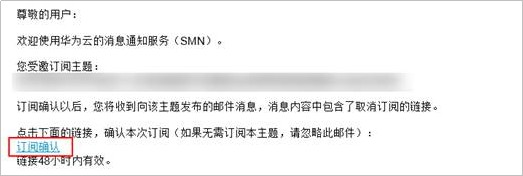
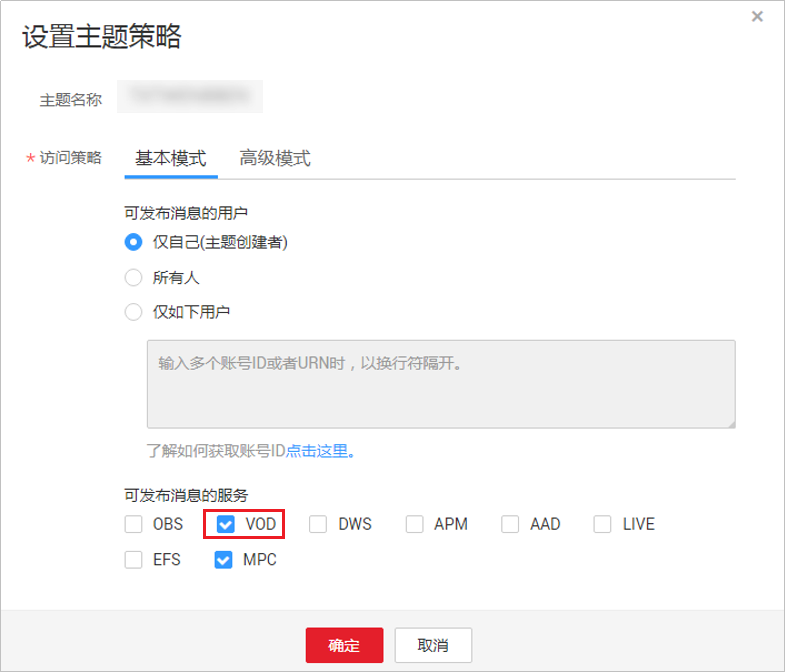
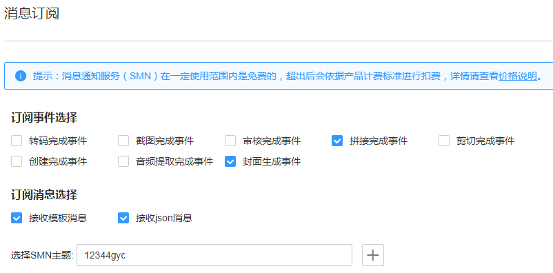

# 消息订阅

视频点播支持消息通知功能，对转码事件，截图事件，审核事件等进行任务执行状态的实时通知。由于消息通知由消息通知服务（SMN）完成，所以SMN将对发送的消息通知进行单独计费，具体的计费标准请参考[SMN价格详情](https://www.huaweicloud.com/pricing.html?tab=detail#/smn)。

## 功能介绍

-   主题是消息发布或客户端订阅通知的特定事件类型。它作为发送消息和订阅通知的信道，为发布者和订阅者提供一个可以相互交流的通道。在配置点播消息订阅前必须定制主题。
-   点播消息通知包括“转码完成“、“截图完成“、“审核完成“、“拼接完成“、“剪切完成”、“创建完成”、“音频提取完成”、“封面生成完成”几类。消息订阅是客户将订阅者注册到主题的操作，客户可以拥有多个主题，每个主题有多个订阅者。

## 配置流程

消息订阅的配置流程，如[图1](#fig8572102817556)所示。

**图 1**  消息订阅配置流程图  

1.  [创建消息主题](#section74914302111)：在消息通知服务控制台新建消息主题，用于消息发送和订阅通知。
2.  [设置主题策略](#section1236167104517)：授权点播服务可对该主题发布消息。
3.  [配置点播消息订阅](#section7268131263020)：在点播控制台配置消息订阅，即可在转码、截图、审核等操作时接收到消息通知。

## 创建消息主题

1.  登录[消息通知服务](https://console.huaweicloud.com/smn)控制台，单击“主题管理 \> 主题”，进入主题管理页面。
2.  单击右上角“创建主题”，创建消息通知的主题。
3.  在创建主题弹窗配置主题的信息，信息说明请参见[表1](#zh-cn_topic_0133683185_zh-cn_topic_0128969723_zh-cn_topic_0133683185_table12732184541220)。配置完成后，单击“确定”。

    **表 1**  创建主题

    
    <table><thead align="left"><tr id="zh-cn_topic_0133683185_zh-cn_topic_0128969723_zh-cn_topic_0133683185_row1773384511219"><th class="cellrowborder" valign="top" width="12.04%" id="mcps1.2.3.1.1">
主题信息

    </th>
    <th class="cellrowborder" valign="top" width="87.96000000000001%" id="mcps1.2.3.1.2">
说明

    </th>
    </tr>
    </thead>
    <tbody><tr id="zh-cn_topic_0133683185_zh-cn_topic_0128969723_zh-cn_topic_0133683185_row1273374571213"><td class="cellrowborder" valign="top" width="12.04%" headers="mcps1.2.3.1.1 ">
消息名称

    </td>
    <td class="cellrowborder" valign="top" width="87.96000000000001%" headers="mcps1.2.3.1.2 "><ul id="zh-cn_topic_0133683185_zh-cn_topic_0128969723_zh-cn_topic_0133683185_ul144772058131615"><li>消息名称为必填</li><li>只能包含大写字母、小写字母、数字、-和_，且必须由大写字母、小写字母或数字开头</li><li>长度为1～256字符</li></ul>
    </td>
    </tr>
    <tr id="zh-cn_topic_0133683185_zh-cn_topic_0128969723_zh-cn_topic_0133683185_row4733154551213"><td class="cellrowborder" valign="top" width="12.04%" headers="mcps1.2.3.1.1 ">
显示名

    </td>
    <td class="cellrowborder" valign="top" width="87.96000000000001%" headers="mcps1.2.3.1.2 ">
可不填写。推送邮件消息时：

    <ul id="zh-cn_topic_0133683185_zh-cn_topic_0128969723_zh-cn_topic_0133683185_ul1342165013207"><li>若未设置主题的显示名，发件人呈现为"username@example.com"</li><li>若已设置主题的显示名，发件人则呈现为"显示名&lt;username@example.com&gt;"</li></ul>
    </td>
    </tr>
    <tr id="zh-cn_topic_0133683185_zh-cn_topic_0128969723_zh-cn_topic_0133683185_row1273364541216"><td class="cellrowborder" valign="top" width="12.04%" headers="mcps1.2.3.1.1 ">
标签

    </td>
    <td class="cellrowborder" valign="top" width="87.96000000000001%" headers="mcps1.2.3.1.2 ">
用于标识多种云资源，可不填写

    </td>
    </tr>
    </tbody>
    </table>

4.  在已创建的主题行单击“操作“列的“添加订阅“，进入添加订阅页面。
5.  配置消息通知的协议和订阅终端，如[图2](#zh-cn_topic_0133683185_zh-cn_topic_0128969723_zh-cn_topic_0129029645_fig2840163341217)所示。

    **图 2**  添加订阅  
    

    参数说明如[表2](#zh-cn_topic_0133683185_zh-cn_topic_0128969723_zh-cn_topic_0129029645_zh-cn_topic_0129313184_table7895120104519)所示。

    **表 2**  添加订阅参数说明

    
    <table><thead align="left"><tr id="zh-cn_topic_0133683185_zh-cn_topic_0128969723_zh-cn_topic_0129029645_zh-cn_topic_0129313184_row1389740134510"><th class="cellrowborder" valign="top" width="18%" id="mcps1.2.3.1.1">
参数

    </th>
    <th class="cellrowborder" valign="top" width="82%" id="mcps1.2.3.1.2">
说明

    </th>
    </tr>
    </thead>
    <tbody><tr id="zh-cn_topic_0133683185_zh-cn_topic_0128969723_zh-cn_topic_0129029645_zh-cn_topic_0129313184_row389810034519"><td class="cellrowborder" valign="top" width="18%" headers="mcps1.2.3.1.1 ">
主题名称

    </td>
    <td class="cellrowborder" valign="top" width="82%" headers="mcps1.2.3.1.2 ">
待添加订阅的主题名称，不需要修改。

    </td>
    </tr>
    <tr id="zh-cn_topic_0133683185_zh-cn_topic_0128969723_zh-cn_topic_0129029645_zh-cn_topic_0129313184_row1389911024510"><td class="cellrowborder" valign="top" width="18%" headers="mcps1.2.3.1.1 ">
协议

    </td>
    <td class="cellrowborder" valign="top" width="82%" headers="mcps1.2.3.1.2 ">
消息通知的方式。在下拉框中选择需要订阅终端支持的协议。

    
媒体处理服务常用的消息通知方式为“短信”、“邮件”和“HTTP/HTTPS”。

    </td>
    </tr>
    <tr id="zh-cn_topic_0133683185_zh-cn_topic_0128969723_zh-cn_topic_0129029645_zh-cn_topic_0129313184_row8899110144510"><td class="cellrowborder" valign="top" width="18%" headers="mcps1.2.3.1.1 ">
订阅终端

    </td>
    <td class="cellrowborder" valign="top" width="82%" headers="mcps1.2.3.1.2 ">
订阅的终端地址，短信、邮件、HTTP以及HTTPS终端支持批量输入，批量添加时，每个终端地址占一行。最多可输入10个终端。

    <ul id="zh-cn_topic_0133683185_zh-cn_topic_0128969723_zh-cn_topic_0129029645_zh-cn_topic_0129313184_ul684911201488"><li>选择“短信”，请输入有效手机号码。
输入规则为[+] [国家码][手机号码]。国内手机号码可省略[+]或[+] [国家码]。

    
例如：

    
+8600000000000

    
+8600000000001

    </li><li>选择“邮件”，请输入有效电子邮件地址。
例如：

    
username@example.com

    
username2@example.com

    </li><li>选择“HTTP”或“HTTPS”，请输入公网网址。
例如：

    
http://example.com/notification/action

    
http://example2.com/notification/action

    </li></ul>
    </td>
    </tr>
    </tbody>
    </table>

6.  添加订阅后，配置的订阅终端将收到确认订阅消息。若订阅终端为邮件，如[图3](#zh-cn_topic_0133683185_zh-cn_topic_0128969723_zh-cn_topic_0129029645_fig196641486191)所示。确认后，设置的订阅终端才能收到该主题发布的消息。

    **图 3**  消息订阅确认  
    

## 设置主题策略

1.  在[消息通知服务](https://console.huaweicloud.com/smn)控制台的左侧导航树中选择“主题管理 \> 主题“，进入主题页面。
2.  在创建的主题行单击“操作“列的“更多 \> 设置主题策略”，弹出主题策略设置页面。
3.  配置主题策略的参数，如[图4](#fig197371035175117)所示。

    **图 4**  设置主题策略  
    

    访问策略分为基本模式和高级模式，其中基本模式只可对用户和服务设置发布消息的操作权限，如[图4](#fig197371035175117)所示。

    **表 3**  基本模式说明

    
    <table><thead align="left"><tr id="row18859182275112"><th class="cellrowborder" valign="top" width="20.03%" id="mcps1.2.4.1.1">
策略对象

    </th>
    <th class="cellrowborder" valign="top" width="19.97%" id="mcps1.2.4.1.2">
参数设置

    </th>
    <th class="cellrowborder" valign="top" width="60%" id="mcps1.2.4.1.3">
说明

    </th>
    </tr>
    </thead>
    <tbody><tr id="row2860172225117"><td class="cellrowborder" rowspan="3" valign="top" width="20.03%" headers="mcps1.2.4.1.1 ">
可发布消息的用户

    </td>
    <td class="cellrowborder" valign="top" width="19.97%" headers="mcps1.2.4.1.2 ">
仅自己（主题创建者）

    </td>
    <td class="cellrowborder" valign="top" width="60%" headers="mcps1.2.4.1.3 ">
仅主题创建者有权限向该主题发布消息。

    </td>
    </tr>
    <tr id="row158601722195114"><td class="cellrowborder" valign="top" headers="mcps1.2.4.1.1 ">
所有人

    </td>
    <td class="cellrowborder" valign="top" headers="mcps1.2.4.1.2 ">
所有用户均有权限向该主题发布消息。

    </td>
    </tr>
    <tr id="row886252214518"><td class="cellrowborder" valign="top" headers="mcps1.2.4.1.1 ">
仅如下用户

    </td>
    <td class="cellrowborder" valign="top" headers="mcps1.2.4.1.2 ">
设置可向该主题发布消息的用户。

    
格式为urn:csp:iam::domainId:root

    
其中，domainId即为用户的账号ID。多个用户时，以英文逗号隔开，可输入的用户数量没有限制，但生成的策略总长度不超过30KB。
 说明： 
<ul id="ul13862122219513"><li>您只需填写用户的“账号ID”，输入完成后，单击“确定”。其余内容由系统自动补全。</li><li>“账号ID”的获取方式：登录消息通知服务控制台，单击右上角用户名下的“我的凭证”，可查看“账号ID”。</li></ul>
    

    

    </td>
    </tr>
    <tr id="row1786311227517"><td class="cellrowborder" valign="top" width="20.03%" headers="mcps1.2.4.1.1 ">
可发布消息的服务

    </td>
    <td class="cellrowborder" valign="top" width="19.97%" headers="mcps1.2.4.1.2 ">
设置项如<a href="#fig197371035175117">图4</a>中所示。

    </td>
    <td class="cellrowborder" valign="top" width="60%" headers="mcps1.2.4.1.3 ">
勾选“VOD”，表示授权该云服务可对该主题进行操作。

    </td>
    </tr>
    </tbody>
    </table>

## 配置点播消息订阅

1.  登录[视频点播控制台](https://console.huaweicloud.com/vod)。
2.  在左侧导航树中选择“全局设置 \> 消息订阅”，进入消息订阅页签。

    **图 5**  配置消息订阅  
    

3.  根据需要勾选订阅事件。
4.  根据需要勾选订阅消息类型。

    > **说明：** 
    >当前配置消息订阅，模板消息以及json消息都勾选时，对于“短信”以及“邮件”订阅协议，只能接收到模板消息，对于“HTTP”以及“HTTPS”订阅协议，只能接收到json消息。

    -   勾选“接收模板消息”，模板消息内容请参考[表4 模板消息说明](#table3997340125215)。

        **表 4**  模板消息说明

        
        <table><thead align="left"><tr id="row1799264015220"><th class="cellrowborder" valign="top" width="16.830000000000002%" id="mcps1.2.5.1.1">
事件

        </th>
        <th class="cellrowborder" valign="top" width="7.739999999999999%" id="mcps1.2.5.1.2">
事件处理结果状态

        </th>
        <th class="cellrowborder" valign="top" width="55.52%" id="mcps1.2.5.1.3">
通知文本消息内容

        </th>
        <th class="cellrowborder" valign="top" width="19.91%" id="mcps1.2.5.1.4">
备注

        </th>
        </tr>
        </thead>
        <tbody><tr id="row109921040135216"><td class="cellrowborder" rowspan="2" valign="top" width="16.830000000000002%" headers="mcps1.2.5.1.1 ">
转码完成

        </td>
        <td class="cellrowborder" valign="top" width="7.739999999999999%" headers="mcps1.2.5.1.2 ">
成功

        </td>
        <td class="cellrowborder" valign="top" width="55.52%" headers="mcps1.2.5.1.3 ">
尊敬的用户，您的视频转码任务已成功完成。视频ID：{asset_id}，名称：{title}，请登录点播Console或调用点播API获取详细转码信息。

        </td>
        <td class="cellrowborder" rowspan="2" valign="top" width="19.91%" headers="mcps1.2.5.1.4 ">
asset_id、title、err_code、err_msg根据具体转码的视频而定。

        

        </td>
        </tr>
        <tr id="row299354095216"><td class="cellrowborder" valign="top" headers="mcps1.2.5.1.1 ">
失败

        </td>
        <td class="cellrowborder" valign="top" headers="mcps1.2.5.1.2 ">
尊敬的用户，您的视频转码任务处理时出现错误。视频ID：{asset_id}，名称：{title}，错误码：{err_code}，错误信息：{err_msg}。

        </td>
        </tr>
        <tr id="row1899314019520"><td class="cellrowborder" rowspan="2" valign="top" width="16.830000000000002%" headers="mcps1.2.5.1.1 ">
截图完成

        </td>
        <td class="cellrowborder" valign="top" width="7.739999999999999%" headers="mcps1.2.5.1.2 ">
成功

        </td>
        <td class="cellrowborder" valign="top" width="55.52%" headers="mcps1.2.5.1.3 ">
尊敬的用户，您的视频截图任务已成功完成。视频ID：{asset_id}，名称：{title}，请登录点播Console或调用点播API获取详细截图信息。

        </td>
        <td class="cellrowborder" rowspan="2" valign="top" width="19.91%" headers="mcps1.2.5.1.4 ">
asset_id、title、err_code、err_msg根据具体截图的视频而定。

        </td>
        </tr>
        <tr id="row5993194055212"><td class="cellrowborder" valign="top" headers="mcps1.2.5.1.1 ">
失败

        </td>
        <td class="cellrowborder" valign="top" headers="mcps1.2.5.1.2 ">
尊敬的用户，您的视频截图任务处理时出现错误。视频ID：{asset_id}，名称：{title}，错误码：{err_code}，错误信息：{err_msg}。

        </td>
        </tr>
        <tr id="row89943405525"><td class="cellrowborder" rowspan="2" valign="top" width="16.830000000000002%" headers="mcps1.2.5.1.1 ">
审核完成

        </td>
        <td class="cellrowborder" valign="top" width="7.739999999999999%" headers="mcps1.2.5.1.2 ">
成功

        </td>
        <td class="cellrowborder" valign="top" width="55.52%" headers="mcps1.2.5.1.3 ">
尊敬的用户，您的视频审核任务已成功完成。视频ID：{asset_id}，名称：{title}，审核建议：{suggestion}，请登录点播Console或调用点播API获取详细审核信息。

        </td>
        <td class="cellrowborder" rowspan="2" valign="top" width="19.91%" headers="mcps1.2.5.1.4 ">
asset_id、title、err_code、err_msg、suggestion根据具体审核的视频而定。

        </td>
        </tr>
        <tr id="row1699494025214"><td class="cellrowborder" valign="top" headers="mcps1.2.5.1.1 ">
失败

        </td>
        <td class="cellrowborder" valign="top" headers="mcps1.2.5.1.2 ">
尊敬的用户，您的视频审核任务处理时出现错误。视频ID：{asset_id}，名称：{title}，错误码：{err_code}，错误信息：{err_msg}。

        </td>
        </tr>
        <tr id="row799444018523"><td class="cellrowborder" valign="top" width="16.830000000000002%" headers="mcps1.2.5.1.1 ">
拼接完成

        </td>
        <td class="cellrowborder" valign="top" width="7.739999999999999%" headers="mcps1.2.5.1.2 ">
成功

        </td>
        <td class="cellrowborder" valign="top" width="55.52%" headers="mcps1.2.5.1.3 ">
尊敬的用户，您的视频拼接任务已成功完成。生成视频ID：{asset_id}，生成视频名称：{title}，请登录点播Console或调用点播API获取详细生成视频信息。

        </td>
        <td class="cellrowborder" valign="top" width="19.91%" headers="mcps1.2.5.1.4 ">
asset_id、title、err_code、err_msg根据具体拼接而成的视频而定。

        </td>
        </tr>
        <tr id="row19941740135212"><td class="cellrowborder" valign="top" width="16.830000000000002%" headers="mcps1.2.5.1.1 ">
拼接完成

        </td>
        <td class="cellrowborder" valign="top" width="7.739999999999999%" headers="mcps1.2.5.1.2 ">
失败

        </td>
        <td class="cellrowborder" valign="top" width="55.52%" headers="mcps1.2.5.1.3 ">
尊敬的用户，您的视频拼接任务处理时出现错误。生成视频ID：{asset_id}，生成视频名称：{title}，错误码：{err_code}，错误信息：{err_msg}。

        </td>
        <td class="cellrowborder" valign="top" width="19.91%" headers="mcps1.2.5.1.4 ">
asset_id、title、err_code、err_msg根据具体拼接而成的视频而定。

        </td>
        </tr>
        <tr id="row199584015525"><td class="cellrowborder" valign="top" width="16.830000000000002%" headers="mcps1.2.5.1.1 ">
剪切完成

        </td>
        <td class="cellrowborder" valign="top" width="7.739999999999999%" headers="mcps1.2.5.1.2 ">
成功

        </td>
        <td class="cellrowborder" valign="top" width="55.52%" headers="mcps1.2.5.1.3 ">
尊敬的用户，您的视频剪切任务已成功完成。生成视频ID：{asset_id}，生成视频名称：{title}，请登录点播Console或调用点播API获取详细生成视频信息。

        </td>
        <td class="cellrowborder" valign="top" width="19.91%" headers="mcps1.2.5.1.4 ">
asset_id、title、err_code、err_msg根据具体剪切而成的视频而定。

        </td>
        </tr>
        <tr id="row1499519400520"><td class="cellrowborder" valign="top" width="16.830000000000002%" headers="mcps1.2.5.1.1 ">
剪切完成

        </td>
        <td class="cellrowborder" valign="top" width="7.739999999999999%" headers="mcps1.2.5.1.2 ">
失败

        </td>
        <td class="cellrowborder" valign="top" width="55.52%" headers="mcps1.2.5.1.3 ">
尊敬的用户，您的视频剪切任务处理时出现错误。生成视频ID：{asset_id}，生成视频名称：{title}，错误码：{err_code}，错误信息：{err_msg}。

        </td>
        <td class="cellrowborder" valign="top" width="19.91%" headers="mcps1.2.5.1.4 ">
asset_id、title、err_code、err_msg根据具体剪切而成的视频而定。

        </td>
        </tr>
        <tr id="row1999554015524"><td class="cellrowborder" rowspan="2" valign="top" width="16.830000000000002%" headers="mcps1.2.5.1.1 ">
媒资创建完成

        </td>
        <td class="cellrowborder" valign="top" width="7.739999999999999%" headers="mcps1.2.5.1.2 ">
成功

        </td>
        <td class="cellrowborder" valign="top" width="55.52%" headers="mcps1.2.5.1.3 ">
尊敬的用户，您的视频创建完成。视频ID：{asset_id}，视频名称：{title}，请登录点播Console或调用点播API获取详细视频信息。

        </td>
        <td class="cellrowborder" rowspan="2" valign="top" width="19.91%" headers="mcps1.2.5.1.4 ">
asset_id、title、err_code、err_msg根据具体创建的媒资而定。

        </td>
        </tr>
        <tr id="row2099634045212"><td class="cellrowborder" valign="top" headers="mcps1.2.5.1.1 ">
失败

        </td>
        <td class="cellrowborder" valign="top" headers="mcps1.2.5.1.2 ">
尊敬的用户，您的视频创建时出现错误。视频ID：{asset_id}，视频名称：{title}，错误码：{err_code}，错误信息：{err_msg}。

        </td>
        </tr>
        <tr id="row1299616403526"><td class="cellrowborder" rowspan="2" valign="top" width="16.830000000000002%" headers="mcps1.2.5.1.1 ">
音频提取完成

        </td>
        <td class="cellrowborder" valign="top" width="7.739999999999999%" headers="mcps1.2.5.1.2 ">
成功

        </td>
        <td class="cellrowborder" valign="top" width="55.52%" headers="mcps1.2.5.1.3 ">
尊敬的用户，您的音频提取完成。音频ID：{asset_id}，音频名称：{title}，请登录点播Console或调用点播API获取详细音频信息。

        </td>
        <td class="cellrowborder" rowspan="2" valign="top" width="19.91%" headers="mcps1.2.5.1.4 ">
asset_id、title、err_code、err_msg根据具体提取音频的媒资而定。

        </td>
        </tr>
        <tr id="row1899674095211"><td class="cellrowborder" valign="top" headers="mcps1.2.5.1.1 ">
失败

        </td>
        <td class="cellrowborder" valign="top" headers="mcps1.2.5.1.2 ">
尊敬的用户，您的音频提取时出现错误。音频ID：{asset_id}，音频名称：{title}，错误码：{err_code}，错误信息：{err_msg}。

        </td>
        </tr>
        <tr id="row15997114019522"><td class="cellrowborder" rowspan="2" valign="top" width="16.830000000000002%" headers="mcps1.2.5.1.1 ">
封面生成完成

        </td>
        <td class="cellrowborder" valign="top" width="7.739999999999999%" headers="mcps1.2.5.1.2 ">
成功

        </td>
        <td class="cellrowborder" valign="top" width="55.52%" headers="mcps1.2.5.1.3 ">
尊敬的用户，您的视频封面已生成。视频ID：{asset_id}，视频名称：{title}，请登录点播Console或调用点播API获取详细视频信息。

        </td>
        <td class="cellrowborder" rowspan="2" valign="top" width="19.91%" headers="mcps1.2.5.1.4 ">
asset_id、title、err_code、err_msg根据具体生成封面的媒资而定。

        </td>
        </tr>
        <tr id="row17997124016526"><td class="cellrowborder" valign="top" headers="mcps1.2.5.1.1 ">
失败

        </td>
        <td class="cellrowborder" valign="top" headers="mcps1.2.5.1.2 ">
尊敬的用户，您的视频封面生成失败。视频ID：{asset_id}，视频名称：{title}，错误码：{err_code}，错误信息：{err_msg}。

        </td>
        </tr>
        </tbody>
        </table>

    -   勾选“接收json消息”，消息模板请参考[表5 json消息模板说明](#table132134165213)。

        **表 5**  json消息模板说明

        
        <table><thead align="left"><tr id="row0998940115219"><th class="cellrowborder" valign="top" width="19.7%" id="mcps1.2.4.1.1">
参数

        </th>
        <th class="cellrowborder" valign="top" width="60.56%" id="mcps1.2.4.1.2">
说明

        </th>
        <th class="cellrowborder" valign="top" width="19.74%" id="mcps1.2.4.1.3">
类型

        </th>
        </tr>
        </thead>
        <tbody><tr id="row14999174010526"><td class="cellrowborder" valign="top" width="19.7%" headers="mcps1.2.4.1.1 ">
event_type

        </td>
        <td class="cellrowborder" valign="top" width="60.56%" headers="mcps1.2.4.1.2 ">
事件类型，当前支持的取值如下：

        <ul id="ul19991409525"><li>TranscodeComplete：转码（加密）完成</li><li>ThumbnailComplete：截图完成</li><li>ReviewComplete：审核完成</li><li>ConcatComplete：拼接完成</li><li>CutComplete：剪切完成</li><li>CreateComplete：媒资创建完成</li><li>AudioExtractComplete：音频提取完成</li><li>coverComplete：封面生成完成</li></ul>
        </td>
        <td class="cellrowborder" valign="top" width="19.74%" headers="mcps1.2.4.1.3 ">
String

        </td>
        </tr>
        <tr id="row99997407529"><td class="cellrowborder" valign="top" width="19.7%" headers="mcps1.2.4.1.1 ">
transcode_info

        </td>
        <td class="cellrowborder" valign="top" width="60.56%" headers="mcps1.2.4.1.2 ">
转码（含加密）信息，仅当是转码（加密）事件才有该字段，具体消息说明请参考<a href="转码消息体.md">转码消息体</a>。

        </td>
        <td class="cellrowborder" valign="top" width="19.74%" headers="mcps1.2.4.1.3 ">
TranscodeInfo

        </td>
        </tr>
        <tr id="row8044111525"><td class="cellrowborder" valign="top" width="19.7%" headers="mcps1.2.4.1.1 ">
thumbnail_info

        </td>
        <td class="cellrowborder" valign="top" width="60.56%" headers="mcps1.2.4.1.2 ">
截图信息，仅当是截图事件才有该字段，具体消息说明请参考<a href="截图消息体.md">截图消息体</a>。

        </td>
        <td class="cellrowborder" valign="top" width="19.74%" headers="mcps1.2.4.1.3 ">
ThumbnailInfo

        </td>
        </tr>
        <tr id="row40124120521"><td class="cellrowborder" valign="top" width="19.7%" headers="mcps1.2.4.1.1 ">
review_info

        </td>
        <td class="cellrowborder" valign="top" width="60.56%" headers="mcps1.2.4.1.2 ">
审核信息，仅当是审核事件才有该字段，具体消息说明请参考<a href="审核消息体.md">审核消息体</a>。

        </td>
        <td class="cellrowborder" valign="top" width="19.74%" headers="mcps1.2.4.1.3 ">
ReviewInfo

        </td>
        </tr>
        <tr id="row141441135214"><td class="cellrowborder" valign="top" width="19.7%" headers="mcps1.2.4.1.1 ">
concat_info

        </td>
        <td class="cellrowborder" valign="top" width="60.56%" headers="mcps1.2.4.1.2 ">
拼接信息，仅当是拼接事件才有该字段，具体消息说明请参考<a href="拼接消息体.md">拼接消息体</a>。

        </td>
        <td class="cellrowborder" valign="top" width="19.74%" headers="mcps1.2.4.1.3 ">
ConcatInfo

        </td>
        </tr>
        <tr id="row20120412528"><td class="cellrowborder" valign="top" width="19.7%" headers="mcps1.2.4.1.1 ">
cut_info

        </td>
        <td class="cellrowborder" valign="top" width="60.56%" headers="mcps1.2.4.1.2 ">
剪切信息，仅当是剪切事件才有该字段，具体消息说明请参考<a href="剪切消息体.md">剪切消息体</a>。

        </td>
        <td class="cellrowborder" valign="top" width="19.74%" headers="mcps1.2.4.1.3 ">
CutInfo

        </td>
        </tr>
        <tr id="row61104120524"><td class="cellrowborder" valign="top" width="19.7%" headers="mcps1.2.4.1.1 ">
create_info

        </td>
        <td class="cellrowborder" valign="top" width="60.56%" headers="mcps1.2.4.1.2 ">
新创建的媒资信息，仅当是媒资创建事件才有该字段，具体消息说明请参考<a href="创建媒资-音频提取消息体.md">创建媒资&amp;音频提取消息体</a>。

        </td>
        <td class="cellrowborder" valign="top" width="19.74%" headers="mcps1.2.4.1.3 ">
AssetInfo

        </td>
        </tr>
        <tr id="row32114185216"><td class="cellrowborder" valign="top" width="19.7%" headers="mcps1.2.4.1.1 ">
audio_extract_info

        </td>
        <td class="cellrowborder" valign="top" width="60.56%" headers="mcps1.2.4.1.2 ">
新提取的音频信息，仅当是音频提取事件才有该字段，具体消息说明请参考<a href="创建媒资-音频提取消息体.md">创建媒资&amp;音频提取消息体</a>。

        </td>
        <td class="cellrowborder" valign="top" width="19.74%" headers="mcps1.2.4.1.3 ">
AssetInfo

        </td>
        </tr>
        <tr id="row92441155220"><td class="cellrowborder" valign="top" width="19.7%" headers="mcps1.2.4.1.1 ">
cover_info

        </td>
        <td class="cellrowborder" valign="top" width="60.56%" headers="mcps1.2.4.1.2 ">
封面生成消息，仅当是封面生成事件才有该字段，具体消息说明请参考<a href="封面生成消息体.md">封面生成消息体</a>。

        </td>
        <td class="cellrowborder" valign="top" width="19.74%" headers="mcps1.2.4.1.3 ">
CoverInfo

        </td>
        </tr>
        </tbody>
        </table>

5.  勾选在消息通知服务创建的SMN主题。
6.  单击“确定”，完成消息订阅配置。

