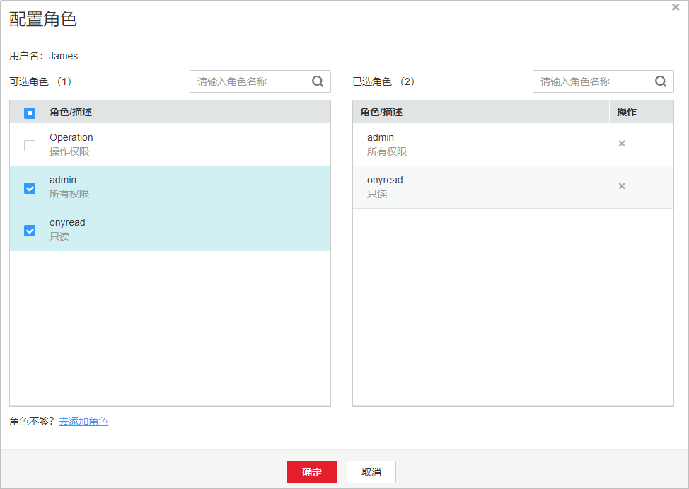

# 用户管理

点播服务除了提供IAM权限管理，还支持通过权限模板和角色实现对媒资进行权限设置。

## 权限说明

-   [角色](用户管理.md)：一个角色关联多个用户，一个角色关联多个权限模板。
-   [权限模板](权限模板.md)：用于约定权限定义信息的统称。
-   权限级别：用于表示对某权限模板或用户可访问的级别，通常分一下四种级别可读（READ ）、可写（WRITE）、可执行（EXECUTE）、可删除（DELETE）。

媒资上传时可以设置每个资源或文件夹都拥有权限模板属性，当IAM用户操作媒资时，系统会根据用户角色取得对应的权限模板，再和媒资的权限模板进行比对。用户仅能进行与媒资权限一致的操作。

示例：

资源配置的权限模板如[表1](#table207576243352)所示，用户配置的权限模板如[表2](#table130565703620)所示

**表 1**  资源权限

<table><thead align="left"><tr id="row137585243359"><th class="cellrowborder" valign="top" width="50%" id="mcps1.2.3.1.1">
名称

</th>
<th class="cellrowborder" valign="top" width="50%" id="mcps1.2.3.1.2">
权限模板

</th>
</tr>
</thead>
<tbody><tr id="row16758924193510"><td class="cellrowborder" valign="top" width="50%" headers="mcps1.2.3.1.1 ">
R1

</td>
<td class="cellrowborder" valign="top" width="50%" headers="mcps1.2.3.1.2 ">
p1

</td>
</tr>
<tr id="row2758152415355"><td class="cellrowborder" valign="top" width="50%" headers="mcps1.2.3.1.1 ">
R2

</td>
<td class="cellrowborder" valign="top" width="50%" headers="mcps1.2.3.1.2 ">
p2

</td>
</tr>
</tbody>
</table>

**表 2**  用户权限

<table><thead align="left"><tr id="row73061757123613"><th class="cellrowborder" valign="top" width="20%" id="mcps1.2.4.1.1">
名称

</th>
<th class="cellrowborder" valign="top" width="20%" id="mcps1.2.4.1.2">
角色对应权限模板

</th>
<th class="cellrowborder" valign="top" width="60%" id="mcps1.2.4.1.3">
权限模板对应权限级别

</th>
</tr>
</thead>
<tbody><tr id="row16306757203612"><td class="cellrowborder" valign="top" width="20%" headers="mcps1.2.4.1.1 ">
U1

</td>
<td class="cellrowborder" valign="top" width="20%" headers="mcps1.2.4.1.2 ">
p1

</td>
<td class="cellrowborder" valign="top" width="60%" headers="mcps1.2.4.1.3 ">
READ

</td>
</tr>
<tr id="row930618579368"><td class="cellrowborder" valign="top" width="20%" headers="mcps1.2.4.1.1 ">
U2

</td>
<td class="cellrowborder" valign="top" width="20%" headers="mcps1.2.4.1.2 ">
p1，p2

</td>
<td class="cellrowborder" valign="top" width="60%" headers="mcps1.2.4.1.3 ">
WRITE

</td>
</tr>
</tbody>
</table>

-   当U1查询R1资源时：

    由于U1角色对应的权限模板有p1，而资源R1的权限模板也为p1，且U1对p1的权限级别为READ，因此能正常查询。

-   当U1删除R1资源时：

    U1角色对应的权限模板有p1，资源R1的权限模板也为p1，但U1对p1的权限级别为READ，此时是在做删除操作，因此该条件不满足

-   当U2修改R2资源时：

    U2角色对应的权限模板有p2，资源R2的权限模板为p2，U2对p2的权限级别为WRITE，此时是在做修改操作，因此能正常修改。

## 注意事项

-   IAM子账号无法进行用户管理，仅有主账号可以对其名下的IAM子账号进行权限配置。
-   用户管理功能暂只支持“华北-北京四”区域，若您有需要，请[提交工单](https://console.huaweicloud.com/ticket/?#/ticketindex/business?productTypeId=ffb4ebf5fb094bc6aef0129c276ce42e)申请开通。

## 前提条件

-   已在IAM控制台创建IAM用户，若无IAM用户，请参见[创建用户](创建用户并授权使用VOD.md)操作。
-   已创建权限模板，请参见[权限模板](权限模板.md)。
-   已创建角色，并将角色关联到对应的权限模板，具体请参见[角色管理](角色管理.md)。

## 配置角色

1.  登录[视频点播控制台](https://console.huaweicloud.com/vod)。
2.  在控制台左上角切换区域到“华北-北京四”。

    **图 1**  切换区域  
    

3.  在左侧导航树中选择“权限管理 \> 用户管理”，进入用户管理页面。
4.  在需要配置角色的用户行单击“配置角色”，进入角色配置页面。
5.  在“角色/描述”中勾选需要为用户配置角色即可。

    **图 2**  配置角色  
    

6.  单击“确定”，完成配置。

