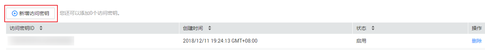

# 获取AK和SK

访问密钥即AK/SK（Access Key ID/Secret Access Key），表示一组密钥对，用于验证调用API发起请求的访问者身份，与密码的功能相似。用户通过调用API接口使用视频点播服务时，需要使用成对的AK/SK进行加密签名，确保请求的机密性、完整性和请求双方身份的正确性。用户可以在“我的凭证”中生成并管理访问密钥。

## 获取步骤

1.  登录[华为云](https://auth.huaweicloud.com/authui/login.action?service=https://account.huaweicloud.com/usercenter/#/login)官网，在右上角单击账号名，选择“账号中心”。
2.  在基本信息页面单击“管理我的凭证“，进入“我的凭证”页面。
3.  在左侧导航栏中选择“访问密钥“，单击“新增访问密钥“，在弹出的页面中输入华为云账号密码及短信验证码。

    **图 1**  访问密钥  
    

4.  单击“确定“，即可下载一个命名为“credentials.csv”的文件，其中包含AK和SK。

