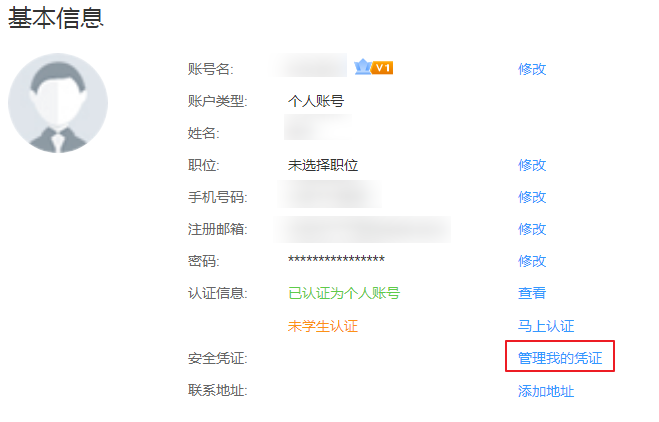
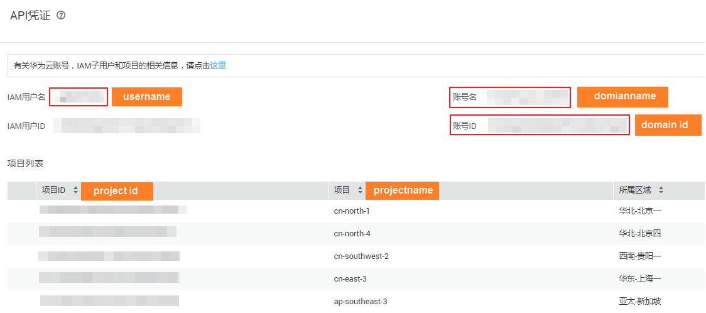

# 获取项目ID

项目ID（Project ID）是识别客户身份的唯一ID。

## 获取步骤

1.  登录[华为云](https://auth.huaweicloud.com/authui/login.action?service=https://account.huaweicloud.com/usercenter/#/login)官网，在右上角单击账号名，选择“账号中心”。
2.  在基本信息页面单击“管理我的凭证“，进入“我的凭证”页面。

    **图 1**  基本信息  
    

3.  在左侧导航栏中选择“API凭证“，即可获取对应的项目ID信息。

    **图 2**  获取项目ID  
    

