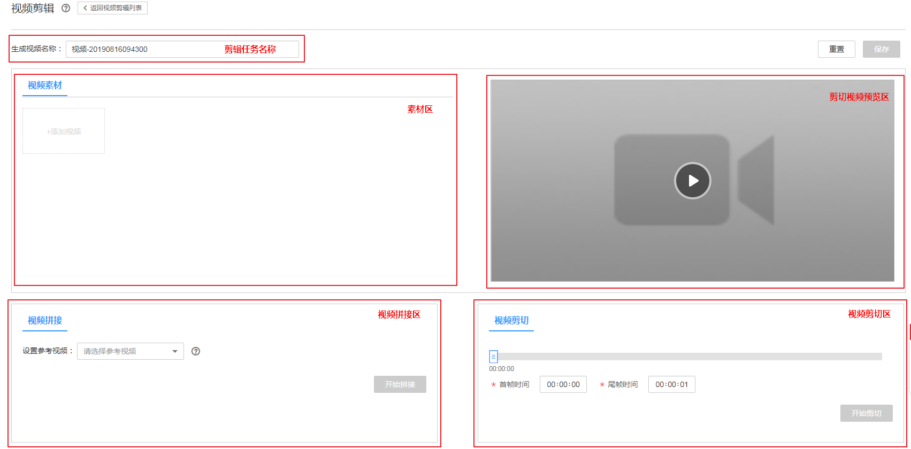
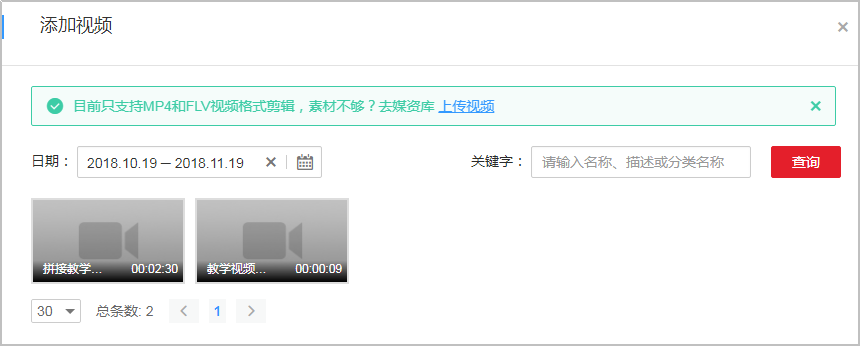
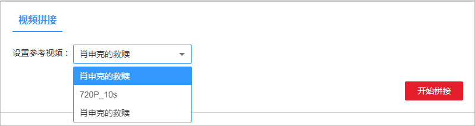
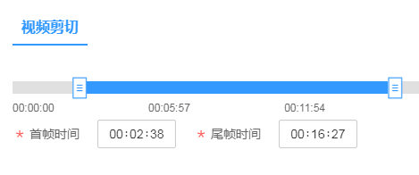

# 视频剪辑

视频点播提供了可视化的视频剪辑功能，能够快速实现多个视频的拼接，单个视频的剪切，帮助用户提升视频。

您可以参考如下步骤进行视频剪辑，也可以参考[视频指导](https://bbs.huaweicloud.com/videos/f748bfaf93cc41af9d038b33af6fdbde)来操作。

## 使用限制

-   暂只支持剪辑MP4和FLV格式的视频文件。
-   最多只支持添加10个视频素材进行拼接。

## 视频拼接

视频拼接是将多个视频合成为一个视频，例如将片头、正片和片尾拼接合成为一个完整视频。

> **说明：**   
>待拼接的视频文件的分辨率和码率不能差异过大，否则可能导致拼接生成视频的清晰度不佳。  

1.  登录[视频点播控制台](视频点播控制台https://console.huaweicloud.com/vod)。
2.  在左侧导航栏选择“视频处理 \> 视频剪辑”，进入视频剪辑页面。
3.  单击“剪辑新视频”，添加一个新的剪辑任务。

    **图 1**  视频剪辑  
    

4.  在“生成视频名称”输入框内自定义拼接后生成的视频文件的名称。

    视频名称长度限制在128个字符以内，若为空则拼接后的视频与“参考视频”同名。

5.  单击“添加视频”，选择需要剪辑的视频素材。

    最多支持添加10个视频素材。

    **图 2**  添加视频素材  
    

6.  在“视频拼接”区域，单击“设置参考视频”下拉框，选择参考视频。

    拼接后的视频格式等其他参数将与参考视频一致。

    **图 3**  视频拼接  
    

7.  单击“开始拼接”，提交拼接任务。

    剪辑任务列表新增一个任务，当“状态”为“处理成功”时表示视频拼接完成。

8.  拼接完成后，可以在“视频剪辑“页面预览视频，也可以在“音视频管理”页面对拼接的视频进行其它操作。

## 视频剪切

视频剪切是从一个视频中提取指定时间范围的片段，并将片段作为一个新视频。

1.  登录[视频点播控制台](视频点播控制台https://console.huaweicloud.com/vod)。
2.  在左侧导航栏选择“视频处理 \> 视频剪辑”，进入视频剪辑页面。
3.  单击“剪辑新视频”，添加一个新的剪辑任务。

    **图 4**  视频剪辑  
    

4.  视频名称按时间戳默认生成，您也可以在“生成视频名称”输入框内修改为您需要的剪切后的视频名称。

    视频名称长度在128个字符以内；若为空则剪切后的视频名称随机生成。

5.  单击“添加视频”，选择需要剪辑的视频素材。

    最多支持添加10个视频素材。

    **图 5**  添加视频素材  
    

6.  在“素材区”选中需要剪切的源视频文件，单击“剪切预览区”的播放按钮，通过预览确定需要剪切的时间范围。
7.  在“视频剪切”区拖动时间轴或者直接设置需要剪切的时间范围。

    **图 6**  视频剪切  
    

    -   **首帧时间**：为新视频的起始帧。
    -   **尾帧时间**：为新视频的结束帧。

8.  单击“开始剪切”，提交剪切任务。

    剪辑任务列表新增一个任务，当“状态”为“处理成功”时表示视频剪切完成。

9.  剪切完成后，您可以在“视频剪辑“页面预览视频，也可以在“音视频管理”页面对拼接的视频进行其它操作。

