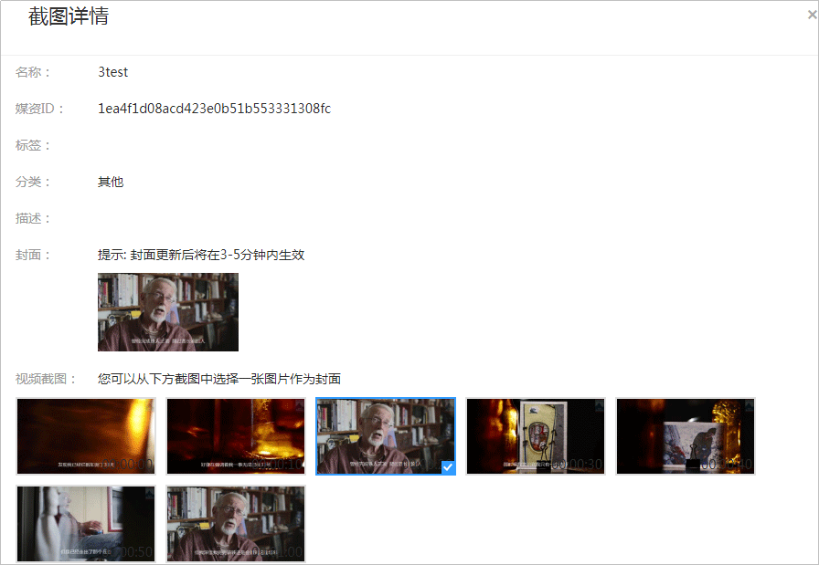

# 视频截图

仅支持对视频文件进行截图，截图完成后，可将截图设置为视频封面，该功能按截图张数计费，具体计费请参见[价格说明](https://support.huaweicloud.com/price-vod/vod070001.html)。

## 使用限制

-   暂只支持对视频格式为FLV、MP4、TS、MOV、MXF、MPG、WMV、AVI、M4V、F4V和MPEG的视频文件进行截图。
-   暂只支持截图生成JPG格式的图片文件。

## 操作步骤

1.  登录[视频点播控制台](视频点播控制台https://console.huaweicloud.com/vod)。
2.  在左侧导航栏选择“视频处理 \> 视频截图”，进入视频截图页面。
3.  单击视频文件右侧的“截图”，或者勾选多个视频文件，单击“截图”，弹出截图设置窗口。
4.  配置视频截图参数。

    支持采样截图（按时间间隔）和指定时间点截图两种方式。

    -   按时间间隔截图：根据设置的时间间隔，从视频首帧开始截图，以最后一帧截图结束，最大间隔不能超过12秒。可选择是否将首帧截图作为视频封面。

        **图 1**  按时间间隔截图设置  
        

    -   按指定时间点截图：根据设置指定时间从视频中截取图片，最多可设置10个时间点。可选择是否将首张截图作为视频封面。

        **图 2**  指定时间截图设置  
        

5.  配置完成，单击“确认”，开始截图。

    当视频列表中的“状态”为“截图成功”时，表示截图完成。

6.  截图完成后，单击视频文件右侧的“详情”，进入截图详情界面，查看截图详情。

    您可以根据需要选择一张截图作为视频封面，封面更新后将在3\~5分钟内生效。

    **图 3**  截图详情  
    

