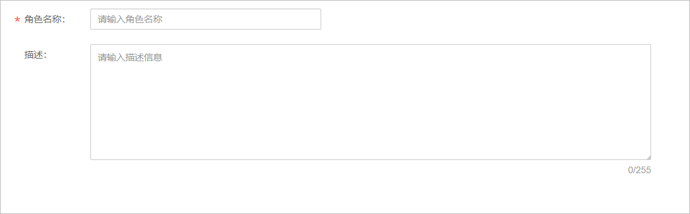
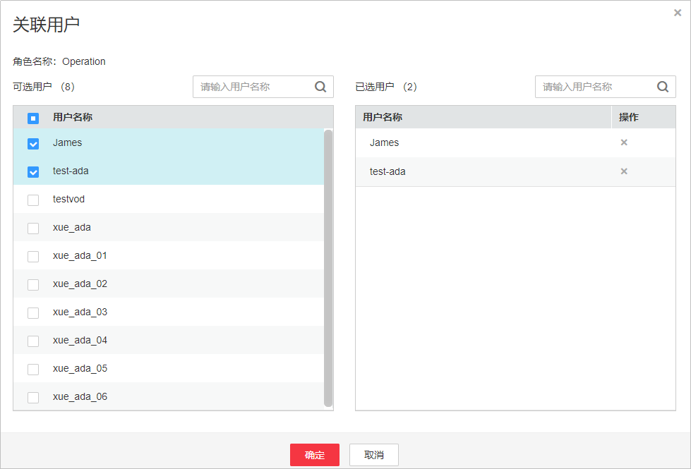
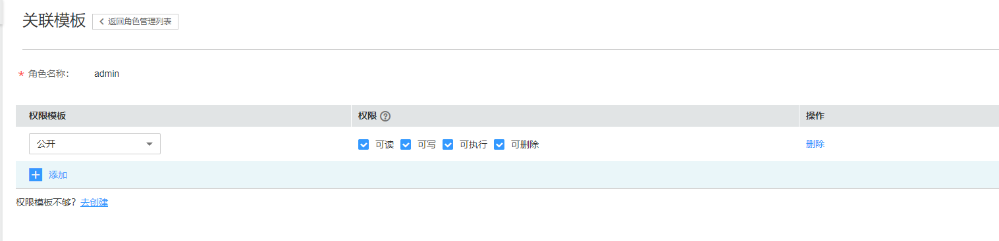

# 角色管理

您可以根据需求创建角色，然后将角色关联到IAM用户，并对角色配置相关权限模板。

## 注意事项

-   IAM子账号无法进行角色管理。
-   角色管理功能暂只支持“华北-北京四”区域，若您有需要，请[提交工单](https://console.huaweicloud.com/ticket/?#/ticketindex/business?productTypeId=ffb4ebf5fb094bc6aef0129c276ce42e)申请开通。

## 前提条件

-   已在IAM控制台创建IAM用户，若无IAM用户，请参见[创建用户](创建用户并授权使用VOD.md)操作。

-   已创建对应的权限模板，若未创建，请参见[权限模板](权限模板.md)。

## 创建角色

1.  登录[视频点播控制台](https://console.huaweicloud.com/vod)。
2.  在控制台左上角切换区域到“华北-北京四”。

    **图 1**  切换区域  
    

3.  在左侧导航树中选择“权限管理 \> 角色管理”，进入角色管理页面。
4.  单击“创建角色”，配置角色参数。

    

5.  单击“确定”，完成创建。

    角色创建后，您可以对该角色进行[关联用户](#section19392520124610)和[关联模板](#section10837142723219)。

## 关联用户

角色创建后，可以将角色关联到对应的IAM用户中，您也可以在用户管理中[配置角色](用户管理.md#section970011785618)。

1.  登录[视频点播控制台](https://console.huaweicloud.com/vod)。
2.  在控制台左上角切换区域到“华北-北京四”。

    **图 2**  切换区域  
    

3.  在左侧导航树中选择“权限管理 \> 角色管理”，进入角色管理页面。
4.  在已经创建的角色行单击“模板”，进入关联用户页面。
5.  选择已创建的IAM用户。

    **图 3**  关联用户  
    

6.  单击“确定”，完成关联。

## 关联模板

角色创建后，您可以为角色选择权限模板，配置权限级别。

1.  登录[视频点播控制台](https://console.huaweicloud.com/vod)。
2.  在控制台左上角切换区域到“华北-北京四”。

    **图 4**  切换区域  
    

3.  在左侧导航树中选择“权限管理 \> 角色管理”，进入角色管理页面。
4.  在已经创建的角色行单击“模板”，进入权限模板设置页面。
5.  选择权限模板，设置权限级别。

    

6.  单击“确定”，完成配置。

