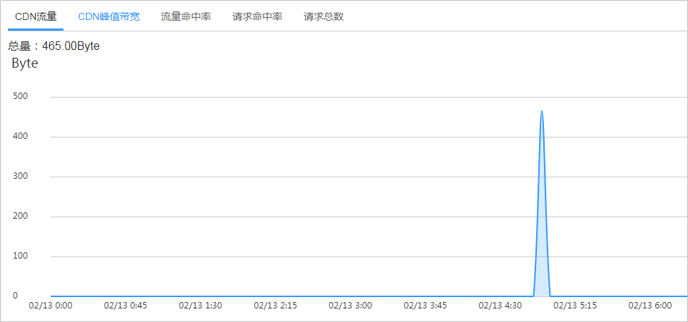
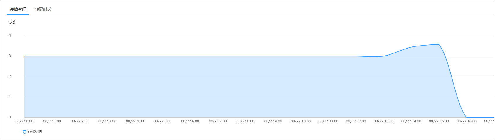

# 资源用量

点播服务提供了用量统计功能，支持查看CDN侧的流量、带宽、流量命中率等数据，同时也支持查看点播源站侧的存储空间和转码时长的消耗。

## 查询说明

-   支持查看最近90天的历史数据。
-   CDN数据支持选择按域名查询，但单次查看的域名总数不能超过20个。源站数据不支持按域名查看。
-   查询的时间跨度最长为31天。
-   最小统计粒度为4小时，如2019-04-02 8:00:00\~2019-04-02 8:04:59时间段内的数据会统计展示在2019-04-02 8:00:00这个统计点上。

## 查询步骤

1.  登录[视频点播控制台](https://console.huaweicloud.com/vod)。
2.  在左侧导航栏选择“统计分析 \> 资源用量”，进入资源用量统计页面。
3.  选择“CDN数据”或“源站数据”查看对应的统计数据。

## CDN数据

支持查看CDN流量、CDN峰值带宽、流量命中率、请求命中率以及请求总数的具体情况，如[表1](#table13425171295813)所示。

**图 1**  CDN数据  

**表 1**  CDN统计数据项说明

<table><thead align="left"><tr id="row942517122582"><th class="cellrowborder" valign="top" width="20%" id="mcps1.2.3.1.1">
数据统计项

</th>
<th class="cellrowborder" valign="top" width="80%" id="mcps1.2.3.1.2">
说明

</th>
</tr>
</thead>
<tbody><tr id="row144261112115817"><td class="cellrowborder" valign="top" width="20%" headers="mcps1.2.3.1.1 ">
CDN流量

</td>
<td class="cellrowborder" valign="top" width="80%" headers="mcps1.2.3.1.2 ">
指定时间跨度的CDN流量。

</td>
</tr>
<tr id="row5426912205819"><td class="cellrowborder" valign="top" width="20%" headers="mcps1.2.3.1.1 ">
CDN峰值带宽

</td>
<td class="cellrowborder" valign="top" width="80%" headers="mcps1.2.3.1.2 ">
指定时间跨度的CDN峰值带宽。

</td>
</tr>
<tr id="row18426111245817"><td class="cellrowborder" valign="top" width="20%" headers="mcps1.2.3.1.1 ">
流量命中率

</td>
<td class="cellrowborder" valign="top" width="80%" headers="mcps1.2.3.1.2 ">
流量命中率=命中缓存产生的流量/请求总流量，请求总流量为命中缓存产生的流量和请求回源产生的流量之和。

</td>
</tr>
<tr id="row74284129581"><td class="cellrowborder" valign="top" width="20%" headers="mcps1.2.3.1.1 ">
请求命中率

</td>
<td class="cellrowborder" valign="top" width="80%" headers="mcps1.2.3.1.2 ">
请求命中率=命中缓存的请求数/请求总数。

</td>
</tr>
<tr id="row542851210588"><td class="cellrowborder" valign="top" width="20%" headers="mcps1.2.3.1.1 ">
请求总数

</td>
<td class="cellrowborder" valign="top" width="80%" headers="mcps1.2.3.1.2 ">
指定时间跨度内的请求总数。

</td>
</tr>
</tbody>
</table>

> **须知：** 
>由于实际产生的网络流量包括TCP/IP包头和TCP重传消耗，因此账单的计费数据可能与展示的流量图不完全一致。

## 源站数据

支持查看视频点播消耗的存储空间以及转码时长，如[表2](#table243222119317)所示。

**图 2**  源站数据  

**表 2**  源站统计数据项说明

<table><thead align="left"><tr id="row54323211035"><th class="cellrowborder" valign="top" width="20%" id="mcps1.2.3.1.1">
数据统计项

</th>
<th class="cellrowborder" valign="top" width="80%" id="mcps1.2.3.1.2">
说明

</th>
</tr>
</thead>
<tbody><tr id="row44339213317"><td class="cellrowborder" valign="top" width="20%" headers="mcps1.2.3.1.1 ">
存储空间

</td>
<td class="cellrowborder" valign="top" width="80%" headers="mcps1.2.3.1.2 ">
指定时间跨度内媒资文件占用的存储空间，包括原始媒资文件以及音视频处理后产生的媒资文件。

</td>
</tr>
<tr id="row343316211234"><td class="cellrowborder" valign="top" width="20%" headers="mcps1.2.3.1.1 ">
转码时长

</td>
<td class="cellrowborder" valign="top" width="80%" headers="mcps1.2.3.1.2 ">
指定时间跨度内音视频文件转码的时长。

</td>
</tr>
</tbody>
</table>

