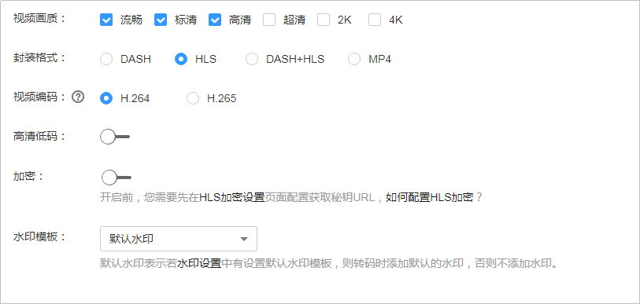
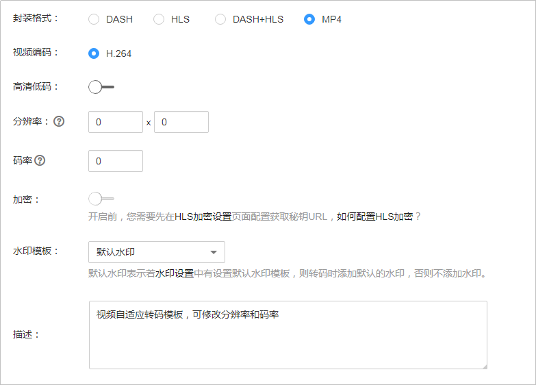
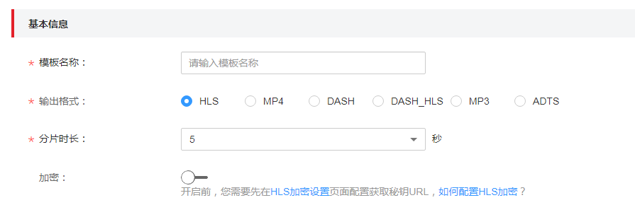
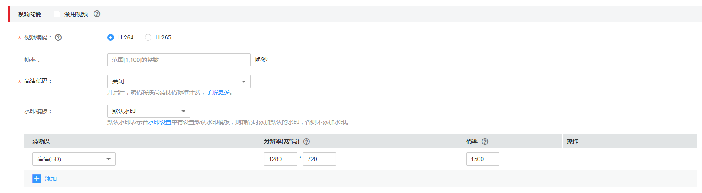
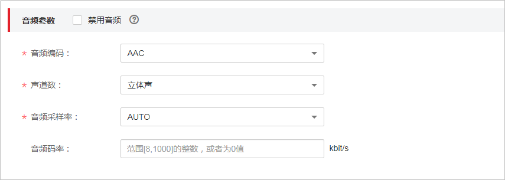
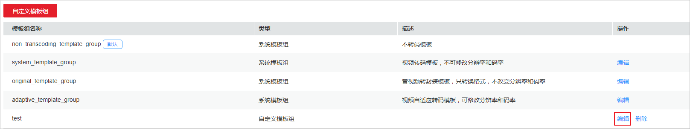

# 转码设置

视频点播支持在上传音视频时或上传后，对音视频文件进行转码，提供了4个预置的系统模板，同时也支持根据实际需求自定义转码模板。您可以参考如下步骤配置转码模板，也可参考[视频指导](https://bbs.huaweicloud.com/videos/e4b55122ed224f9f9e472fafe22fa024)来操作。

## 场景说明

通过点播服务加速分发的音视频可能被引用到各种业务场景，如产品官网、视频网站等，也可能在不同的终端进行播放，如web端、移动端。为适用于多样化的场景，点播服务提供了转码功能，支持改变音视频的编码格式、封装格式、分辨率、码率等参数，从而适用于不同的业务场景、播放终端及网络环境。

转码功能可以帮助您处理如下问题：

-   适配不同播放终端：您可以将原始音视频转码为更适应于各终端播放的格式，如MP4格式适用于网站点播的场景。
-   适配不同网络环境：您可以根据不同的网络带宽设置转码输出的码率，以适应不同的网络播放环境。
-   降低分发成本：支持压缩率更高的H.265编码格式，您也可以在转码时开启高清低码功能，在分辨率不变的情况下，码率下降20%左右，从而降低音视频的分发成本。
-   HLS内容保护：您可以在转码时开启HLS加密，对转码的HLS格式音视频进行加密，从而防止音视频被盗用后进行二次分发。
-   版权保护：您可以为视频添加自己独有的logo等标识水印，以宣示该视频的版权所属。
-   音视频提取：支持转码提取音频文件，主要适用于一些纯音频的场景，如电台、音频APP等。
-   禁用音频：同时也支持输出无音频的视频文件，主要适用于需要禁用原音频的场景。

## 转码模板介绍

为了方便对点播服务熟悉程度不同的用户快速使用转码功能，点播服务提供了四种系统转码模板，若您是点播服务的新用户，建议您优先使用系统模板。

点播服务内置了如下四种系统转码模板：

-   不转码模板（non\_transcoding\_template\_group ）：对音视频进行不转码操作，若您在音视频处理中未选择其它转码模板，则该模板默认生效。由于上传到点播服务的音视频默认是不转码分发的，所以对于用户来说，该模板无实际使用场景。
-   视频转码模板（system\_template\_group）：内置了常用的视频清晰度，该模板适用于对分辨率、码率、帧率等音视频具体参数不熟悉的用户。
-   转封装模板（original\_template\_group）：只转换音视频的封装格式，不改变其它参数，该模板主要适用于只需改变格式，无分辨率和码率等改变需求的场景。
-   视频自适应转码模板（adaptive\_template\_group）：支持视频画质增强功能，该模板适用于有修复视频受损图像需求的场景。

若您对于音视频的相关参数足够熟悉，且系统模板无法满足实际需求，您也可以选择自定义转码模板。

## 使用限制

音视频转码当前支持的输入格式如下所示：

-   支持输入的音视频文件格式：MP4、TS、MOV、FLV、MPG、MXF、WMV、ADTS、AVI、MKV、MPEG等。
-   支持输入的视频编码格式：H.264、 H.265、 MPEG-2、MPEG-4、MJPEG、WMV1/2/3、Proress422等。
-   支持输入的音频编码格式：AAC、 AC3、EAC3、HE-AAC、MP2、MP3、PCM（s161e，s16be,，s241e，s24be，dvd）、WMA等。

## 费用说明

音视频转码为计费项功能，默认为[按需付费](https://www.huaweicloud.com/pricing.html?tab=detail#/vod)，建议您[购买转码套餐包](https://account.huaweicloud.com/usercenter/#/buyservice/commonCloud?pkgCode=vod)，更优惠。目前视频点播提供了三种转码包，各转码包的使用场景如下所示：

-   **H.264标准转码包**
    -   支持抵扣“视频编码“为“H.264“，且“高清低码“为“关闭“状态的视频转码。
    -   支持抵扣音频转码，按“5/22”折算时长后进行抵扣。

-   **H.264高清低码转码包**：只能抵扣“视频编码“为“H.264“，且“高清低码“为“开启“状态的视频转码。
-   **H.265标准转码包**：只能抵扣“视频编码“为“H.265“，且“高清低码“为“关闭“状态的视频转码。

> **说明：** 
>三种转码包都不支持抵扣使用转封装模板（original\_template\_group）产生的费用。

## 编辑系统模板组

系统模板内置了常用的视频清晰度，编码格式等参数，建议您在使用系统模板时，先确认系统模板的设置是否满足需求，若不满足，可以对系统模板进行编辑。

1.  登录[视频点播控制台](https://console.huaweicloud.com/vod)。
2.  在左侧导航栏选择“全局设置  \>  转码设置“，进入转码设置界面。
3.  在系统模板行单击“编辑”，在编辑页面修改系统模板的参数。

    不同系统模板，可编辑的参数不同。

    -   系统模板（system\_template\_group  ）

        支持选择视频画质、封装格式、视频编码、水印模板，可以选择开启高清低码和加密。视频画质内置了流畅、标清、高清、超清、2K、4K六种清晰度，具体对应分辨率和码率如[表3](#table3149102962218)所示。

        **图 1**  系统模板  
        

    -   转封装模板（original\_template\_group）

        支持将FLV和HLS格式转换为MP4格式，将MP3、MP4和FLV格式转换成HLS格式。

        **图 2**  转封装模板  
        

    -   视频自适应转码模板（adaptive\_template\_group）

        视频编码格式只支持H.264。支持自定义分辨率，若不设置，则默认按原始分辨率输出。开启高清低码后可以选择画质增强功能。

        **图 3**  自适应模板  
        

4.  编辑完成后，单击“确定”。

## 添加自定义模板组

若系统预置模板无法满足您的业务需求，您也可以根据实际需求自定义转码模板组。若您需要自定义音频转码模板，请在输出格式中选择“MP3”或“ADTS”。

1.  登录[视频点播控制台](https://console.huaweicloud.com/vod)。
2.  在左侧导航栏选择“全局设置  \>  转码设置“，进入转码设置界面。
3.  单击“自定义模板组”，在参数配置页面配置相关参数。
4.  设置**基本信息**，如[图4](#fig13677111085919)所示，参数说明如[表1](#table45569122610)所示

    **图 4**  设置基本信息  
    

    **表 1**  基本信息参数说明

    
    <table><thead align="left"><tr id="row555714121561"><th class="cellrowborder" valign="top" width="20%" id="mcps1.2.3.1.1">
参数

    </th>
    <th class="cellrowborder" valign="top" width="80%" id="mcps1.2.3.1.2">
说明

    </th>
    </tr>
    </thead>
    <tbody><tr id="row1655710122611"><td class="cellrowborder" valign="top" width="20%" headers="mcps1.2.3.1.1 ">
模板名称

    </td>
    <td class="cellrowborder" valign="top" width="80%" headers="mcps1.2.3.1.2 ">
自定义模板的名称。

    
模板名只能以字母或下划线或数字组成，不含特殊字符，长度不能超过128个字符。

    
示例：MP4_H264

    </td>
    </tr>
    <tr id="row055714126614"><td class="cellrowborder" valign="top" width="20%" headers="mcps1.2.3.1.1 ">
输出格式

    </td>
    <td class="cellrowborder" valign="top" width="80%" headers="mcps1.2.3.1.2 ">
输出音视频的文件格式，目前支持如下格式：<ul id="ul95071398212"><li>视频格式：MP4、HLS、DASH_HLS、DASH</li><li>音频格式：ADTS、MP3</li></ul>
    

    
<strong id="b6503125594">注意</strong>：当勾选音频输出格式时，视频参数将被禁用。

    </td>
    </tr>
    <tr id="row13476122712168"><td class="cellrowborder" valign="top" width="20%" headers="mcps1.2.3.1.1 ">
分片时长

    </td>
    <td class="cellrowborder" valign="top" width="80%" headers="mcps1.2.3.1.2 ">
HLS分片的长度。

    
仅当输出格式为HLS或DASH_HLS时，才有此配置项。

    </td>
    </tr>
    <tr id="row11732153918595"><td class="cellrowborder" valign="top" width="20%" headers="mcps1.2.3.1.1 ">
加密

    </td>
    <td class="cellrowborder" valign="top" width="80%" headers="mcps1.2.3.1.2 ">
配置是否加密输出音视频。当前只支持加密输出HLS格式音视频流，不会对原始上传的音视频进行加密处理，勾选非HLS的输出音视频格式时，此字段为不可配置。开启此配置前，请参考<a href="HLS加密设置.md">HLS加密设置</a>获取密钥URL。

    </td>
    </tr>
    </tbody>
    </table>

5.  设置**视频参数**，如[图5](#fig11831401089)所示，参数说明如[表2 视频参数](#table17169166386)所示。

    **图 5**  视频参数  
    

    > **说明：** 
    >若勾选“禁用视频”，则输出文件将不包含视频信息，适用于抽取视频文件音频信息的场景。请参考[步骤7](#li13651937112417)完成音频参数配置。

    **表 2**  视频参数说明

    
    <table><thead align="left"><tr id="row816917615818"><th class="cellrowborder" valign="top" width="20%" id="mcps1.2.3.1.1">
参数名称

    </th>
    <th class="cellrowborder" valign="top" width="80%" id="mcps1.2.3.1.2">
参数说明

    </th>
    </tr>
    </thead>
    <tbody><tr id="row56947325813"><td class="cellrowborder" valign="top" width="20%" headers="mcps1.2.3.1.1 ">
视频编码

    </td>
    <td class="cellrowborder" valign="top" width="80%" headers="mcps1.2.3.1.2 ">
视频的编码格式，支持H.264和H.265两种格式。

    </td>
    </tr>
    <tr id="row278692612714"><td class="cellrowborder" valign="top" width="20%" headers="mcps1.2.3.1.1 ">
帧率

    </td>
    <td class="cellrowborder" valign="top" width="80%" headers="mcps1.2.3.1.2 ">
视频每秒显示的帧数。

    
取值范围：[1,100]之间的整数。

    </td>
    </tr>
    <tr id="row19186155161015"><td class="cellrowborder" valign="top" width="20%" headers="mcps1.2.3.1.1 ">
高清低码

    </td>
    <td class="cellrowborder" valign="top" width="80%" headers="mcps1.2.3.1.2 ">
是否开启高清低码功能。

    
开启后，视频点播服务将根据片源的质量进行转码优化，输出码率通常会低于设定码率。产生的转码费用按高清低码转码标准收费。

    </td>
    </tr>
    <tr id="row991213912014"><td class="cellrowborder" valign="top" width="20%" headers="mcps1.2.3.1.1 ">
水印模板

    </td>
    <td class="cellrowborder" valign="top" width="80%" headers="mcps1.2.3.1.2 ">
配置转码时添加的水印模板。

    
可选择默认水印模板以及其他自定义非默认水印模板。

    <ul id="ul124785161010"><li>默认水印：表示若<a href="水印设置.md">水印设置</a>中有设置默认水印模板，则转码时添加默认的水印，否则不添加水印。</li><li>其他自定义非默认水印模板：表示转码时添加此水印。</li></ul>
    </td>
    </tr>
    <tr id="row202292548312"><td class="cellrowborder" valign="top" width="20%" headers="mcps1.2.3.1.1 ">
清晰度

    </td>
    <td class="cellrowborder" valign="top" width="80%" headers="mcps1.2.3.1.2 ">
视频的画质清晰度，支持4K、2K、超清、高清、标清、流畅共六种清晰度。

    </td>
    </tr>
    <tr id="row162242298333"><td class="cellrowborder" valign="top" width="20%" headers="mcps1.2.3.1.1 ">
分辨率（宽*高）

    </td>
    <td class="cellrowborder" valign="top" width="80%" headers="mcps1.2.3.1.2 ">
视频的宽高，默认为选择的清晰度的推荐分辨率，支持根据实际需求修改。

    
若宽或高设置为0，则按照源文件的分辨率进行输出。

    </td>
    </tr>
    <tr id="row1657326123315"><td class="cellrowborder" valign="top" width="20%" headers="mcps1.2.3.1.1 ">
码率

    </td>
    <td class="cellrowborder" valign="top" width="80%" headers="mcps1.2.3.1.2 ">
视频的码率，默认为选择的清晰度的推荐码率，支持根据实际需求修改。

    
若码率设置为0，则按源文件分辨率对应推荐码率进行输出。

    </td>
    </tr>
    </tbody>
    </table>

    > **说明：** 
    >-   最多支持6路不同分辨率码率的输出。
    >-   清晰度中标识的4K/2K/HD/SD/LD与计费项中对应，若修改了清晰度对应的默认分辨率，则按设置的分辨率进行计费，转码价格详情请参见[价格详情](https://www.huaweicloud.com/pricing.html?tab=detail#/vod)。

    对于不同清晰度，建议您使用系统推荐的分辨率和码率，如[表3](#table3149102962218)所示。

    **表 3**  推荐分辨率和码率

    
    <table><thead align="left"><tr id="row161491029162218"><th class="cellrowborder" valign="top" width="20%" id="mcps1.2.5.1.1">
视频画质

    </th>
    <th class="cellrowborder" valign="top" width="20%" id="mcps1.2.5.1.2">
推荐分辨率

    </th>
    <th class="cellrowborder" valign="top" width="30%" id="mcps1.2.5.1.3">
推荐码率-H.265（Kbps）

    </th>
    <th class="cellrowborder" valign="top" width="30%" id="mcps1.2.5.1.4">
推荐码率-H.264（Kbps）

    </th>
    </tr>
    </thead>
    <tbody><tr id="row3150329202217"><td class="cellrowborder" valign="top" width="20%" headers="mcps1.2.5.1.1 ">
4K

    </td>
    <td class="cellrowborder" valign="top" width="20%" headers="mcps1.2.5.1.2 ">
3840*2160

    </td>
    <td class="cellrowborder" valign="top" width="30%" headers="mcps1.2.5.1.3 ">
5600

    </td>
    <td class="cellrowborder" valign="top" width="30%" headers="mcps1.2.5.1.4 ">
8000

    </td>
    </tr>
    <tr id="row3150182917227"><td class="cellrowborder" valign="top" width="20%" headers="mcps1.2.5.1.1 ">
2K

    </td>
    <td class="cellrowborder" valign="top" width="20%" headers="mcps1.2.5.1.2 ">
2560*1440

    </td>
    <td class="cellrowborder" valign="top" width="30%" headers="mcps1.2.5.1.3 ">
4900

    </td>
    <td class="cellrowborder" valign="top" width="30%" headers="mcps1.2.5.1.4 ">
7000

    </td>
    </tr>
    <tr id="row151501829162211"><td class="cellrowborder" valign="top" width="20%" headers="mcps1.2.5.1.1 ">
超清

    </td>
    <td class="cellrowborder" valign="top" width="20%" headers="mcps1.2.5.1.2 ">
1920*1080

    </td>
    <td class="cellrowborder" valign="top" width="30%" headers="mcps1.2.5.1.3 ">
2100

    </td>
    <td class="cellrowborder" valign="top" width="30%" headers="mcps1.2.5.1.4 ">
3000

    </td>
    </tr>
    <tr id="row8150162919223"><td class="cellrowborder" valign="top" width="20%" headers="mcps1.2.5.1.1 ">
高清

    </td>
    <td class="cellrowborder" valign="top" width="20%" headers="mcps1.2.5.1.2 ">
1280*720

    </td>
    <td class="cellrowborder" valign="top" width="30%" headers="mcps1.2.5.1.3 ">
700

    </td>
    <td class="cellrowborder" valign="top" width="30%" headers="mcps1.2.5.1.4 ">
1000

    </td>
    </tr>
    <tr id="row71501929182213"><td class="cellrowborder" valign="top" width="20%" headers="mcps1.2.5.1.1 ">
标清

    </td>
    <td class="cellrowborder" valign="top" width="20%" headers="mcps1.2.5.1.2 ">
854*480

    </td>
    <td class="cellrowborder" valign="top" width="30%" headers="mcps1.2.5.1.3 ">
500

    </td>
    <td class="cellrowborder" valign="top" width="30%" headers="mcps1.2.5.1.4 ">
600

    </td>
    </tr>
    <tr id="row1715192916221"><td class="cellrowborder" valign="top" width="20%" headers="mcps1.2.5.1.1 ">
流畅

    </td>
    <td class="cellrowborder" valign="top" width="20%" headers="mcps1.2.5.1.2 ">
480*270

    </td>
    <td class="cellrowborder" valign="top" width="30%" headers="mcps1.2.5.1.3 ">
200

    </td>
    <td class="cellrowborder" valign="top" width="30%" headers="mcps1.2.5.1.4 ">
300

    </td>
    </tr>
    </tbody>
    </table>

6.  设置**音频参数**，如[图6](#fig73017241128)所示，参数说明如[表4 音频参数](#table6791151919188)所示。

    **图 6**  音频参数  
    

    > **说明：** 
    >若勾选“禁用音频”，则输出文件将不包含音频信息，该功能适用于抽取视频画面，不需要音频的场景。

    **表 4**  音频参数

    
    <table><thead align="left"><tr id="row2790161916183"><th class="cellrowborder" valign="top" width="19.509999999999998%" id="mcps1.2.3.1.1">
参数

    </th>
    <th class="cellrowborder" valign="top" width="80.49%" id="mcps1.2.3.1.2">
说明

    </th>
    </tr>
    </thead>
    <tbody><tr id="row127907193180"><td class="cellrowborder" valign="top" width="19.509999999999998%" headers="mcps1.2.3.1.1 ">
音频编码

    </td>
    <td class="cellrowborder" valign="top" width="80.49%" headers="mcps1.2.3.1.2 ">
音频编码格式。目前仅支持AAC或HEAAC1。

    
默认为AAC。

    </td>
    </tr>
    <tr id="row197901219111810"><td class="cellrowborder" valign="top" width="19.509999999999998%" headers="mcps1.2.3.1.1 ">
声道数

    </td>
    <td class="cellrowborder" valign="top" width="80.49%" headers="mcps1.2.3.1.2 ">
声音录制时的音源数量或回放时相应的扬声器数量。目前仅支持立体声或单声道。

    
默认为立体声。

    </td>
    </tr>
    <tr id="row27904192183"><td class="cellrowborder" valign="top" width="19.509999999999998%" headers="mcps1.2.3.1.1 ">
音频采样率

    </td>
    <td class="cellrowborder" valign="top" width="80.49%" headers="mcps1.2.3.1.2 ">
每秒对声音进行采集的次数。

    
取值为AUTO、22050、3200、44100、48000、96000。

    
默认为AUTO，单位：Hz。

    </td>
    </tr>
    <tr id="row1379161961818"><td class="cellrowborder" valign="top" width="19.509999999999998%" headers="mcps1.2.3.1.1 ">
音频码率

    </td>
    <td class="cellrowborder" valign="top" width="80.49%" headers="mcps1.2.3.1.2 ">
输出文件的音频码率。

    
取值范围：0或者[8，1000]之间的整数，单位：Kbps。

    </td>
    </tr>
    </tbody>
    </table>

7.  参数配置完成后，单击“确定“。

    “转码设置”页签将生成新创建的模板。

## 编辑/删除自定义模板

自定义模板创建后，可以在模板列表中单击“编辑”，修改对应的自定义模板。您也可以单击“删除”，删除已不需要的模板。删除模板后，使用该模板转码的音视频不受影响。

**图 7**  编辑自定义模板  

