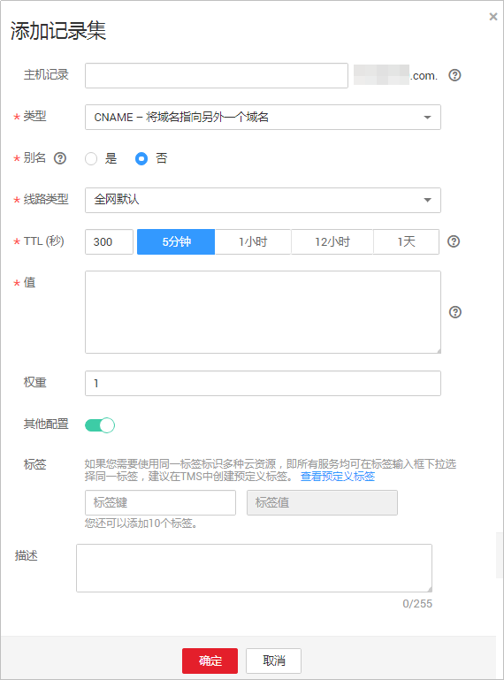
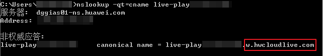

# 配置CNAME<a name="live010010"></a>

域名添加后，系统将会为您自动分配一个CNAME值。您需要在域名DNS服务商处完成CNAME解析配置，配置生效后，即可启用加速服务。

## 注意事项<a name="zh-cn_topic_0117188957_section421012115244"></a>

-   若您添加的域名是在华为云[域名注册服务](https://support.huaweicloud.com/domain/index.html)申请的，请参考[操作步骤](#section6663324202916)配置CNAME解析。
-   若您添加的域名是通过第三方域名注册商注册的，您可以先通过[创建公网域名](https://support.huaweicloud.com/usermanual-dns/zh-cn_topic_0035467702.html#section3)操作将域名添加至云解析服务。然后再执行[操作步骤](#section6663324202916)配置CNAME解析。您也可以参考[配置CNAME解析（非华为云）](配置CNAME（非华为云）.md)，在对应域名服务提供商处进行配置，如指导与实际配置不符，请以各自域名服务提供商的指导信息为准。
-   您需要分别对推流域名和播放域名进行CNAME配置。

## 操作步骤<a name="section6663324202916"></a>

下面以播放域名为例，推流域名的CNAME配置步骤相同。

1.  <a name="li184701358115720"></a>获取域名对应的CNAME值。
    1.  登录[视频直播控制台](视频直播控制台https://console.huaweicloud.com/live)，在左侧导航树中选择“域名管理 ”，进入域名管理页面。
    2.  在已添加的域名行单击“管理”，选择“基本信息”。

        在基本信息页面获取播放域名的CNAME。

        **图 1**  播放地址<a name="fig199493611582"></a>  
        

        以“test-play.example.com“为例，获得对应的CNAME为“test-play.example.com.w.hwcloudlive.com“。

    3.  登录[视频点播控制台](视频点播控制台https://console.huaweicloud.com/vod)，在左侧导航树中选择“域名管理“，进入域名管理页。
    4.  在所需域名行获取对应的CNAME 。

        **图 2**  获取CNAME值<a name="fig058414430588"></a>  
        

2.  登录[云解析服务](https://console.huaweicloud.com/dns)控制台。
3.  在左侧导航中，选择“域名解析 \> 公网解析“，进入域名列表页面。
4.  在需要配置解析的域名行，单击“域名“列的域名名称。

    以域名“example.com”为例，找到对应的"example.com"域名行。

    **图 3**  域名列表<a name="fig8360253165811"></a>  
    

5.  在页面右上角单击“添加记录集“。

    **图 4**  添加记录集<a name="fig899211345914"></a>  
    

    根据界面提示填写参数配置，参数信息如[表1](#zh-cn_topic_0117188957_table18772105019323)所示。

    **表 1**  参数说明

    <a name="zh-cn_topic_0117188957_table18772105019323"></a>
    <table><thead align="left"><tr id="zh-cn_topic_0117188957_row11912185013213"><th class="cellrowborder" valign="top" width="18%" id="mcps1.2.4.1.1"><p id="p26391125111012"><a name="p26391125111012"></a><a name="p26391125111012"></a>参数名</p>
    </th>
    <th class="cellrowborder" valign="top" width="47.949999999999996%" id="mcps1.2.4.1.2"><p id="p18639172517105"><a name="p18639172517105"></a><a name="p18639172517105"></a>描述</p>
    </th>
    <th class="cellrowborder" valign="top" width="34.050000000000004%" id="mcps1.2.4.1.3"><p id="zh-cn_topic_0117188957_p1491217508321"><a name="zh-cn_topic_0117188957_p1491217508321"></a><a name="zh-cn_topic_0117188957_p1491217508321"></a>如何配置</p>
    </th>
    </tr>
    </thead>
    <tbody><tr id="zh-cn_topic_0117188957_row4912105063215"><td class="cellrowborder" valign="top" width="18%" headers="mcps1.2.4.1.1 "><p id="zh-cn_topic_0117188957_p1791211501323"><a name="zh-cn_topic_0117188957_p1791211501323"></a><a name="zh-cn_topic_0117188957_p1791211501323"></a>主机记录</p>
    </td>
    <td class="cellrowborder" valign="top" width="47.949999999999996%" headers="mcps1.2.4.1.2 "><p id="p10821175620454"><a name="p10821175620454"></a><a name="p10821175620454"></a>输入域名的二级域名（后缀无需用户手动填写）。</p>
    </td>
    <td class="cellrowborder" valign="top" width="34.050000000000004%" headers="mcps1.2.4.1.3 "><p id="p14551715184910"><a name="p14551715184910"></a><a name="p14551715184910"></a>以播放域名“test-play.example.com”为例，此处输入“test-play”。</p>
    <p id="p104271852204715"><a name="p104271852204715"></a><a name="p104271852204715"></a>以域名“test-play.example.com”为例，此处输入“test-play”。</p>
    </td>
    </tr>
    <tr id="zh-cn_topic_0117188957_row17912125016326"><td class="cellrowborder" valign="top" width="18%" headers="mcps1.2.4.1.1 "><p id="zh-cn_topic_0117188957_p791245012328"><a name="zh-cn_topic_0117188957_p791245012328"></a><a name="zh-cn_topic_0117188957_p791245012328"></a>类型</p>
    </td>
    <td class="cellrowborder" valign="top" width="47.949999999999996%" headers="mcps1.2.4.1.2 "><p id="zh-cn_topic_0117188957_p10912750173210"><a name="zh-cn_topic_0117188957_p10912750173210"></a><a name="zh-cn_topic_0117188957_p10912750173210"></a>记录集的类型，此处为CNAME类型。</p>
    </td>
    <td class="cellrowborder" valign="top" width="34.050000000000004%" headers="mcps1.2.4.1.3 "><p id="zh-cn_topic_0117188957_p191215507322"><a name="zh-cn_topic_0117188957_p191215507322"></a><a name="zh-cn_topic_0117188957_p191215507322"></a>选择“CNAME-将域名指向另外一个域名”。</p>
    </td>
    </tr>
    <tr id="row170145193715"><td class="cellrowborder" valign="top" width="18%" headers="mcps1.2.4.1.1 "><p id="p41125123715"><a name="p41125123715"></a><a name="p41125123715"></a>别名</p>
    </td>
    <td class="cellrowborder" valign="top" width="47.949999999999996%" headers="mcps1.2.4.1.2 "><p id="p148333013716"><a name="p148333013716"></a><a name="p148333013716"></a>用于是否将此记录集关联至云服务资源实例。</p>
    <a name="ul14834306376"></a><a name="ul14834306376"></a><ul id="ul14834306376"><li>是：为此记录集关联云服务资源实例，详细说明请参见<a href="https://support.huaweicloud.com/usermanual-dns/dns_usermanual_0017.html" target="_blank" rel="noopener noreferrer">设置记录集别名</a>。</li><li>否：不为此记录集关联云服务资源实例。</li></ul>
    </td>
    <td class="cellrowborder" valign="top" width="34.050000000000004%" headers="mcps1.2.4.1.3 "><p id="p51185203715"><a name="p51185203715"></a><a name="p51185203715"></a>否</p>
    </td>
    </tr>
    <tr id="zh-cn_topic_0117188957_row17912950153210"><td class="cellrowborder" valign="top" width="18%" headers="mcps1.2.4.1.1 "><p id="zh-cn_topic_0117188957_p129121850183215"><a name="zh-cn_topic_0117188957_p129121850183215"></a><a name="zh-cn_topic_0117188957_p129121850183215"></a>线路类型</p>
    </td>
    <td class="cellrowborder" valign="top" width="47.949999999999996%" headers="mcps1.2.4.1.2 "><p id="zh-cn_topic_0117188957_p691245011321"><a name="zh-cn_topic_0117188957_p691245011321"></a><a name="zh-cn_topic_0117188957_p691245011321"></a>用于DNS服务器在解析域名时，根据访问者的来源，返回对应的服务器IP地址，具体请参见<a href="https://support.huaweicloud.com/usermanual-dns/dns_usermanual_0041.html" target="_blank" rel="noopener noreferrer">解析线路</a>。</p>
    <p id="p203987321322"><a name="p203987321322"></a><a name="p203987321322"></a>默认值为“全网默认”。</p>
    <p id="p1639815326325"><a name="p1639815326325"></a><a name="p1639815326325"></a>仅支持为公网域名的记录集配置此参数。</p>
    </td>
    <td class="cellrowborder" valign="top" width="34.050000000000004%" headers="mcps1.2.4.1.3 "><p id="zh-cn_topic_0117188957_p291285073216"><a name="zh-cn_topic_0117188957_p291285073216"></a><a name="zh-cn_topic_0117188957_p291285073216"></a>选择“全网默认”。</p>
    </td>
    </tr>
    <tr id="zh-cn_topic_0117188957_row691215012328"><td class="cellrowborder" valign="top" width="18%" headers="mcps1.2.4.1.1 "><p id="zh-cn_topic_0117188957_p591217503324"><a name="zh-cn_topic_0117188957_p591217503324"></a><a name="zh-cn_topic_0117188957_p591217503324"></a>TTL(秒)</p>
    </td>
    <td class="cellrowborder" valign="top" width="47.949999999999996%" headers="mcps1.2.4.1.2 "><p id="zh-cn_topic_0117188957_p891255003218"><a name="zh-cn_topic_0117188957_p891255003218"></a><a name="zh-cn_topic_0117188957_p891255003218"></a>记录集的有效缓存时间，以秒为单位。</p>
    <p id="p199661315514"><a name="p199661315514"></a><a name="p199661315514"></a>数值越小，修改记录各地生效时间越快。</p>
    </td>
    <td class="cellrowborder" valign="top" width="34.050000000000004%" headers="mcps1.2.4.1.3 "><p id="zh-cn_topic_0117188957_p6912155073213"><a name="zh-cn_topic_0117188957_p6912155073213"></a><a name="zh-cn_topic_0117188957_p6912155073213"></a>默认为“5分钟”，若无特殊需求，可直接保持默认选择。</p>
    </td>
    </tr>
    <tr id="zh-cn_topic_0117188957_row19912195016327"><td class="cellrowborder" valign="top" width="18%" headers="mcps1.2.4.1.1 "><p id="zh-cn_topic_0117188957_p1991217505327"><a name="zh-cn_topic_0117188957_p1991217505327"></a><a name="zh-cn_topic_0117188957_p1991217505327"></a>值</p>
    </td>
    <td class="cellrowborder" valign="top" width="47.949999999999996%" headers="mcps1.2.4.1.2 "><p id="zh-cn_topic_0117188957_p1491219505324"><a name="zh-cn_topic_0117188957_p1491219505324"></a><a name="zh-cn_topic_0117188957_p1491219505324"></a>需指向的域名，即<a href="#li184701358115720">步骤1</a>获取的CNAME。</p>
    </td>
    <td class="cellrowborder" valign="top" width="34.050000000000004%" headers="mcps1.2.4.1.3 "><p id="p62541540104520"><a name="p62541540104520"></a><a name="p62541540104520"></a>以播放域名“test-play.example.com”为例，此处输入<span class="parmvalue" id="parmvalue196656194612"><a name="parmvalue196656194612"></a><a name="parmvalue196656194612"></a>“test-play.example.com.w.hwcloudlive.com”</span>。</p>
    <p id="p618705355418"><a name="p618705355418"></a><a name="p618705355418"></a>以域名“test-play.example.com”为例，此处输入“test-play.example.com.c.cdnhwc1.com”。</p>
    </td>
    </tr>
    <tr id="row19122133853010"><td class="cellrowborder" valign="top" width="18%" headers="mcps1.2.4.1.1 "><p id="p64191365312"><a name="p64191365312"></a><a name="p64191365312"></a>权重</p>
    </td>
    <td class="cellrowborder" valign="top" width="47.949999999999996%" headers="mcps1.2.4.1.2 "><p id="p1754035633020"><a name="p1754035633020"></a><a name="p1754035633020"></a>可选参数，解析记录的权重，当域名有多条某一类型的解析记录时，根据权重数值选择解析记录，权重数值越高，优先级越高。默认值为1。</p>
    <p id="p175401456123015"><a name="p175401456123015"></a><a name="p175401456123015"></a>仅支持为公网域名的记录集配置此参数。</p>
    <p id="p254075633018"><a name="p254075633018"></a><a name="p254075633018"></a>取值范围：0~100。</p>
    </td>
    <td class="cellrowborder" valign="top" width="34.050000000000004%" headers="mcps1.2.4.1.3 "><p id="p1712383819301"><a name="p1712383819301"></a><a name="p1712383819301"></a>1</p>
    </td>
    </tr>
    <tr id="row1695416427303"><td class="cellrowborder" valign="top" width="18%" headers="mcps1.2.4.1.1 "><p id="p112937113214"><a name="p112937113214"></a><a name="p112937113214"></a>标签</p>
    </td>
    <td class="cellrowborder" valign="top" width="47.949999999999996%" headers="mcps1.2.4.1.2 "><p id="p229127153214"><a name="p229127153214"></a><a name="p229127153214"></a>可选参数，当“其他配置”开关打开时显示。记录集的标识，包括键和值，每个记录集可以创建10个标签。</p>
    </td>
    <td class="cellrowborder" valign="top" width="34.050000000000004%" headers="mcps1.2.4.1.3 "><p id="p15296715323"><a name="p15296715323"></a><a name="p15296715323"></a>example_key1</p>
    <p id="p2294763213"><a name="p2294763213"></a><a name="p2294763213"></a>example_value1</p>
    </td>
    </tr>
    <tr id="zh-cn_topic_0117188957_row391335011329"><td class="cellrowborder" valign="top" width="18%" headers="mcps1.2.4.1.1 "><p id="zh-cn_topic_0117188957_p9913165053217"><a name="zh-cn_topic_0117188957_p9913165053217"></a><a name="zh-cn_topic_0117188957_p9913165053217"></a>描述</p>
    </td>
    <td class="cellrowborder" valign="top" width="47.949999999999996%" headers="mcps1.2.4.1.2 "><p id="zh-cn_topic_0117188957_p49134509324"><a name="zh-cn_topic_0117188957_p49134509324"></a><a name="zh-cn_topic_0117188957_p49134509324"></a>可选参数，当“其他配置”开关打开时显示。对域名的描述，主要起到提示作用。</p>
    <p id="zh-cn_topic_0117188957_p691312505324"><a name="zh-cn_topic_0117188957_p691312505324"></a><a name="zh-cn_topic_0117188957_p691312505324"></a>长度不超过255个字符。</p>
    </td>
    <td class="cellrowborder" valign="top" width="34.050000000000004%" headers="mcps1.2.4.1.3 "><p id="zh-cn_topic_0117188957_p1991345013323"><a name="zh-cn_topic_0117188957_p1991345013323"></a><a name="zh-cn_topic_0117188957_p1991345013323"></a>-</p>
    </td>
    </tr>
    </tbody>
    </table>

6.  <a name="li0498111464411"></a>单击“确定“，完成添加。

    您可以在域名对应的记录集列表中查看添加的记录集。当记录集的状态显示为“正常”时，表示记录集添加成功。

7.  执行[步骤1](#li184701358115720)-[步骤6](#li0498111464411)，完成对推流域名的CNAME配置。

## 验证CNAME是否生效<a name="section131811259171017"></a>

您可以通过“nslookup“命令来查询CNAME是否生效。打开Windows操作系统中的cmd程序，输入如下命令：

```
nslookup -qt=cname 加速域名
```

如果回显CNAME，则表示CNAME配置已经生效，如下图：

**图 5**  CNAME生效验证<a name="fig1929782920556"></a>  


