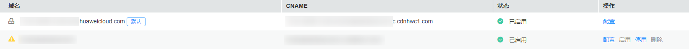
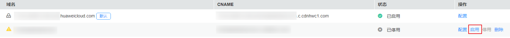

# 配置域名

您可以使用已备案的自有域名进行媒资加速分发。

> **须知：** 
>当前系统域名资源已分配完，若您在开通点播服务后未分配有系统域名，则需要将已备案的域名添加到点播服务中才能进行媒资加速分发。

## 注意事项

系统会对您名下的所有域名进行自动检查，对长期未有播放行为产生的域名进行下线操作，具体如下所示：

-   域名停用：若某个域名在一个月内未有下行流量产生，则停用该域名，点播控制台上对应域名为“已停用”状态。
-   域名删除：若某个域名在两个月内未有下行流量产生，则删除该域名。

域名停用或删除后，不能再使用该域名进行媒资的分发和播放，但不影响媒资的上传、处理等操作。

**域名恢复**：若域名被停用，您可以在点播控制台的“域名管理”中手动启用。若域名已被删除，则需要重新添加该域名，并配置CNAME，才可再次使用该域名。

## 域名准入流程

使用自有域名进行视频点播加速的流程如[图1](#fig176111448124214)所示。

**图 1**  域名准入流程  

1.  注册域名：若还未有自有域名，您可以在华为云购买或注册域名，具体请参见[域名注册服务](https://www.huaweicloud.com/product/domain.html)。
2.  备案域名：自有域名需在工信部完成备案，您也可以在华为云[备案中心](https://beian.huaweicloud.com/)完成。
3.  添加自有域名：将已备案的域名添加的视频点播服务中，视频点播最多支持添加5个自有域名，具体请参见[添加域名](#section1116911714363)。
4.  配置CNAME解析：需要在域名DNS服务商处完成CNAME解析配置，将您的域名指向视频点播分配的CNAME，具体请参见[配置CNAME](配置CNAME.md)。

> **说明：** 
>自有域名添加后，点播服务会对其进行内容审核，若违反相关法律法规的域名，如涉黄，涉赌，涉毒等，将会对域名进行停止解析处理。

## 添加域名

1.  登录[视频点播控制台](https://console.huaweicloud.com/vod)。
2.  在左侧导航栏选择“域名管理”，进入域名管理界面。
3.  单击“新增域名”，在“添加域名”页面输入已备案的域名。

    > **说明：** 
    >最多可添加5个域名，不支持添加泛域名，如“\*.example.com“。

4.  单击“确定”，完成添加。

    添加成功后，系统将会为添加的域名分配一个CNAME值。

    **图 2**  域名添加成功  
    

5.  在域名DNS服务商处配置CNAME解析，并验证CNAME是否生效，具体操作请参见[配置CNAME](配置CNAME.md)。

    若域名添加后未配置CNAME就设置为默认启用，则可能导致点播中的音视频无法正常播放，封面无法正常显示等异常。

6.  在已添加的域名后单击“设为默认”，可以将自有域名设置为默认域名。

    每个账户仅能设置一个默认域名，且设置为“默认“的域名必须处于正常启用状态。设置后，您可以使用该域名向外提供视频点播功能。

## 管理域名

自有域名添加后，您可以在域名管理页面查看已添加域名的基本信息，您也可以根据实际需求停用、启用或删除已添加的域名。

1.  登录[视频点播控制台](https://console.huaweicloud.com/vod)。
2.  在左侧导航栏选择“域名管理”，进入域名管理界面。
3.  您可以根据实际需求选择以下操作。
    -   查看域名信息

        在域名列表中，可查看已添加域名的CNAME值、状态等信息。

        **图 3**  域名信息  
        

        单击右侧操作列的“配置”，可查看目标域名的基本配置信息，还可以为该域名配置[HTTPS安全加速](配置方法.md)和[防盗链](Referer防盗链.md)。

        **图 4**  域名安全配置  
        

    -   停用域名

        若您需要停用某个域名，可以在需要停用的域名行单击“停用”。当“状态“变为“已停用“时，表示域名停用成功。

        > **说明：** 
        >至少要保证设置为“默认“的域名处于“已启用“状态，否则会导致点播音视频播放失败。

        **图 5**  域名停用  
        

    -   启用域名

        若您需要将某个已停用的域名重新启用，可以在需要启用的域名行单击“启用“。当“状态“变为“已启用“时，表示域名启用成功。

        **图 6**  域名启用  
        

    -   删除域名

        **注意**：仅在“停用“状态下的域名才能删除。因此，您需要先停用不需要的域名，再在需要删除的域名行单击“删除”即可。

        **图 7**  域名删除  
        

## 常见问题

-   [使用自有域名，为什么视频播放失败？](https://support.huaweicloud.com/vod_faq/vod_08_0097.html)
-   [为什么添加自有域名失败？](https://support.huaweicloud.com/vod_faq/vod_08_0056.html)

