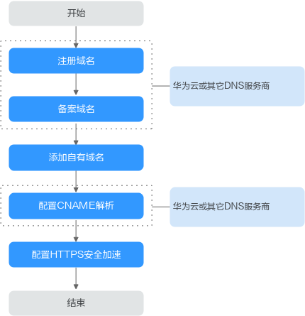

# 配置域名

视频点播服务给每个租户都提供了公网域名，同时支持用户使用自有的域名对外提供点播服务，并通过对接CDN进行内容缓存、快速分发。

> **须知：**   
>新注册用户登录点播服务控制台时，点播服务默认分配的域名启动预计需要十分钟，请您耐心等待，否则使用点播服务播放视频会产生源站外网下行流量费用。  

## 域名准入流程

若您需要使用自有域名进行视频点播加速，请参考如下流程进行操作。

**图 1**  域名准入流程  

1.  注册域名：若还未有自有域名，您可以在华为云购买或注册域名，具体请参见[域名注册服务](https://www.huaweicloud.com/product/domain.html)。
2.  备案域名：自有域名在工信部完成备案，您可以在华为云[备案中心](https://beian.huaweicloud.com/)完成。
3.  添加自有域名：将已备案的域名添加的视频点播服务中，视频点播最多支持添加5个自有域名，具体请参见[添加域名](#section1116911714363)。
4.  配置CNAME解析：需要在域名DNS服务商处完成CNAME解析配置，将您的域名指向视频点播分配的CNAME，具体请参见[配置CNAME](配置CNAME.md)。

> **说明：**   
>自有域名添加后，点播服务会对其进行内容审核，若违反相关法律法规的域名，如涉黄，涉赌，涉毒等，将会对域名进行停止解析处理。  

## 添加域名

1.  登录[视频点播控制台](视频点播控制台https://console.huaweicloud.com/vod)。
2.  在左侧导航栏选择“域名管理”，进入域名管理界面。
3.  单击“新增域名”，在“添加域名”页面输入已备案的域名。
4.  单击“确定”，完成添加。

    添加成功后，系统将会为添加的域名分配一个CNAME值。

    **图 2**  域名添加成功  
    

5.  在域名DNS服务商处配置CNAME解析，具体操作请参见[配置CNAME](配置CNAME.md)。
6.  单击“启用“将域名下发到CDN。

    启用过程预计需要10分钟，界面返回CNAME且状态为“已启用“时表示配置成功。

7.  在已添加的域名后单击“设为默认”，可以将自有域名设置为默认。

    每个账户仅能设置一个默认域名，设置后，您可以使用该域名向外提供视频点播功能。

## 其它域名操作

-   **启用/停用**：在域名列表中单击域名行的“启用”或“停用”，可以启用或停用某个域名。
-   **删除**：若需要删除某个域名，需要先停用，然后删除。

