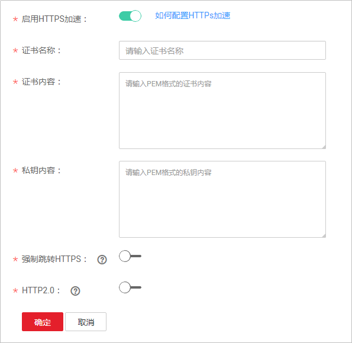

# 配置方法

视频点播支持HTTPS安全加速，保障您的点播数据在传输过程中受到加密保护。视频点播的分配的系统域名默认开启HTTPS，不需要额外配置。若您使用自有域名进行点播加速，建议您配置并开启HTTPS。

## 背景信息

**强制跳转HTTPS**：配置HTTPS后，开启强制跳转HTTPS，若用户发起HTTP请求，服务端会返回302重定向响应，原来的HTTP请求将会被强制重定向为HTTPS请求。

**HTTP 2.0**：HTTP 2.0标准于2015年5月以RFC 7540正式发表。HTTP/2的标准化工作由Chrome、Opera、Firefox、Internet Explorer 11、Safari、Amazon Silk及Edge等浏览器提供支持。

相比HTTP协议，HTTPS具有如下优势：

-   HTTPS协议是由SSL+HTTP协议构建的可进行加密传输、身份认证的网络协议，要比HTTP协议安全，可防止数据在传输过程中不被窃取、改变，确保数据的完整性。
-   在HTTPS协议中，会对用户的关键信息进行加密，避免Session ID或Cookie内容被攻击者捕获，导致敏感信息泄露。

HTTP 2.0具有如下优势：

-   多路复用：在HTTP 2.0中，允许同时通过单一的连接发起多重的请求-响应消息。
-   二进制分帧：HTTP 2.0会将所有传输的信息分割为更小的消息和帧，并对它们采用二进制格式的编码，替代HTTP/1.x中的纯文本传输。
-   服务器推送：在HTTP/2中，服务器可以将响应主动“推送”到客户端缓存中，提高了网页加载速度。
-   首部压缩：HTTP 2.0使用了专门为首部压缩而设计的HPACK算法。对消息头进行压缩，并为消息头建立索引表，相同的消息头只发送索引号，减少了头部数据的传输。

## 前提条件

-   已完成自有域名的配置，具体请参见[配置域名](配置域名.md)。
-   已准备HTTPS证书。若还未有HTTPS证书。您可以在华为云[SSL证书管理](https://www.huaweicloud.com/product/scm.html)中购买。
-   HTTPS证书格式满足[HTTPS证书要求](HTTPS证书要求.md)，若您的证书为非PEM格式，请参照HTTPS证书要求进行[格式转换](HTTPS证书要求.md#zh-cn_topic_0064907759_section6645502812116)。

## 启用HTTPS

1.  登录[视频点播控制台](https://console.huaweicloud.com/vod)。
2.  在左侧导航栏选择“域名管理”，进入域名管理界面。
3.  单击自有域名右侧“配置”，选择“HTTPS配置“页签。
4.  打开“启用HTTPS加速”开关，配置HTTPS参数，如[图1 自有域名配置HTTPS证书](#fig826053720484)所示。

    **图 1**  自有域名配置HTTPS证书  
    

    设置证书名称，使用文本工具打开获取的证书文件和私钥文件，并将对应的内容复制到对应的“证书内容”和“私钥内容”框中。不同机构颁布的证书，存在如下差异：

    -   若证书是Root CA机构颁发的，则证书是一份完整的证书，复制该证书内容即可。

        **图 2**  HTTPS证书  
        

    -   若证书是中级CA机构颁发的，则证书文件会包含多份证书，您需要将所有证书拼接在一起组成一份完整的证书。具体拼接方法请参见[中级CA机构颁发的证书](HTTPS证书要求.md#zh-cn_topic_0064907759_section23934614192754)。

5.  选择是否开启“强制跳转HTTPS”和“HTTP2.0”。
    -   **强制跳转HTTPS**：开启此项配置后，当您访问点播服务中的媒资时，所有访问请求方式都将强制跳转为HTTPS访问。
    -   **HTTP2.0**：开启此配置后，您访问点播服务中的媒资时的访问请求都将遵从HTTP/2协议。

6.  验证HTTPS安全加速是否生效。

    HTTPS开启后，[音视频管理](音视频管理.md)中播放地址为HTTPS方式的，您可以使用对应的地址播放音视频，若播放成功，则表示HTTPS安全加速生效。

## 更新证书

若您的域名证书进行了变更，您需要将新的证书内容同步到HTTPS配置中，具体更新方法同[启用HTTPS](#section11464111118173)。

