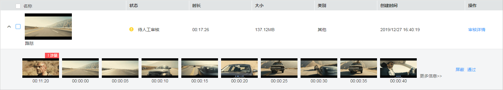

# 音视频审核

为了满足客户对音视频进行审查，提供了音视频审核功能，用户可以提前或及时下线不符合条件的音视频，避免或减少对外发布后造成的不良影响。您可以参考如下步骤进行音视频审核，也可以通过[视频指导](https://bbs.huaweicloud.com/videos/66dd0b71aed0498696444e20f6260277)来操作。

## 注意事项

音视频审核功能暂不支持“华东-上海二”区域。

## 审核流程

点播控制台提供的审核模式是“先发后审“，即音视频上传后可直接播放，您可以根据需求进行智能审核和人工审核，然后决定是否屏蔽该音视频文件。若您需要使用“先审后发“模式，请调用点播API进行处理。具体请参见[如何实现对上传音视频进行先审后发？](https://support.huaweicloud.com/vod_faq/vod_08_0079.html)

**图 1**  审核流程  

-   智能审核：在音视频审核模块中，提供了基于文本、封面、截图的智能鉴黄、鉴恐、鉴政服务，默认为未开启状态。开启智能鉴黄、鉴恐、鉴政功能后，针对已上传的音视频，会自动识别其合法性，如果有违规涉黄、涉恐、涉政的文字描述或者画面，会在审核时标识，从而加快审核效率。
-   人工审核：在音视频审核详情中，针对发现疑似有问题的音视频进行再审查，确认存在问题后可以对音视频进行“屏蔽”或“通过”操作。
-   屏蔽：已屏蔽的媒资的状态会转为“未发布”，未发布状态的媒资只能通过控制台预览，无法通过域名下载和播放，已被外网引用的播放地址也将无法播放。

## 前提条件

默认使用系统模板审核，若您需要自定义审核模板，请先[自定义审核模板](审核设置.md)，并将创建模板设置为默认。

## 视频审核

对于视频文件，智能审核的审核范围包括封面、标题、视频描述、视频画面。

1.  登录[视频点播控制台](https://console.huaweicloud.com/vod)。
2.  在左侧导航栏选择“审核管理 \> 音视频审核”，进入音视频审核页面。
3.  勾选视频，单击“审核”，系统会根据设置的默认审核模板进行智能审核。您可以通过[审核设置](审核设置.md)修改或编辑审核模板。

    当审核列表中的视频状态为“审核通过”、“待人工审核”或“审核不通过”时，表示审核完成。

4.  根据实际需求选择是否进行人工复审。

    您可以选择如下两种方式进行人工审核：

    -   单击视频左侧的，下拉框中将会展示当前视频的最多10张截图，系统会对存在违规内容的截图进行标识。可以对标识的截图进行人工审核。如[图1 截图预判图](#fig1046715560436)所示。

        **图 2**  截图预判图  
        

    -   若仅凭当前的截图信息，无法进行视频审查，您也可以单击视频文件右侧的“审核详情”，进入视频审核详情页。

        若截图涉黄、涉恐、涉政，则将被标识，若文本信息涉黄、涉恐、涉政，字体由黑色变为红色，在视频预览区域，可以进行视频的播放，从而进行更为严格的审核。

        **图 3**  视频审核详情页  
        

5.  返回音视频审核列表，勾选多个视频，可以对审核通过的视频进行批量通过，或批量屏蔽审核未通过的视频文件。

## 音频审核

对于音频文件，智能审核的审核范围包括标题、音频描述、封面。

1.  登录[视频点播控制台](https://console.huaweicloud.com/vod)。
2.  在左侧导航栏选择“审核管理 \> 音视频审核”，进入音视频审核页面。
3.  勾选音频，单击“审核”，系统会根据设置的默认审核模板进行智能审核。您可以通过[审核设置](审核设置.md)修改或编辑审核模板。

    当审核列表中的音频状态为“审核通过”、“待人工审核”或“审核不通过”时，表示审核完成。

4.  审核完成后，单击音频右侧的“审核详情”，进入审核详情页面。

    若封面涉黄、涉恐、涉政，则封面将被标识，若文本信息涉黄、涉恐、涉政，字体由黑色变为红色，从而可通过智能审核的结果对音频文件进行人工审核，选择“屏蔽”或“通过”。

5.  返回视频审核列表，勾选多个音频，可以对审核通过的音频进行批量通过，或批量屏蔽审核未通过的音频文件。

